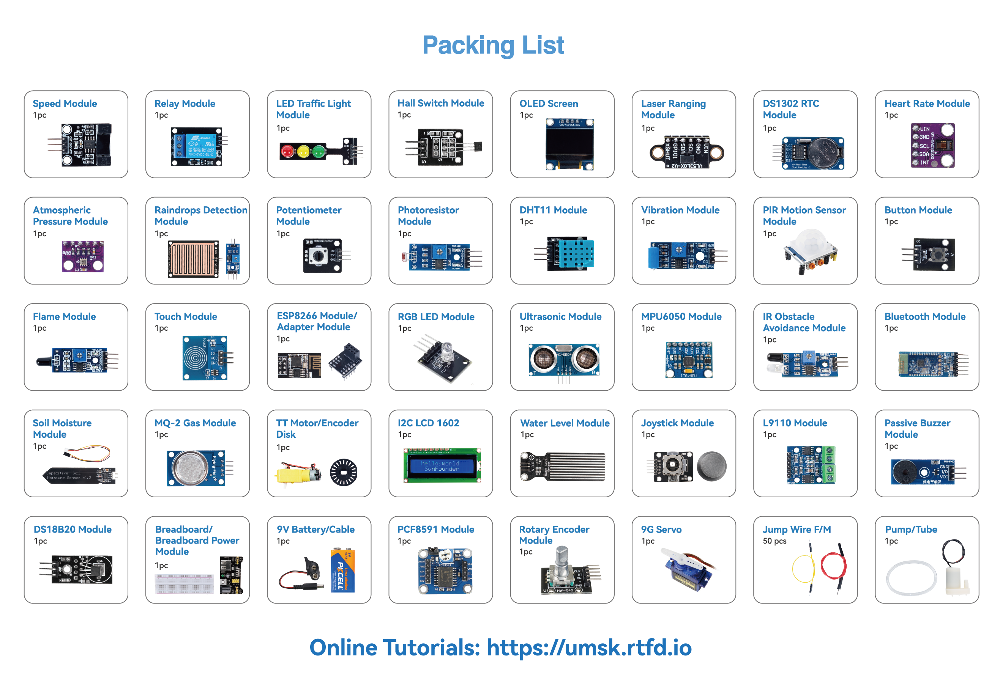

.. note::

    Hello, welcome to the SunFounder Raspberry Pi & Arduino & ESP32 Enthusiasts Community on Facebook! Dive deeper into Raspberry Pi, Arduino, and ESP32 with fellow enthusiasts.

    **Why Join?**

    - **Expert Support**: Solve post-sale issues and technical challenges with help from our community and team.
    - **Learn & Share**: Exchange tips and tutorials to enhance your skills.
    - **Exclusive Previews**: Get early access to new product announcements and sneak peeks.
    - **Special Discounts**: Enjoy exclusive discounts on our newest products.
    - **Festive Promotions and Giveaways**: Take part in giveaways and holiday promotions.

    👉 Ready to explore and create with us? Click [|link_sf_facebook|] and join today!

Component Reference
============================================

This section is a reference guide for the components covered in the core camp lessons. Each page covers the component's working principle, pinout, and a simple code example to help you get started.

For components not covered in the core curriculum, see the :doc:`Advanced Component Reference </09_advanced_components/advanced_components>`.

* :download:`SunFounder Universal Maker Sensor Kit Components List </_static/pdf/sunfounder_universal_maker_sensor_components_list.pdf>`

**Basic**

.. toctree::
    :maxdepth: 1

    38-component_breadboard

**Sensor**

.. toctree::
    :maxdepth: 1

    01-component_button
    12-component_pir_motion
    13-component_potentiometer
    19-component_dht11
    22-component_touch
    23-component_ultrasonic

**Display**

.. toctree::
    :maxdepth: 1

    26-component_i2c_lcd1602
    27-component_oled
    28-component_rgb
    29-component_traffic

**Actuator**

.. toctree::
    :maxdepth: 1

    30-component_relay
    31-component_pump
    32-component_buzzer
    33-component_servo

**Power**

.. toctree::
    :maxdepth: 1

    39-component_power
