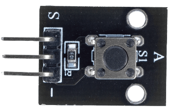
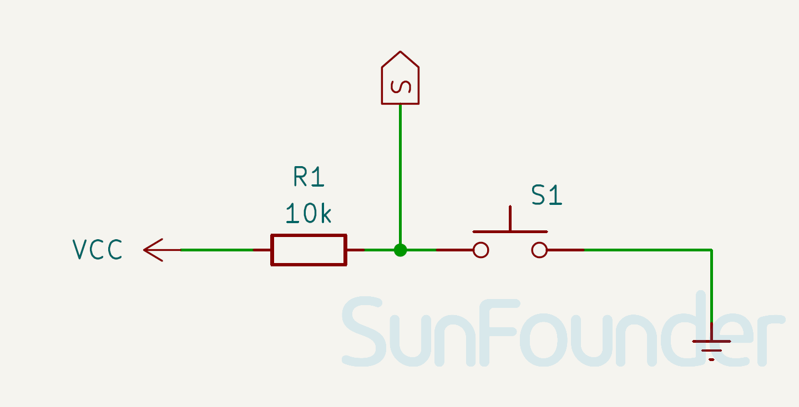

.. note:: 

    ¡Hola, bienvenido a la Comunidad de Entusiastas de SunFounder Raspberry Pi & Arduino & ESP32 en Facebook! Profundiza en Raspberry Pi, Arduino y ESP32 con otros entusiastas.

    **¿Por qué unirse?**

    - **Soporte experto**: Resuelve problemas postventa y desafíos técnicos con la ayuda de nuestra comunidad y equipo.
    - **Aprender y compartir**: Intercambia consejos y tutoriales para mejorar tus habilidades.
    - **Vistas previas exclusivas**: Accede antes que nadie a nuevos anuncios de productos y avances.
    - **Descuentos especiales**: Disfruta de descuentos exclusivos en nuestros productos más nuevos.
    - **Promociones festivas y sorteos**: Participa en sorteos y promociones especiales.

    👉 ¿Listo para explorar y crear con nosotros? Haz clic en [|link_sf_facebook|] y únete hoy mismo!

.. _cpn_button:

Módulo de Botón
==========================

.. raw:: html

    

.. _btn_intro:

El módulo de botón es un dispositivo electrónico que detecta el estado de un botón. Generalmente se utilizan como interruptores para conectar o interrumpir circuitos. Los botones se emplean en diversos escenarios, como timbres, lámparas de escritorio, controles remotos, ascensores, alarmas de incendios, etc.

Principio de funcionamiento
------------------------------
El módulo de botón funciona según el principio de un interruptor. Un interruptor es un componente eléctrico que puede utilizarse para abrir o cerrar un circuito.

A continuación se muestra la estructura interna de un botón. El símbolo de la derecha generalmente se usa para representar un botón en circuitos.

.. image:: img/01_button_2.png
    :width: 400
    :align: center

Dado que el pin 1 está conectado al pin 2, y el pin 3 al pin 4, cuando el botón se presiona, los 4 pines se conectan, cerrando así el circuito.

.. _cpn_button_sch:

Diagrama esquemático
---------------------------

.. raw:: html

    

Ejemplo
---------------------------

* :ref:`uno_lesson01_button` (Arduino UNO)
* :ref:`eps32_lesson01_button` (ESP32)
* :ref:`pico_lesson01_button` (Raspberry Pi Pico)
* :ref:`pi_lesson01_button` (Raspberry Pi)
* :ref:`esp32_iot_mqtt` (ESP32)