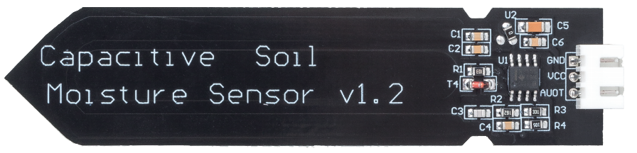
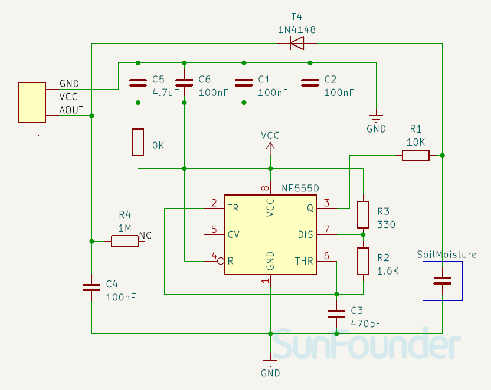

.. note:: 

    Ciao, benvenuto nella community SunFounder per appassionati di Raspberry Pi, Arduino ed ESP32 su Facebook! Approfondisci il mondo di Raspberry Pi, Arduino ed ESP32 insieme ad altri appassionati.

    **Why Join?**

    - **Expert Support**: Risolvi problemi post-vendita e difficoltà tecniche con l’aiuto del nostro team e della community.
    - **Learn & Share**: Scambia suggerimenti e tutorial per migliorare le tue competenze.
    - **Exclusive Previews**: Accedi in anteprima agli annunci dei nuovi prodotti e alle anticipazioni.
    - **Special Discounts**: Goditi sconti esclusivi sui nostri prodotti più recenti.
    - **Festive Promotions and Giveaways**: Partecipa a concorsi e promozioni speciali durante le festività.

    👉 Pronto a esplorare e creare con noi? Clicca su [|link_sf_facebook|] e unisciti subito!

.. _cpn_soil:

Capacitive Soil Moisture Module
=====================================

.. raw:: html

     

Il modulo per l’umidità del suolo è un sensore impiegato in ambito agricolo per misurare il contenuto di umidità nel terreno, aiutando gli agricoltori a monitorare i livelli di umidità e determinare il momento ideale per l’irrigazione.
Questo sensore capacitivo differisce dai sensori resistivi comunemente presenti sul mercato: utilizza il principio dell’induzione capacitiva per rilevare l’umidità, evitando il problema della corrosione tipica dei sensori resistivi e garantendo una durata operativa significativamente più lunga.

Pinout
---------------------------
* **VCC**: Ingresso di alimentazione positiva dal controller principale.
* **GND**: Collegamento a massa.
* **AUOT**: Uscita analogica. Maggiore è l’umidità del terreno, minore sarà il valore dell’uscita analogica.

Principle
---------------------------

Questo sensore capacitivo per l’umidità del suolo si distingue dalla maggior parte dei sensori resistivi in commercio grazie all’impiego dell’induzione capacitiva per la rilevazione dell’umidità. Elimina il problema della corrosione a cui sono soggetti i sensori resistivi e garantisce una durata molto più lunga.

È costruito con materiali resistenti alla corrosione e offre un’eccellente longevità. Basta inserirlo nel terreno attorno alla pianta per monitorare in tempo reale i dati sull’umidità. Il modulo è dotato di un regolatore di tensione integrato, che consente il funzionamento con una gamma di alimentazione da 3,3 a 5,5 V. È ideale per microcontrollori a bassa tensione, come quelli da 3,3 V e 5 V.

Lo schema elettrico del sensore capacitivo per l’umidità del suolo è illustrato di seguito.

.. raw:: html

     

Il circuito include un oscillatore a frequenza fissa realizzato con un timer 555. L’onda quadra generata viene inviata al sensore, che si comporta come un condensatore. Per tale segnale, il condensatore mostra una certa reattanza, che insieme a una resistenza puramente ohmica (resistenza da 10kΩ sul pin 3) forma un partitore di tensione.

Maggiore è l’umidità del terreno, maggiore sarà la capacità del sensore. Di conseguenza, la reattanza diminuisce, riducendo la tensione sulla linea del segnale e producendo un valore analogico inferiore letto dal microcontrollore.

Example
---------------------------
* :ref:`uno_lesson02_soil_moisture` (Arduino UNO)
* :ref:`esp32_lesson02_soil_moisture` (ESP32)
* :ref:`pico_lesson02_soil_moisture` (Raspberry Pi Pico)
* :ref:`pi_lesson02_soil_moisture` (Raspberry Pi Pi)

* :ref:`uno_lesson45_plant_monitor` (Arduino UNO)
* :ref:`esp32_plant_monitor` (ESP32)
