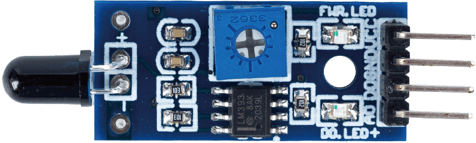
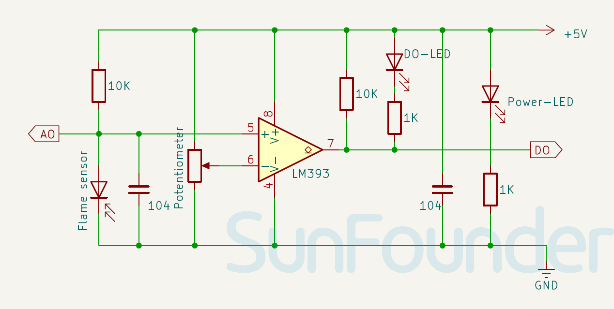

.. note:: 

    ¡Hola, bienvenido a la Comunidad de Entusiastas de SunFounder Raspberry Pi & Arduino & ESP32 en Facebook! Profundiza en Raspberry Pi, Arduino y ESP32 con otros entusiastas.

    **¿Por qué unirse?**

    - **Soporte experto**: Resuelve problemas postventa y desafíos técnicos con la ayuda de nuestra comunidad y equipo.
    - **Aprende y comparte**: Intercambia consejos y tutoriales para mejorar tus habilidades.
    - **Vistas previas exclusivas**: Accede antes que nadie a nuevos anuncios de productos y avances.
    - **Descuentos especiales**: Disfruta de descuentos exclusivos en nuestros productos más nuevos.
    - **Promociones festivas y sorteos**: Participa en sorteos y promociones especiales.

    👉 ¿Listo para explorar y crear con nosotros? Haz clic en [|link_sf_facebook|] y únete hoy mismo!

.. _cpn_flame:

Módulo Sensor de Llama
==========================

.. raw:: html

    

.. tip::
   Mantén una distancia adecuada entre el sensor y la llama para evitar daños por altas temperaturas.

.. note::
   **Aviso**: Debido a un error de producción, algunos de los sensores de llama incluidos en nuestros kits pueden ser la versión de 3 pines, la cual carece de la salida AO (Salida Analógica). Esta versión es adecuada para la mayoría de los proyectos y no afecta el uso general. Si necesitas la versión de 4 pines, por favor contacta con nuestro servicio de atención al cliente en service@sunfounder.com. Te proporcionaremos un reemplazo gratuito para satisfacer tus necesidades.

El sensor de llama es un dispositivo que puede detectar la presencia de fuego o llamas. El sensor de llama funciona basándose en la radiación infrarroja. El fotodiodo IR detecta la radiación infrarroja de cualquier cuerpo caliente. Este valor se compara con un valor establecido. Una vez que la radiación alcanza el valor umbral, el sensor cambiará su salida en consecuencia. Se utiliza ampliamente en sistemas de detección de incendios en hogares e industrias.

El sensor de llama trabaja con el principio de detección infrarroja (IR). El sensor tiene un receptor IR que detecta la radiación IR emitida por las llamas. Cuando el fuego arde, emite una pequeña cantidad de luz infrarroja, que será recibida por el fotodiodo (receptor IR) en el módulo del sensor. Luego, usamos un amplificador operativo (Op-Amp) para verificar el cambio de voltaje a través del receptor IR, de modo que si se detecta un incendio, el pin de salida (DO) dará 0V (BAJO), y si no hay fuego, el pin de salida dará 5V (ALTO).

Especificaciones
---------------------------
* Voltaje de suministro: 3.3V - 5V
* Tamaño del PCB: 31 x 14mm
* Tipo de señal de salida: DO y AO
* Ángulo de detección: 60 grados

Pinout
---------------------------
* **VCC**: Entrada de alimentación positiva desde el control principal.
* **GND**: Conexión a tierra.
* **DO**: Salida digital. Indica la presencia de una llama. Cuando la radiación infrarroja supera el valor umbral (establecido por el potenciómetro), DO se vuelve BAJO; de lo contrario, permanece ALTO.
* **AO**: Salida analógica. Genera un voltaje de salida que es inversamente proporcional a la intensidad de la radiación infrarroja (tamaño de la llama). Por lo tanto, una mayor radiación infrarroja resultará en un voltaje más bajo, mientras que una menor radiación infrarroja resultará en un voltaje más alto.

Diagrama esquemático
---------------------------

.. raw:: html

    

Ejemplo
---------------------------
* :ref:`uno_lesson03_flame` (Arduino UNO)
* :ref:`esp32_lesson03_flame` (ESP32)
* :ref:`pico_lesson03_flame` (Raspberry Pi Pico)
* :ref:`pi_lesson03_flame` (Raspberry Pi)
* :ref:`uno_iot_flame` (Arduino UNO)