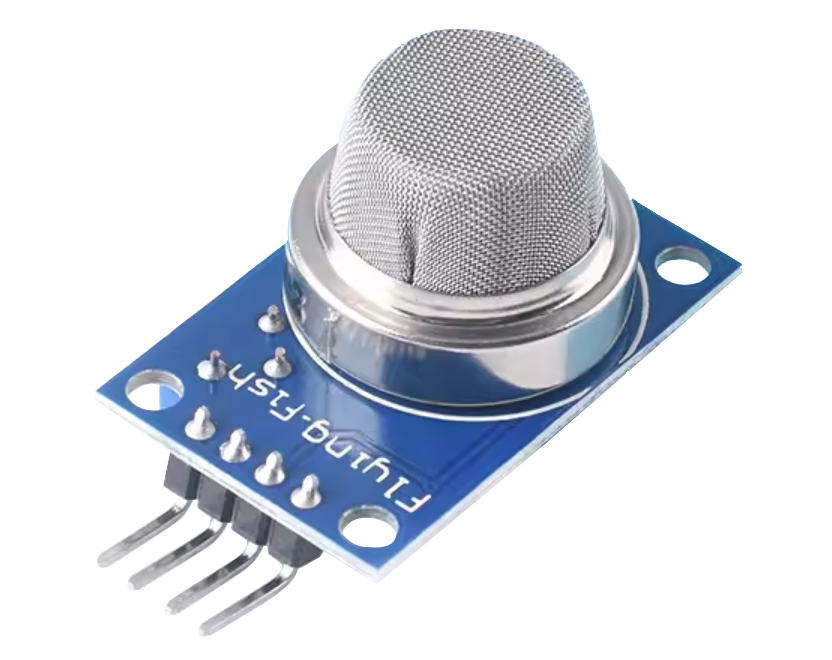

.. note:: 

    ¡Hola, bienvenido a la Comunidad de Entusiastas de SunFounder Raspberry Pi & Arduino & ESP32 en Facebook! Profundiza en Raspberry Pi, Arduino y ESP32 con otros entusiastas.

    **¿Por qué unirse?**

    - **Soporte experto**: Resuelve problemas postventa y desafíos técnicos con la ayuda de nuestra comunidad y equipo.
    - **Aprende y comparte**: Intercambia consejos y tutoriales para mejorar tus habilidades.
    - **Vistas previas exclusivas**: Accede antes que nadie a nuevos anuncios de productos y avances.
    - **Descuentos especiales**: Disfruta de descuentos exclusivos en nuestros productos más nuevos.
    - **Promociones festivas y sorteos**: Participa en sorteos y promociones especiales.

    👉 ¿Listo para explorar y crear con nosotros? Haz clic en [|link_sf_facebook|] y únete hoy mismo!

.. _cpn_gas:

Módulo Sensor de Gas/Humo (MQ2)
=====================================

.. tip::
   El MQ2 es un sensor basado en calefacción que generalmente requiere un periodo de precalentamiento antes de su uso. Durante este periodo de precalentamiento, el sensor normalmente lee un valor alto que luego disminuye gradualmente hasta estabilizarse.

El sensor MQ-2 es un sensor de gas versátil capaz de detectar una amplia gama de gases, incluidos alcohol, monóxido de carbono, hidrógeno, isobutano, gas licuado de petróleo, metano, propano y humo. Es muy popular entre los principiantes debido a su bajo costo y sus características fáciles de usar.

Principio
---------------------------
El sensor MQ-2 funciona sobre el principio de cambios de resistencia en presencia de diferentes gases. Cuando el gas objetivo entra en contacto con el material MOS (Semiconductor de Óxido Metálico) calentado, sufre reacciones de oxidación o reducción que cambian la resistencia del material MOS. **Es importante destacar que el sensor de gas MQ2 es capaz de detectar múltiples gases, pero carece de la capacidad para diferenciarlos.** Esta es una característica común en la mayoría de los sensores de gas.

El sensor cuenta con un potenciómetro integrado que permite ajustar el umbral de salida digital del sensor (D0). Cuando la concentración de gas en el aire supera un valor umbral determinado, la resistencia del sensor cambia. Este cambio en la resistencia se convierte luego en una señal eléctrica que puede ser leída por una placa Arduino.

Calibración del Sensor de Gas MQ2
----------------------------------
Debido a que el MQ2 es un sensor impulsado por calefacción, la calibración del sensor puede desviarse si se ha dejado en almacenamiento durante un periodo largo de tiempo. 
Cuando se utiliza por primera vez después de un largo periodo de almacenamiento (un mes o más), el sensor debe ser completamente calentado durante 24-48 horas para garantizar la máxima precisión. 
Si el sensor se ha utilizado recientemente, solo tomará entre 5 y 10 minutos para calentarse por completo. Durante el periodo de calentamiento, el sensor generalmente lee un valor alto y luego disminuye gradualmente hasta estabilizarse.

Especificaciones
---------------------------
* Modelo: MQ2
* Voltaje de suministro: 5V
* Tamaño del PCB: 32 x 20mm
* Tipo de señal de salida: DO y AO
* Concentración de detección: 300 a 10000ppm
* Duración de precalentamiento: Más de 24 horas (primera vez)
* Gases detectados: LPG, Alcohol, Propano, Hidrógeno, CO e incluso metano

Pinout
---------------------------
* **VCC**: Entrada de alimentación positiva desde el control principal.
* **GND**: Conexión a tierra.
* **DO**: Salida digital. Indica la presencia de gases combustibles. Cuando la concentración de gas supera el valor umbral (establecido por el potenciómetro), DO se vuelve BAJO; de lo contrario, permanece ALTO.
* **AO**: Salida analógica. Genera un voltaje de salida proporcional a la concentración de gas, por lo que una mayor concentración resulta en un voltaje más alto y una menor concentración resulta en un voltaje más bajo.

Ejemplo
---------------------------
* :ref:`uno_lesson04_mq2` (Arduino UNO)
* :ref:`esp32_lesson04_mq2` (ESP32)
* :ref:`pico_lesson04_mq2` (Raspberry Pi Pico)
* :ref:`pi_lesson04_mq2` (Raspberry Pi)

* :ref:`uno_lesson38_gas_leak_alarm` (Arduino UNO)
* :ref:`esp32_gas_leak_alarm` (ESP32)