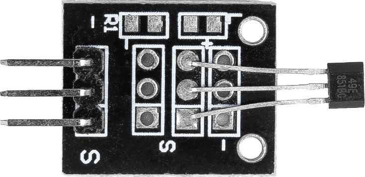
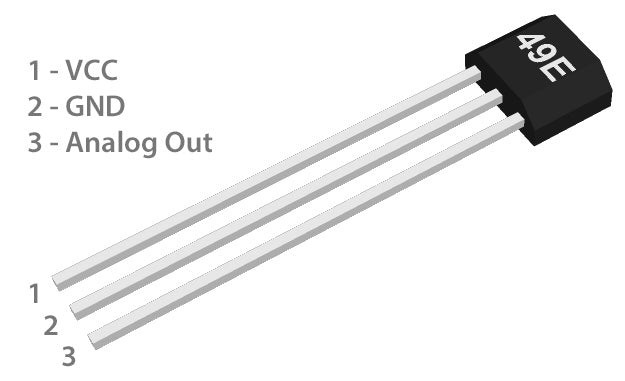

.. note:: 

    Ciao! Benvenuto nella community Facebook dedicata agli appassionati di SunFounder, Raspberry Pi, Arduino ed ESP32! Unisciti a noi per esplorare a fondo Raspberry Pi, Arduino ed ESP32 insieme ad altri maker ed entusiasti.

    **Perché unirsi?**

    - **Supporto esperto**: Risolvi problemi post-vendita e sfide tecniche con il supporto della nostra community e del nostro team.
    - **Impara e condividi**: Scambia consigli e tutorial per migliorare le tue competenze.
    - **Anteprime esclusive**: Ottieni accesso anticipato a nuovi annunci e anticipazioni sui prodotti.
    - **Sconti speciali**: Approfitta di sconti esclusivi sui nostri prodotti più recenti.
    - **Promozioni festive e giveaway**: Partecipa a omaggi ed eventi promozionali durante le festività.

    👉 Pronto a scoprire e creare con noi? Clicca su [|link_sf_facebook|] e unisciti oggi stesso!

.. _cpn_hall:

Modulo Sensore di Effetto Hall
=====================================

.. raw:: html

    

Il modulo sensore Hall è un sensore magnetico senza contatto che produce un segnale elettrico proporzionale al campo magnetico applicato. È in grado di rilevare sia la polarità nord che sud di un campo magnetico, nonché l’intensità relativa del campo stesso. Funziona come un rilevatore di magneti, utile in progetti per individuare la presenza di magneti nelle vicinanze. Questo sensore è ideale in applicazioni come sistemi di allarme per porte o per misurare la velocità di oggetti rotanti.

Principio di funzionamento
---------------------------===

Il principio di funzionamento del modulo Hall si basa sull’|link_hall_effect|, scoperto da Edwin Hall. In parole semplici: quando la corrente elettrica attraversa un conduttore (come un filo) e viene applicato un campo magnetico, quest’ultimo spinge gli elettroni in movimento verso un lato del conduttore, generando così una differenza di tensione – questo è l’effetto Hall.

Nel modulo Hall, quando un magnete si avvicina, il campo magnetico influenza gli elettroni presenti nel materiale semiconduttore del sensore. Questo altera la tensione ai capi del sensore, che viene quindi rilevata. L’Arduino può leggere questa variazione e determinare se un magnete è presente e quanto è forte il campo magnetico.

.. raw:: html

    

Il modulo Hall è dotato di un sensore lineare ad effetto Hall 49E, capace di misurare sia la polarità nord che sud di un campo magnetico, così come la sua intensità relativa. Il pin di uscita fornisce un segnale analogico che rappresenta la presenza e la forza del campo magnetico, insieme alla sua polarità (nord o sud). In assenza di campo magnetico, il sensore 49E restituisce una tensione pari a circa la metà della tensione di alimentazione. Se il polo sud di un magnete viene avvicinato al lato etichettato del 49E (quello con il testo inciso), la tensione di uscita aumenterà linearmente fino a raggiungere la tensione di alimentazione in proporzione all’intensità del campo. Al contrario, se si avvicina il polo nord, la tensione di uscita diminuirà proporzionalmente.

Ad esempio, alimentando il 49E con 5V e in assenza di campo magnetico, l’uscita sarà di circa 2.5V. Avvicinando il polo sud di un magnete potente, la tensione può aumentare fino a circa 4.2V; mentre con il polo nord potrà scendere fino a circa 0.86V, in funzione dell’intensità del campo magnetico applicato.

Esempi
---------------------------
* :ref:`uno_lesson06_hall_sensor` (Arduino UNO)
* :ref:`esp32_lesson06_hall_sensor` (ESP32)
* :ref:`pico_lesson06_hall_sensor` (Raspberry Pi Pico)
* :ref:`pi_lesson06_hall_sensor` (Raspberry Pi)