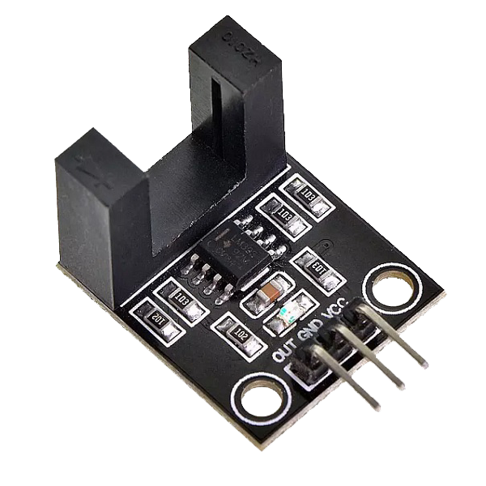
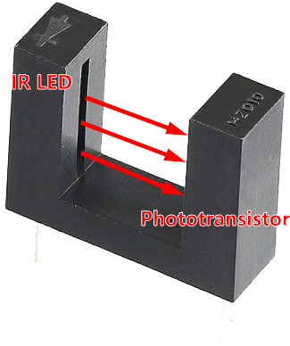
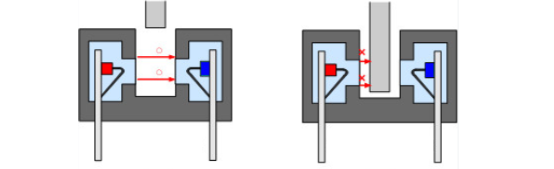
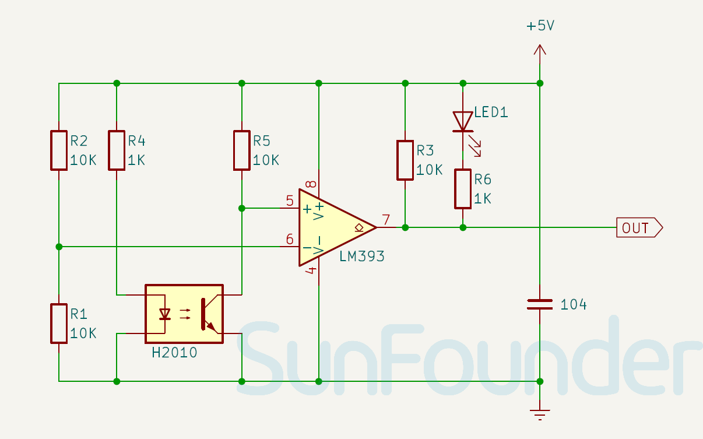

.. note:: 

    ¡Hola, bienvenido a la Comunidad de Entusiastas de SunFounder Raspberry Pi & Arduino & ESP32 en Facebook! Profundiza más en Raspberry Pi, Arduino y ESP32 con otros entusiastas.

    **¿Por qué unirse?**

    - **Soporte experto**: Resuelve problemas postventa y desafíos técnicos con la ayuda de nuestra comunidad y equipo.
    - **Aprende y comparte**: Intercambia consejos y tutoriales para mejorar tus habilidades.
    - **Vistas previas exclusivas**: Accede antes que nadie a nuevos anuncios de productos y avances.
    - **Descuentos especiales**: Disfruta de descuentos exclusivos en nuestros productos más nuevos.
    - **Promociones festivas y sorteos**: Participa en sorteos y promociones especiales.

    👉 ¿Listo para explorar y crear con nosotros? Haz clic en [|link_sf_facebook|] y únete hoy mismo!

.. _cpn_speed:

Módulo Sensor de Velocidad Infrarrojo
========================================

El Módulo Sensor de Velocidad Infrarrojo es un contador IR que tiene un transmisor y receptor IR. Si se coloca algún obstáculo entre estos sensores, se envía una señal al microcontrolador. El módulo se puede usar en asociación con un microcontrolador para la detección de velocidad de motores, conteo de pulsos, límites de posición, etc.

Pinout
---------------------------
* **VCC**: Esta es la entrada de alimentación positiva (3.3V o 5V) del control principal.
* **GND**: Conexión a tierra.
* **OUT**: Salida digital. Cuando el sensor de velocidad está obstruido, emite un nivel alto; cuando no está obstruido, emite un nivel bajo.

Principio
---------------------------

El módulo sensor de velocidad se usa principalmente para detectar cambios en la velocidad de rotación o velocidad. Cuando un objeto pasa por el sensor H2010, genera una señal de pulso. El comparador LM393 integrado dentro del módulo compara esta señal de pulso con un umbral preestablecido, produciendo una señal de salida estable de nivel alto.

El Módulo Sensor de Velocidad Infrarrojo tiene una célula fotoeléctrica H2010, que consta de un fototransistor y un emisor de luz infrarroja, empaquetados en una carcasa plástica negra de 10 cm de ancho.

Cuando está en funcionamiento, el diodo emisor de luz infrarroja emite continuamente luz infrarroja (luz invisible), y el triodo fotosensible conducirá si la recibe.

.. raw:: html

    

Diagrama esquemático
---------------------------

.. raw:: html

    

Ejemplo
---------------------------
* :ref:`uno_lesson07_speed` (Arduino UNO)
* :ref:`esp32_lesson07_speed` (ESP32)
* :ref:`pico_lesson07_speed` (Raspberry Pi Pico)
* :ref:`pi_lesson07_speed` (Raspberry Pi)
