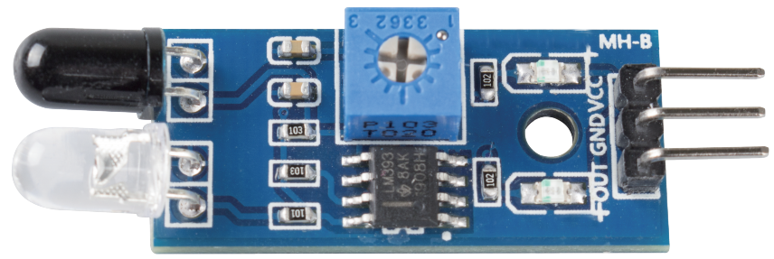
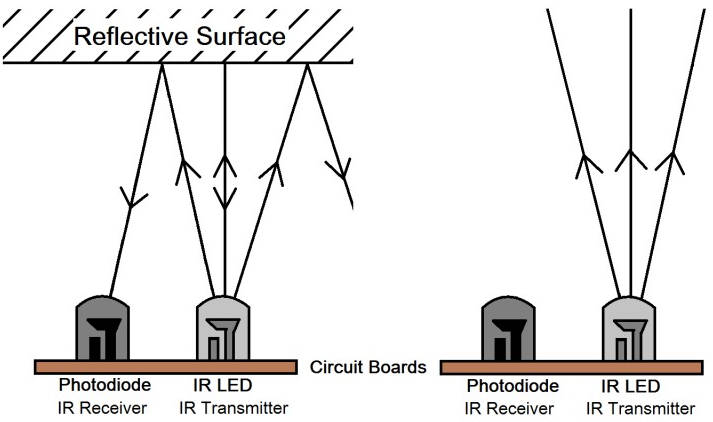
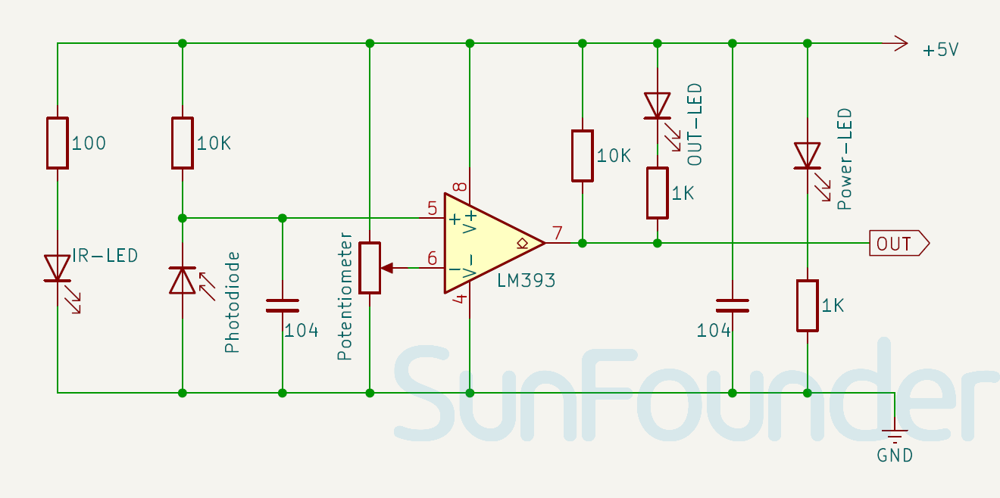

.. note:: 

    Ciao! Benvenuto nella community Facebook dedicata agli appassionati di SunFounder, Raspberry Pi, Arduino ed ESP32! Unisciti a noi per esplorare in profondità Raspberry Pi, Arduino ed ESP32 insieme ad altri maker ed entusiasti.

    **Perché unirsi?**

    - **Supporto esperto**: Risolvi problemi post-vendita e sfide tecniche con il supporto della nostra community e del nostro team.
    - **Impara e condividi**: Scambia suggerimenti e tutorial per migliorare le tue competenze.
    - **Anteprime esclusive**: Accedi in anticipo a nuovi annunci e anteprime di prodotto.
    - **Sconti speciali**: Approfitta di sconti esclusivi sui nostri ultimi prodotti.
    - **Promozioni festive e giveaway**: Partecipa a omaggi e promozioni in occasione delle festività.

    👉 Pronto a esplorare e creare con noi? Clicca su [|link_sf_facebook|] e unisciti oggi stesso!

.. _cpn_ir_obstacle:

Modulo Sensore IR per Evitamento Ostacoli
==============================================

.. raw:: html

    

Questo modulo è in grado di adattarsi alla luce ambientale ed è composto da una coppia di tubi a infrarossi, uno emettitore e uno ricevitore. Il tubo emettitore invia raggi IR a una frequenza specifica, e quando nella direzione del rilevamento è presente un ostacolo (superficie riflettente), il tubo ricevitore capta il segnale riflesso. Il segnale elaborato dal circuito comparatore accende il LED verde e, contemporaneamente, l’interfaccia di uscita emette un segnale digitale (livello basso). La distanza di rilevamento può essere regolata tramite una manopola del potenziometro.

Specifiche
---------------------------
* Tensione di alimentazione: 3.3V - 5V
* Dimensioni PCB: 32 x 14mm
* Tipo di segnale in uscita: Uscita digitale
* Angolo di rilevamento: 35°
* Distanza di rilevamento: 2～30cm

Pinout
---------------------------
* **VCC**: Ingresso di alimentazione positiva dal controllore principale. 
* **GND**: Collegamento a massa.
* **OUT**: Uscita digitale. Emette livello alto quando non ci sono ostacoli e livello basso quando viene rilevato un ostacolo. La distanza di rilevamento può essere regolata tramite il potenziometro integrato nel modulo.

Principio di funzionamento
---------------------------
Un sensore per l’evitamento di ostacoli è composto principalmente da un trasmettitore a infrarossi, un ricevitore a infrarossi e un potenziometro. In base alla capacità riflettente di un oggetto: se non c’è ostacolo, il raggio IR si indebolisce con la distanza fino a scomparire; se invece è presente un ostacolo, il raggio viene riflesso verso il ricevitore IR. Il ricevitore rileva quindi il segnale riflesso, confermando la presenza di un ostacolo di fronte. L'intervallo di rilevamento può essere regolato tramite il potenziometro integrato.

.. raw:: html

    

Schema elettrico
---------------------------

.. raw:: html

    

Esempi
---------------------------
* :ref:`uno_lesson08_ir_obstacle_avoidance` (Arduino UNO)
* :ref:`esp32_lesson08_ir_obstacle_avoidance` (ESP32)
* :ref:`pico_lesson08_ir_obstacle_avoidance` (Raspberry Pi Pico)
* :ref:`pi_lesson08_ir_obstacle_avoidance` (Raspberry Pi)

* :ref:`uno_lesson39_soap_dispenser` (Arduino UNO)
* :ref:`esp32_soap_dispenser` (ESP32)

