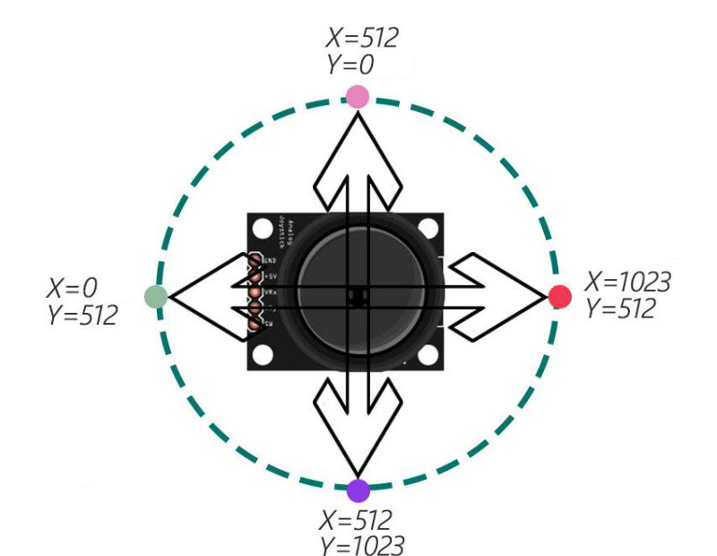
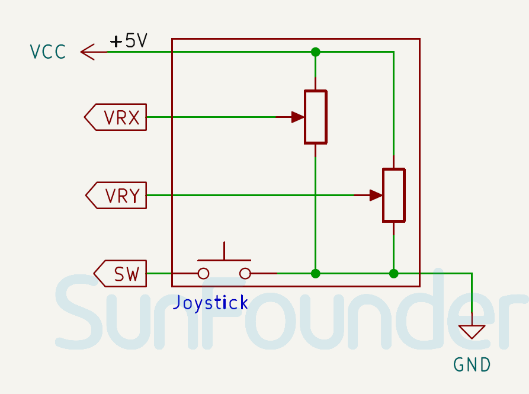

.. note:: 

    ¡Hola, bienvenido a la Comunidad de Entusiastas de SunFounder Raspberry Pi & Arduino & ESP32 en Facebook! Profundiza más en Raspberry Pi, Arduino y ESP32 con otros entusiastas.

    **¿Por qué unirse?**

    - **Soporte experto**: Resuelve problemas postventa y desafíos técnicos con la ayuda de nuestra comunidad y equipo.
    - **Aprende y comparte**: Intercambia consejos y tutoriales para mejorar tus habilidades.
    - **Vistas previas exclusivas**: Accede antes que nadie a nuevos anuncios de productos y avances.
    - **Descuentos especiales**: Disfruta de descuentos exclusivos en nuestros productos más nuevos.
    - **Promociones festivas y sorteos**: Participa en sorteos y promociones especiales.

    👉 ¿Listo para explorar y crear con nosotros? Haz clic en [|link_sf_facebook|] y únete hoy mismo!

.. _cpn_joystick:

Módulo Joystick
==========================

.. image:: img/09_joystick.png
    :width: 400
    :align: center

.. raw:: html

    

Un módulo joystick es un dispositivo que puede medir el movimiento de una perilla en dos direcciones: horizontal (eje X) y vertical (eje Y). Un módulo joystick se puede utilizar para controlar diversos dispositivos como juegos, robots, cámaras, etc.

Especificaciones
---------------------------
* Voltaje de suministro: 3.3V o 5V
* Tamaño de la PCB: 34 x 26mm
* Tipo de señal de salida: DO y AO
* Salida analógica: Eje X, Y, salida analógica en 2 ejes
* Salida digital: Z, salida digital

Pinout
---------------------------
* **+5V**: Esta es la entrada de alimentación positiva desde el control principal.
* **GND**: Conexión a tierra.
* **VRX**: Salida analógica. Voltaje de salida analógica del eje X. Mover el joystick de izquierda a derecha hará que el voltaje de salida cambie de 0 a VCC. Cuando el joystick está en la posición central (estado de reposo), leerá aproximadamente la mitad de VCC.
* **VRY**: Salida analógica. Voltaje de salida analógica del eje Y. Mover el joystick hacia arriba o hacia abajo hará que el voltaje de salida cambie de 0 a VCC. Cuando el joystick está en la posición central (en reposo), leerá aproximadamente la mitad de VCC.
* **SW**: Salida digital. El interruptor del pulsador emite una señal flotante por defecto.

.. tip:: 
    Para leer el interruptor del pulsador, se necesita una resistencia pull-up. Cuando la perilla del joystick se presiona, la salida del interruptor se vuelve LOW; de lo contrario, permanece HIGH. Asegúrate de que el pin de entrada conectado al interruptor tenga habilitada la resistencia pull-up interna o una resistencia pull-up externa conectada.

Principio
---------------------------
El joystick funciona en base al cambio de resistencia de dos potenciómetros (generalmente de 10 kilo ohmios). Al cambiar la resistencia en las direcciones X y Y, Arduino recibe voltajes variables que se interpretan como coordenadas X e Y. El procesador necesita una unidad ADC para convertir los valores analógicos del joystick en valores digitales y realizar el procesamiento necesario.

Las placas Arduino tienen seis canales ADC de 10 bits. Esto significa que el voltaje de referencia de Arduino (5 voltios) se divide en 1024 segmentos. Cuando el joystick se mueve a lo largo del eje X, el valor ADC aumenta de 0 a 1023, con el valor 512 en el medio. La imagen a continuación muestra el valor aproximado del ADC en función de la posición del joystick.

Diagrama esquemático
---------------------------

.. raw:: html

    

Ejemplo
---------------------------
* :ref:`uno_lesson09_joystick` (Arduino UNO)
* :ref:`esp32_lesson09_joystick` (ESP32)
* :ref:`pico_lesson09_joystick` (Raspberry Pi Pico)
* :ref:`pi_lesson09_joystick` (Raspberry)

* :ref:`uno_lesson53_direction_indicator` (Arduino UNO)
