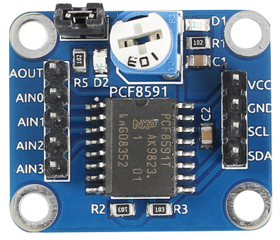
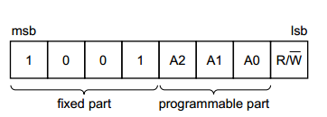
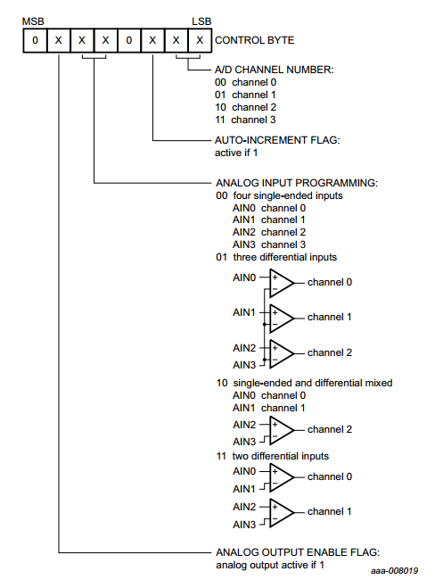
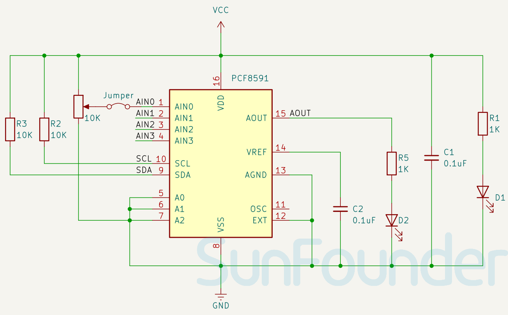

.. note:: 

    ¡Hola, bienvenido a la Comunidad de Entusiastas de SunFounder Raspberry Pi & Arduino & ESP32 en Facebook! Profundiza más en Raspberry Pi, Arduino y ESP32 con otros entusiastas.

    **¿Por qué unirse?**

    - **Soporte experto**: Resuelve problemas postventa y desafíos técnicos con la ayuda de nuestra comunidad y equipo.
    - **Aprende y comparte**: Intercambia consejos y tutoriales para mejorar tus habilidades.
    - **Vistas previas exclusivas**: Accede antes que nadie a nuevos anuncios de productos y avances.
    - **Descuentos especiales**: Disfruta de descuentos exclusivos en nuestros productos más nuevos.
    - **Promociones festivas y sorteos**: Participa en sorteos y promociones especiales.

    👉 ¿Listo para explorar y crear con nosotros? Haz clic en [|link_sf_facebook|] y únete hoy mismo!

.. _cpn_pcf8591:

Módulo Convertidor ADC DAC PCF8591
=====================================

.. raw:: html

    

El PCF8591 es un dispositivo de adquisición de datos CMOS de bajo consumo de energía y 8 bits con una sola fuente de alimentación, que cuenta con cuatro entradas analógicas, una salida analógica y una interfaz de bus serie I2C. Tres pines de dirección A0, A1 y A2 se utilizan para programar la dirección del hardware, lo que permite utilizar hasta ocho dispositivos conectados al bus I2C sin hardware adicional. La dirección, el control y los datos de entrada y salida del dispositivo se transfieren de manera serial a través del bus bidireccional I2C de dos líneas.

Las funciones del dispositivo incluyen multiplexación de entrada analógica, función de seguimiento y retención en el chip, conversión analógico a digital de 8 bits y conversión digital a analógico de 8 bits. La tasa máxima de conversión está determinada por la velocidad máxima del bus I2C.

Principio
---------------------------

**Direccionamiento:**

Cada dispositivo PCF8591 en un sistema de bus I2C se activa enviando una dirección válida al dispositivo. La dirección consta de una parte fija y una parte programable. La parte programable debe configurarse de acuerdo con los pines de dirección A0, A1 y A2. La dirección siempre debe enviarse como el primer byte después de la condición de inicio en el protocolo del bus I2C. El último bit del byte de dirección es el bit de lectura/escritura, que establece la dirección de la transferencia de datos siguiente (ver más abajo).

**Byte de control:**

El segundo byte enviado al dispositivo PCF8591 se almacenará en su registro de control y es necesario para controlar la función del dispositivo. El nibble superior del registro de control se utiliza para habilitar la salida analógica y para programar las entradas analógicas como entradas de un solo extremo o diferenciales. El nibble inferior selecciona uno de los canales de entrada analógica definidos por el nibble superior. Si se activa la bandera de auto-incremento, el número de canal se incrementa automáticamente después de cada conversión A/D. Ver la figura a continuación.

.. _cpn_pcf8591_sch:

Diagrama esquemático
---------------------------

.. raw:: html

    

Ejemplo
---------------------------
* :ref:`uno_lesson10_pcf8591` (Arduino UNO)
* :ref:`esp32_lesson10_pcf8591` (ESP32)
* :ref:`pico_lesson10_pcf8591` (Raspberry Pi Pico)
* :ref:`pi_lesson10_pcf8591` (Raspberry Pi)

* :ref:`pi_lesson02_soil_moisture` (Raspberry Pi)
* :ref:`pi_lesson09_joystick` (Raspberry Pi)
* :ref:`pi_lesson11_photoresistor` (Raspberry Pi)
* :ref:`pi_lesson13_potentiometer` (Raspberry Pi)
* :ref:`pi_lesson25_water_level` (Raspberry Pi)
