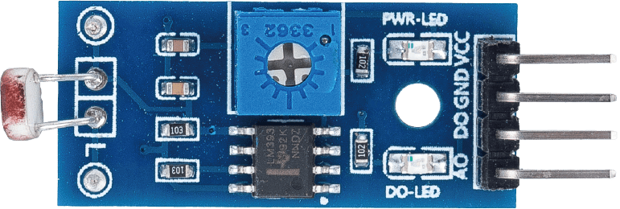
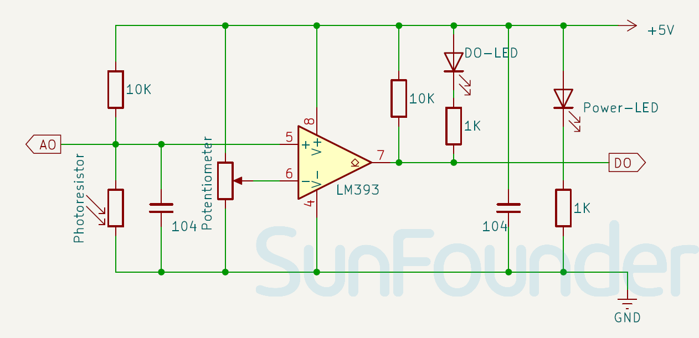

.. note:: 

    ¡Hola, bienvenido a la Comunidad de Entusiastas de SunFounder Raspberry Pi & Arduino & ESP32 en Facebook! Profundiza más en Raspberry Pi, Arduino y ESP32 con otros entusiastas.

    **¿Por qué unirse?**

    - **Soporte experto**: Resuelve problemas postventa y desafíos técnicos con la ayuda de nuestra comunidad y equipo.
    - **Aprende y comparte**: Intercambia consejos y tutoriales para mejorar tus habilidades.
    - **Vistas previas exclusivas**: Accede antes que nadie a nuevos anuncios de productos y avances.
    - **Descuentos especiales**: Disfruta de descuentos exclusivos en nuestros productos más nuevos.
    - **Promociones festivas y sorteos**: Participa en sorteos y promociones especiales.

    👉 ¿Listo para explorar y crear con nosotros? Haz clic en [|link_sf_facebook|] y únete hoy mismo!

.. _cpn_photoresistor:

Módulo de Fotoresistor
===========================

.. raw:: html

    

El módulo de fotoresistor es un dispositivo que puede detectar la intensidad de la luz en el entorno. Puede ser utilizado para diversos propósitos, como ajustar el brillo de un dispositivo, detectar el día y la noche, o activar un interruptor de luz.

Un componente importante del módulo de fotoresistor es el propio fotoresistor. Un fotoresistor es una resistencia variable controlada por la luz. La resistencia de un fotoresistor disminuye a medida que aumenta la intensidad de la luz incidente; en otras palabras, exhibe fotoconductividad.

Un fotoresistor puede aplicarse en circuitos detectores sensibles a la luz y en circuitos de conmutación activados por luz y por oscuridad, funcionando como un semiconductor resistivo. En la oscuridad, un fotoresistor puede tener una resistencia de varios megaohmios (MΩ), mientras que en la luz, un fotoresistor puede tener una resistencia tan baja como unos pocos cientos de ohmios.

Aquí está el símbolo electrónico del fotoresistor.

.. image:: img/11_photoresistor_symbol_2.png
    :width: 200
    :align: center

Especificaciones
---------------------------
* Voltaje de suministro: 3.3V - 5V
* Tamaño de la PCB: 32 x 14mm
* Tipo de señal de salida: DO y AO

Pinout
---------------------------
* **VCC**: Esta es la entrada de suministro de energía positiva del control principal. 
* **GND**: Conexión a tierra.
* **DO**: Salida digital. Cuando la intensidad de la luz supera el valor umbral (ajustado mediante el potenciómetro), D0 se convierte en bajo; de lo contrario, permanece alto.
* **AO**: Salida analógica. Cuanto más fuerte sea la luz, menor será el valor de salida; por el contrario, cuanto más débil sea la luz, mayor será el valor de salida.

Principio
---------------------------
El módulo de fotoresistor funciona según el principio de cambio de resistencia en respuesta a diferentes intensidades de luz. El sensor tiene un potenciómetro incorporado que ajusta el umbral de la salida digital (D0) del sensor.

Diagrama esquemático
---------------------------

.. raw:: html

    

Ejemplo
---------------------------
* :ref:`uno_lesson11_photoresistor` (Arduino UNO)
* :ref:`esp32_lesson11_photoresistor` (ESP32)
* :ref:`pico_lesson11_photoresistor` (Raspberry Pi Pico)
* :ref:`pi_lesson11_photoresistor` (Raspberry Pi)

