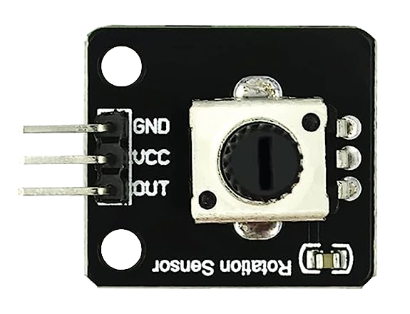
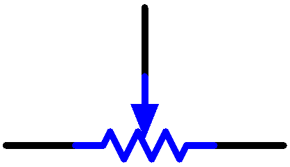
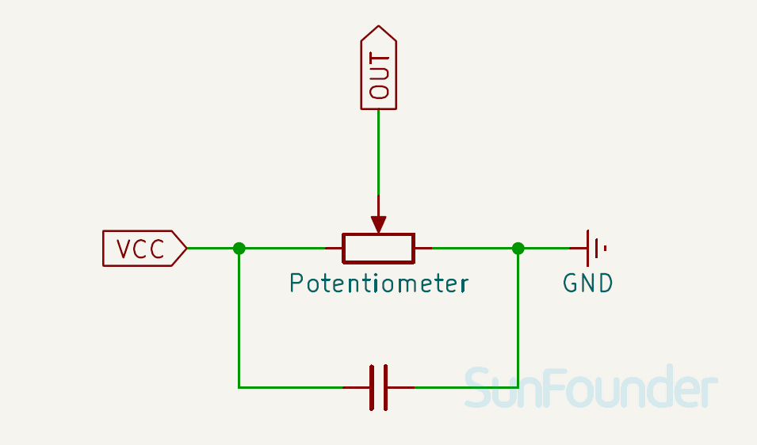

.. note:: 

    ¡Hola, bienvenido a la Comunidad de Entusiastas de SunFounder Raspberry Pi & Arduino & ESP32 en Facebook! Profundiza en Raspberry Pi, Arduino y ESP32 con otros entusiastas.

    **¿Por qué unirse?**

    - **Soporte experto**: Resuelve problemas postventa y desafíos técnicos con la ayuda de nuestra comunidad y equipo.
    - **Aprende y comparte**: Intercambia consejos y tutoriales para mejorar tus habilidades.
    - **Vistas previas exclusivas**: Accede antes que nadie a nuevos anuncios de productos y avances.
    - **Descuentos especiales**: Disfruta de descuentos exclusivos en nuestros productos más nuevos.
    - **Promociones festivas y sorteos**: Participa en sorteos y promociones especiales.

    👉 ¿Listo para explorar y crear con nosotros? Haz clic en [|link_sf_facebook|] y únete hoy mismo!

.. _cpn_potentiometer:

Módulo de Potenciómetro
==========================

.. raw:: html

    

El módulo de potenciómetro es un componente electrónico que cambia su resistencia según la posición del mando giratorio. Se puede utilizar para diversos fines, como controlar el volumen de un altavoz, la intensidad de un LED o la velocidad de un motor.

Pinout
---------------------------
* **VCC**: Entrada de suministro de energía positiva desde el control principal.
* **GND**: Conexión a tierra.
* **AO**: Salida analógica.

Principio
---------------------------
El potenciómetro es también un componente resistivo con 3 terminales y su valor de resistencia puede ajustarse según una variación regular.

Los potenciómetros vienen en diversas formas, tamaños y valores, pero todos tienen las siguientes características comunes:

- Tienen tres terminales (o puntos de conexión).
- Tienen un mando, tornillo o deslizador que se puede mover para variar la resistencia entre el terminal central y uno de los terminales exteriores.
- La resistencia entre el terminal central y cualquiera de los terminales exteriores varía desde 0 Ω hasta la resistencia máxima del potenciómetro, a medida que el mando, tornillo o deslizador se mueve.

Aquí está el símbolo electrónico del potenciómetro.

Las funciones del potenciómetro en el circuito son las siguientes:

#. Sirve como divisor de voltaje
    El potenciómetro es una resistencia ajustable de manera continua. Cuando ajustas el eje o la manija deslizante del potenciómetro, el contacto móvil se desliza sobre la resistencia. En ese momento, se puede obtener un voltaje de salida dependiendo del voltaje aplicado al potenciómetro y el ángulo que ha girado el brazo móvil o el recorrido que ha hecho.

#. Sirve como reóstato
    Cuando el potenciómetro se usa como reóstato, conecta el pin central con uno de los otros dos pines en el circuito. De esta manera, puedes obtener un valor de resistencia que cambia de forma suave y continua dentro del recorrido del contacto móvil.

#. Sirve como controlador de corriente
    Cuando el potenciómetro actúa como controlador de corriente, el terminal de contacto deslizante debe conectarse como uno de los terminales de salida.

Diagrama esquemático
---------------------------

.. raw:: html

    

Ejemplo
---------------------------
* :ref:`uno_lesson13_potentiometer` (Arduino UNO)
* :ref:`esp32_lesson13_potentiometer` (ESP32)
* :ref:`pico_lesson13_potentiometer` (Raspberry Pi Pico)
* :ref:`pi_lesson13_potentiometer` (Raspberry Pi)

* :ref:`uno_lesson43_potentiometer_scale_value` (Arduino UNO)
* :ref:`esp32_potentiometer_scale_value` (ESP32)