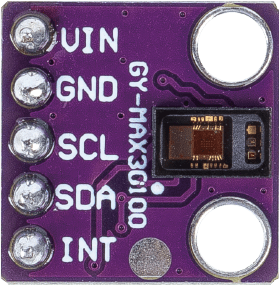

.. note:: 

    Ciao! Benvenuto nella community Facebook dedicata agli appassionati di SunFounder, Raspberry Pi, Arduino ed ESP32! Unisciti a noi per approfondire il mondo di Raspberry Pi, Arduino ed ESP32 insieme ad altri maker ed entusiasti.

    **Perché unirsi?**

    - **Supporto esperto**: Risolvi problemi post-vendita e difficoltà tecniche con l’aiuto della nostra community e del nostro team.
    - **Impara e condividi**: Scambia consigli e tutorial per migliorare le tue competenze.
    - **Anteprime esclusive**: Ottieni accesso anticipato a novità e anteprime sui prodotti.
    - **Sconti speciali**: Approfitta di sconti esclusivi sui nostri prodotti più recenti.
    - **Promozioni festive e giveaway**: Partecipa a omaggi e promozioni speciali durante le festività.

    👉 Pronto a esplorare e creare con noi? Clicca su [|link_sf_facebook|] e unisciti oggi stesso!

.. _cpn_max30102:

Modulo Sensore Pulsossimetro e Frequenza Cardiaca (MAX30102)
===============================================================

.. raw:: html

    

Il MAX30102 è un modulo sensore avanzato progettato per monitorare la frequenza cardiaca e il livello di ossigenazione del sangue (SpO2). Prodotto da Maxim Integrated, combina in un unico chip le funzionalità di pulsossimetria e rilevamento del battito cardiaco, risultando una scelta molto apprezzata per dispositivi indossabili dedicati alla salute e al fitness.

Specifiche
---------------------------
* Tipo di chip: MAX30102  
* Lunghezza d’onda di picco dei LED: 660nm / 880nm  
* Tensione di alimentazione: 3.3V o 5V  
* Tipo di segnale rilevato: Segnale ottico riflesso (PPG)  
* Interfaccia di uscita: Interfaccia I2C  
* Dimensioni PCB: 14 x 14mm  
* Temperatura operativa: -40 ~ +85℃

Pinout
---------------------------
* **VCC**: Ingresso di alimentazione positiva dal controllore principale.  
* **GND**: Collegamento a massa.  
* **SCL**: Pin di clock seriale per l’interfaccia I2C.  
* **SDA**: Pin dati seriali per l’interfaccia I2C.  
* **INT**: Pin di interrupt del chip.

Principio di funzionamento
-----------------------------

Il MAX30102 è un sensore che integra un pulsossimetro e un rilevatore di frequenza cardiaca. Si tratta di un sensore ottico che misura l’assorbimento della luce nel sangue pulsante attraverso un fotodiodo, dopo aver emesso due lunghezze d’onda da due LED — uno rosso e uno a infrarossi. Questa combinazione specifica permette di effettuare letture appoggiando il dito sul sensore.

Il funzionamento si basa sull’emissione di luce rossa e infrarossa sulla pelle (tipicamente su un dito o un lobo dell’orecchio, dove il tessuto non è troppo spesso), e sulla misurazione della luce riflessa tramite un fotodiodo. Questa tecnica di rilevamento si chiama fotopletismografia (PPG).

Il funzionamento del MAX30102 può essere suddiviso in due sezioni principali: misurazione della frequenza cardiaca e pulsossimetria (rilevamento del livello di ossigeno nel sangue).

Misurazione della Frequenza Cardiaca
^^^^^^^^^^^^^^^^^^^^^^^^^^^^^^^^^^^^^^^^
L’emoglobina ossigenata (HbO2) presente nel sangue arterioso assorbe la luce a infrarossi. Più il sangue è ossigenato (più rosso appare), maggiore sarà l’assorbimento della luce IR. Ad ogni battito cardiaco, la quantità di sangue nel dito varia, e di conseguenza anche la quantità di luce riflessa, generando un’onda periodica che può essere interpretata come impulso cardiaco (HR).

Pulsossimetria
^^^^^^^^^^^^^^^^^^^^
La pulsossimetria si basa sul principio che l’assorbimento della luce rossa e infrarossa varia a seconda della quantità di ossigeno presente nel sangue.

Esempi
---------------------------
* :ref:`uno_lesson14_max30102` (Arduino UNO)
* :ref:`esp32_lesson14_max30102` (ESP32)
* :ref:`pico_lesson14_max30102` (Raspberry Pi Pico)
* :ref:`pi_lesson14_max30102` (Raspberry Pi)

* :ref:`uno_lesson41_heartrate_monitor` (Arduino UNO)
* :ref:`esp32_heartrate_monitor` (ESP32)