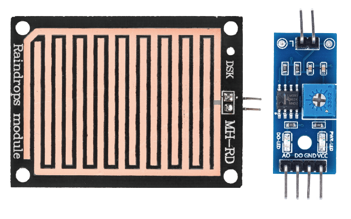
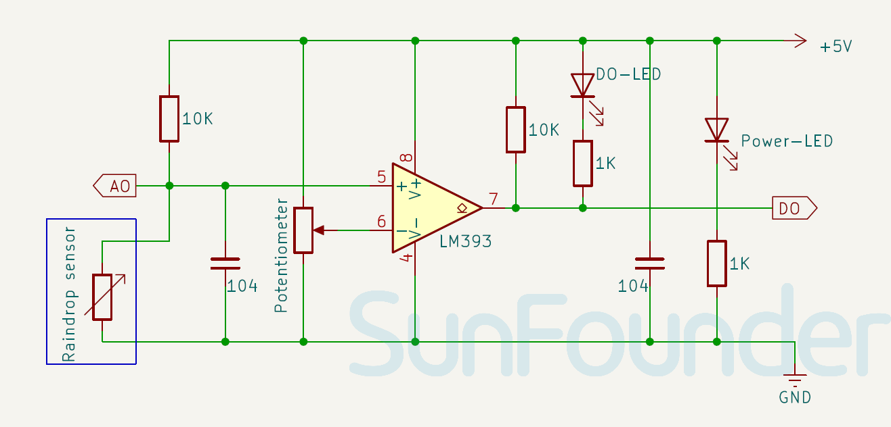

.. note:: 

    Ciao! Benvenuto nella community Facebook dedicata agli appassionati di SunFounder, Raspberry Pi, Arduino ed ESP32! Unisciti a noi per approfondire il mondo di Raspberry Pi, Arduino ed ESP32 insieme ad altri maker ed entusiasti.

    **Perché unirsi?**

    - **Supporto esperto**: Risolvi problemi post-vendita e difficoltà tecniche con il supporto della nostra community e del nostro team.
    - **Impara e condividi**: Scambia suggerimenti e tutorial per migliorare le tue competenze.
    - **Anteprime esclusive**: Ricevi in anticipo annunci e anticipazioni sui nuovi prodotti.
    - **Sconti speciali**: Approfitta di sconti esclusivi sui nostri prodotti più recenti.
    - **Promozioni festive e giveaway**: Partecipa a omaggi e promozioni speciali durante le festività.

    👉 Pronto a esplorare e creare con noi? Clicca su [|link_sf_facebook|] e unisciti oggi stesso!

.. _cpn_raindrop:

Modulo Sensore di Pioggia
============================

Il modulo sensore di pioggia è un sensore meteorologico progettato per rilevare la presenza e l’intensità delle precipitazioni. È composto da una piastra sensibile alla pioggia con piste conduttive stampate, solitamente abbinata a un modulo comparatore. Quando le gocce di pioggia colpiscono la piastra, creano un percorso conduttivo tra le piste, modificando la resistenza. Questa variazione viene quindi convertita in un segnale analogico o digitale per indicare l’intensità della pioggia.

Specifiche
---------------------------
* Tensione di alimentazione: 3.3V - 5V  
* Dimensioni PCB: 32 x 14mm  
* Tipo di segnale in uscita: DO e AO  

Pinout
---------------------------
* **VCC**: Ingresso di alimentazione positiva dal controllore principale.  
* **GND**: Collegamento a massa.  
* **DO**: Uscita digitale. Emette livello basso quando viene rilevata pioggia, e livello alto quando è asciutto.  
* **AO**: Uscita analogica. Più è abbondante la pioggia, più basso sarà il valore analogico in uscita.

Principio di funzionamento
---------------------------
Il sensore di pioggia è essenzialmente una piastra su cui è stato applicato un rivestimento in nichel sotto forma di linee conduttive. Il suo funzionamento si basa sul principio della variazione di resistenza. In assenza di pioggia, la resistenza tra le linee è elevata e quindi, secondo la legge di Ohm (V=IR), la tensione è alta. Quando sono presenti gocce d’acqua, la resistenza diminuisce poiché l’acqua è conduttrice e mette in collegamento le linee di nichel, abbassando così la resistenza e la tensione. Maggiore è l’intensità della pioggia, minore sarà la resistenza.

Schema elettrico
---------------------------

.. raw:: html

    

Esempi
---------------------------
* :ref:`uno_lesson15_raindrop` (Arduino UNO)
* :ref:`esp32_lesson15_raindrop` (ESP32)
* :ref:`pico_lesson15_raindrop` (Raspberry Pi Pico)
* :ref:`pi_lesson15_raindrop` (Raspberry Pi)
