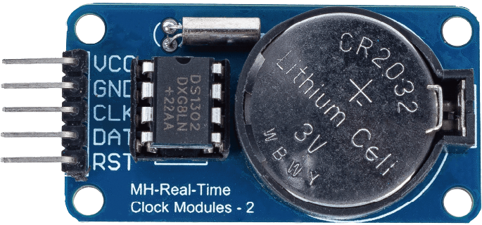
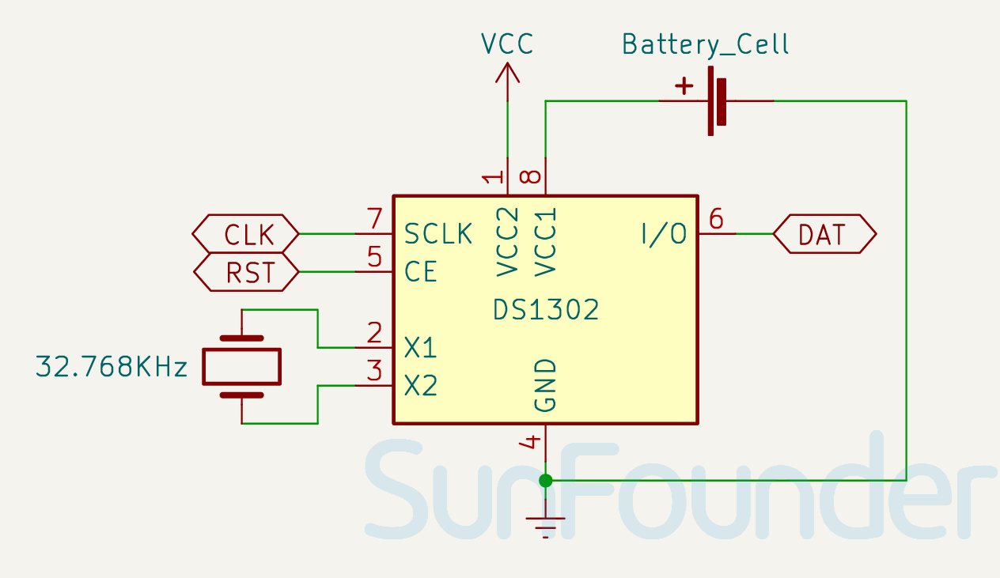

.. note:: 

    ¡Hola, bienvenido a la Comunidad de Entusiastas de SunFounder Raspberry Pi & Arduino & ESP32 en Facebook! Profundiza más en Raspberry Pi, Arduino y ESP32 con otros entusiastas.

    **¿Por qué unirse?**

    - **Soporte experto**: Resuelve problemas postventa y desafíos técnicos con la ayuda de nuestra comunidad y equipo.
    - **Aprende y comparte**: Intercambia consejos y tutoriales para mejorar tus habilidades.
    - **Vistas previas exclusivas**: Accede antes que nadie a nuevos anuncios de productos y avances.
    - **Descuentos especiales**: Disfruta de descuentos exclusivos en nuestros productos más nuevos.
    - **Promociones festivas y sorteos**: Participa en sorteos y promociones especiales.

    👉 ¿Listo para explorar y crear con nosotros? Haz clic en [|link_sf_facebook|] y únete hoy mismo!

.. _cpn_rtc_ds1302:

Módulo de Reloj en Tiempo Real (DS1302)
=========================================

.. raw:: html

    

El módulo DS1302 es un módulo de Reloj en Tiempo Real (RTC) que puede rastrear años, meses, días, días de la semana, horas, minutos y segundos. También tiene la capacidad de ajustar los años bisiestos. Es útil para crear proyectos que requieren un tiempo preciso y programación de eventos.

Especificaciones
---------------------------
* Tensión de suministro: 3.3V - 5V
* Tamaño del PCB: 44 x 23mm
* IC del reloj: DS1302
* Temperatura de funcionamiento: 0℃ - 70℃

Pinout
---------------------------
* **VCC**: Fuente de alimentación del módulo
* **GND**: Tierra
* **CLK**: Pin de reloj
* **DAT**: Pin de datos
* **RST**: Pin de reinicio

Esquema
---------------------------

.. raw:: html

    

Ejemplo
---------------------------
* :ref:`uno_lesson16_ds1306` (Arduino UNO)
* :ref:`esp32_lesson16_ds1306` (ESP32)
* :ref:`pico_lesson16_ds1306` (Raspberry Pi Pico)
