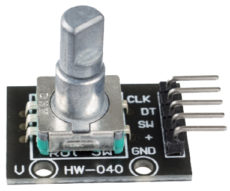
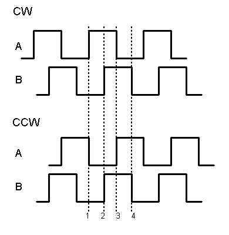
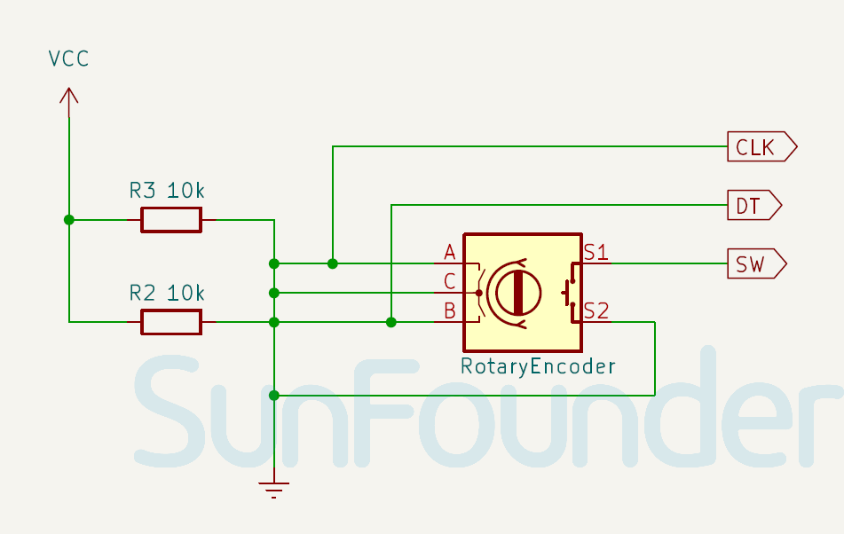

.. note::

    Bonjour, bienvenue dans la communauté des passionnés de SunFounder Raspberry Pi, Arduino et ESP32 sur Facebook ! Approfondissez vos connaissances sur Raspberry Pi, Arduino et ESP32 avec d'autres passionnés.

    **Pourquoi rejoindre ?**

    - **Support d'experts** : Résolvez les problèmes après-vente et les défis techniques avec l'aide de notre communauté et de notre équipe.
    - **Apprendre & Partager** : Échangez des astuces et des tutoriels pour améliorer vos compétences.
    - **Aperçus exclusifs** : Bénéficiez d'un accès en avant-première aux annonces de nouveaux produits et aux avant-premières.
    - **Réductions spéciales** : Profitez de réductions exclusives sur nos produits les plus récents.
    - **Promotions festives et cadeaux** : Participez à des tirages au sort et des promotions de fêtes.

    👉 Prêts à explorer et à créer avec nous ? Cliquez sur [|link_sf_facebook|] et rejoignez-nous aujourd'hui !

.. _cpn_rotary_encoder:

Module Encodeur Rotatif
=====================================

.. raw:: html

    

Un encodeur rotatif est un capteur de position qui convertit la rotation d'un bouton en un signal de sortie, indiquant la direction dans laquelle le bouton est tourné.

Les encodeurs rotatifs sont des versions numériques de potentiomètres, offrant une plus grande polyvalence. Ils peuvent tourner en continu, alors que les potentiomètres ont une rotation limitée. Les potentiomètres indiquent la position exacte du bouton, tandis que les encodeurs rotatifs montrent des changements de position.

Brochage
---------------------------
* **VCC** : C'est l'entrée d'alimentation positive du contrôle principal.
* **GND** : Connexion à la terre.
* **SW** : Sortie numérique.
* **CLK** : similaire à la sortie CLK, mais elle est retardée de 90° par rapport à CLK. Cette sortie est utilisée pour déterminer la direction de la rotation.
* **DT** : est l'impulsion de sortie principale utilisée pour déterminer la quantité de rotation. Chaque fois que le bouton est tourné dans l'une ou l'autre direction d'un seul cran (clic), la sortie « CLK » passe par un cycle de montée puis de descente.

Principe
---------------------------

Les encodeurs incrémentiels produisent des ondes carrées en deux phases, avec une différence de phase de 90 degrés communément appelée les canaux A et B.

Comme illustré ci-dessous, lorsque le canal A passe d'un niveau élevé à un niveau bas, si le canal B est à un niveau élevé, cela indique que l'encodeur rotatif tourne dans le sens horaire (CW) ; si à ce moment le canal B est à un niveau bas, cela signifie que la rotation est dans le sens antihoraire (CCW). Ainsi, en lisant la valeur du canal B lorsque le canal A est à un niveau bas, nous pouvons déterminer la direction de rotation de l'encodeur rotatif.

Schéma
---------------------------

.. raw:: html

    

Exemple
---------------------------
* :ref:`uno_lesson17_rotary_encoder` (Arduino UNO)
* :ref:`esp32_lesson17_rotary_encoder` (ESP32)
* :ref:`pico_lesson17_rotary_encoder` (Raspberry Pi Pico)
* :ref:`pi_lesson17_rotary_encoder` (Raspberry Pi)