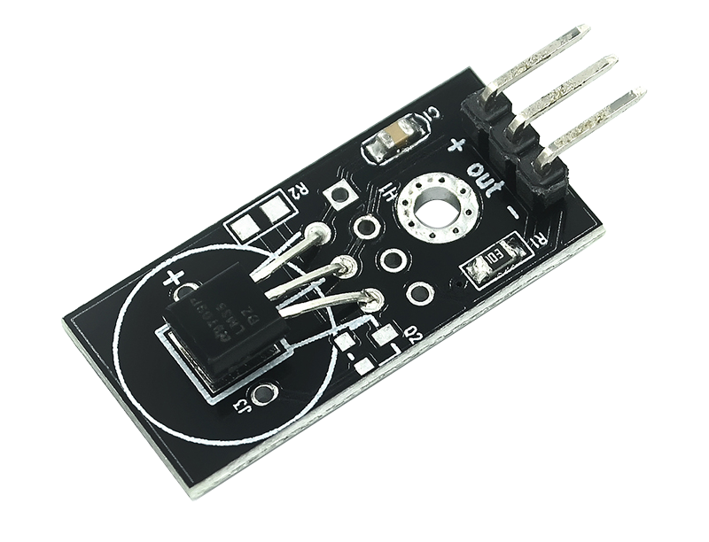
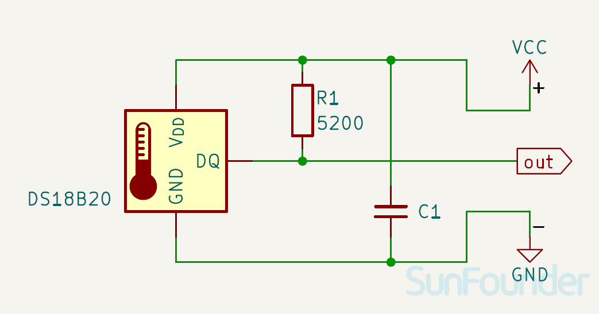

.. note:: 

    Ciao! Benvenuto nella community Facebook dedicata agli appassionati di SunFounder, Raspberry Pi, Arduino ed ESP32! Unisciti a noi per approfondire il mondo di Raspberry Pi, Arduino ed ESP32 insieme ad altri maker ed entusiasti.

    **Perché unirsi?**

    - **Supporto esperto**: Risolvi problemi post-vendita e difficoltà tecniche con l’aiuto della nostra community e del nostro team.
    - **Impara e condividi**: Scambia consigli e tutorial per migliorare le tue competenze.
    - **Anteprime esclusive**: Ottieni accesso anticipato a novità e anteprime sui nuovi prodotti.
    - **Sconti speciali**: Approfitta di sconti esclusivi sui nostri prodotti più recenti.
    - **Promozioni festive e giveaway**: Partecipa a omaggi e promozioni speciali durante le festività.

    👉 Pronto a esplorare e creare con noi? Clicca su [|link_sf_facebook|] e unisciti oggi stesso!

.. _cpn_ds18b20:

Modulo Sensore di Temperatura (DS18B20)
===============================================

.. raw:: html

    

Il DS18B20 è un sensore di temperatura digitale in grado di misurare temperature comprese tra -67°F e +257°F (da -55°C a +125°C) con una precisione di ±0,5°C. Utilizza il protocollo 1-Wire e può comunicare con un microcontrollore usando un solo pin. Il sensore può essere alimentato direttamente attraverso la linea dati, senza la necessità di un'alimentazione esterna. Le sue applicazioni includono sistemi industriali, prodotti di consumo, dispositivi sensibili alla temperatura, controlli termostatici e termometri.

Specifiche
---------------------------
* Dimensioni PCB: 13 x 27,9 mm  
* Alimentazione: da 3V a 5,5V  
* Intervallo di temperatura: da -55°C a +125°C  
* Precisione: ±0,5°C  
* Risoluzione: da 9 a 12 bit (selezionabile)

Pinout
---------------------------
* **VCC**: Ingresso di alimentazione positiva dal controllore principale.  
* **GND**: Collegamento a massa.  
* **OUT**: Bus dati 1-Wire da collegare a un pin digitale del microcontrollore.

Schema elettrico
---------------------------

.. raw:: html

    

Esempi
---------------------------
* :ref:`uno_lesson18_ds18b20` (Arduino UNO)
* :ref:`esp32_lesson18_ds18b20` (ESP32)
* :ref:`pico_lesson18_ds18b20` (Raspberry Pi Pico)
* :ref:`pi_lesson18_ds18b20` (Raspberry Pi)