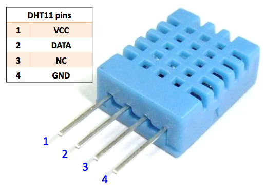

.. note::

    Bonjour et bienvenue dans la communauté des passionnés de SunFounder Raspberry Pi, Arduino et ESP32 sur Facebook ! Approfondissez votre connaissance des Raspberry Pi, Arduino et ESP32 avec d'autres passionnés.

    **Pourquoi rejoindre ?**

    - **Support d'experts** : Résolvez les problèmes après-vente et les défis techniques avec l'aide de notre communauté et de notre équipe.
    - **Apprendre & Partager** : Échangez des astuces et des tutoriels pour améliorer vos compétences.
    - **Aperçus exclusifs** : Obtenez un accès en avant-première aux annonces de nouveaux produits et aux coulisses.
    - **Réductions spéciales** : Profitez de réductions exclusives sur nos produits les plus récents.
    - **Promotions festives et cadeaux** : Participez à des tirages au sort et à des promotions festives.

    👉 Prêts à explorer et créer avec nous ? Cliquez sur [|link_sf_facebook|] et rejoignez-nous aujourd'hui !

.. _cpn_dht11:

Module Capteur de Température et d'Humidité (DHT11)
======================================================

.. image:: img/19_dht11_module.png
    :width: 360
    :align: center

.. raw:: html

    

Le DHT11 est un capteur numérique de température et d'humidité qui intègre une sortie de signal numérique calibrée de température et d'humidité. La technologie des modules numériques dédiés et la technologie de détection de température et d'humidité sont appliquées pour assurer que le produit a une fiabilité élevée et une excellente stabilité à long terme.

Spécifications
---------------------------
* Tension d'alimentation : 3,3V - 5V
* Type de signal de sortie : Sortie numérique
* Plage de mesure de la température : 0-50℃ ± 2℃
* Plage de mesure de l'humidité : 20-90%RH ± 5%RH
* Précision de la température : ±2°C
* Précision de l'humidité : ±5% RH

Brochage
---------------------------
* **VCC** : C'est l'entrée d'alimentation positive du contrôle principal.
* **GND** : Connexion à la terre.
* **S** : Cette broche est utilisée pour transmettre les données de température et d'humidité au microcontrôleur via un protocole unifilaire bidirectionnel.

Principe
---------------------------
Seules trois broches sont disponibles pour l'utilisation : VCC, GND et DATA. Le processus de communication commence par la ligne DATA envoyant des signaux de démarrage au DHT11, et le DHT11 reçoit les signaux et renvoie un signal de réponse. Ensuite, l'hôte reçoit le signal de réponse et commence à recevoir les données de température et d'humidité sur 40 bits (8 bits entier d'humidité + 8 bits décimal d'humidité + 8 bits entier de température + 8 bits décimal de température + 8 bits de somme de contrôle).

.. raw:: html
    
     

Schéma
---------------------------

.. csv-table:: 
   :widths: 30, 70

   |dht11_module|, |dht11_module_schematic|
   |dht11_module_withLED|, |dht11_module_withLED_schematic|

.. |dht11_module| image:: img/19_dht11_module.png
   :width: 100px
.. |dht11_module_withLED| image:: img/19_dht11_module_withLED.png
   :width: 150px
.. |dht11_module_schematic| image:: img/19_dht11_module_schematic.png
   :width: 360px
.. |dht11_module_withLED_schematic| image:: img/19_dht11_module_withLED_schematic.png
   :width: 360px

Exemple
---------------------------
* :ref:`uno_lesson19_dht11` (Arduino UNO)
* :ref:`esp32_lesson19_dht11` (ESP32)
* :ref:`pico_lesson19_dht11` (Raspberry Pi Pico)
* :ref:`pi_lesson19_dht11` (Raspberry Pi)

* :ref:`uno_lesson45_plant_monitor` (Arduino UNO)
* :ref:`esp32_plant_monitor` (ESP32)
* :ref:`esp32_adafruit_io` (ESP32)