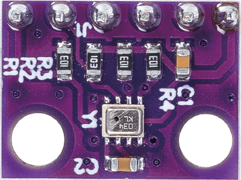
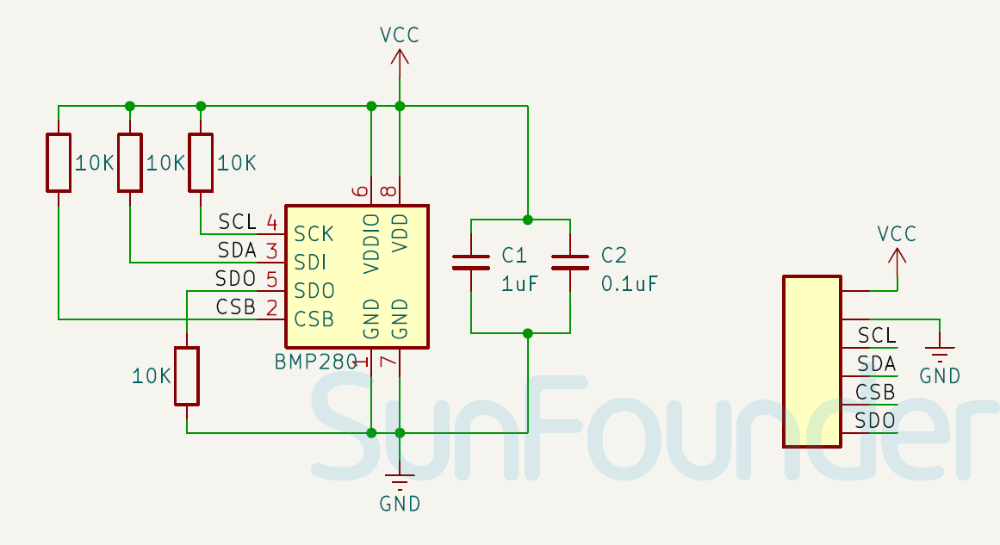

.. note::

    Bonjour et bienvenue dans la communauté des passionnés de SunFounder Raspberry Pi, Arduino et ESP32 sur Facebook ! Plongez plus profondément dans les univers du Raspberry Pi, de l'Arduino et de l'ESP32 avec d'autres passionnés.

    **Pourquoi rejoindre ?**

    - **Support d'experts** : Résolvez les problèmes après-vente et les défis techniques avec l'aide de notre communauté et de notre équipe.
    - **Apprendre & Partager** : Échangez des astuces et des tutoriels pour améliorer vos compétences.
    - **Aperçus exclusifs** : Obtenez un accès anticipé aux annonces de nouveaux produits et aux avant-premières.
    - **Réductions spéciales** : Profitez de réductions exclusives sur nos produits les plus récents.
    - **Promotions festives et cadeaux** : Participez à des tirages au sort et des promotions de fêtes.

    👉 Prêts à explorer et à créer avec nous ? Cliquez sur [|link_sf_facebook|] et rejoignez-nous aujourd'hui !

.. _cpn_bmp280:

Capteur de Température, d'Humidité et de Pression (BMP280)
===============================================================

.. raw:: html
    
     

Le BMP280, développé par Bosch Sensortec, est un module de capteur numérique de haute précision et de faible puissance pour mesurer la pression barométrique et la température. Il est largement utilisé dans les appareils mobiles, le suivi météorologique, les estimations d'altitude et diverses autres applications nécessitant des données précises sur la pression atmosphérique et la température en raison de sa petite taille et de ses performances supérieures.

Spécifications
---------------------------
* Tension d'alimentation : 3.3V ou 5V
* Taille du PCB : 15 x 11mm
* Plage de température de fonctionnement : -40 ~ +85℃
* Plage de mesure de la pression de l'air : 300 ~ 1100hPa
* Interface : I2C (jusqu'à 3.4MHz), SPI (jusqu'à 10MHz)

Brochage
---------------------------
* **VCC** : C'est l'entrée d'alimentation positive du contrôle principal.
* **GND** : Connexion à la terre.
* **SCL** : Broche d'horloge série pour l'interface I2C.
* **SDA** : Broche de données série pour l'interface I2C.
* **CSB** : Broche de sélection de puce du module, si vous communiquez avec le dispositif en SPI vous pouvez utiliser cette broche pour sélectionner un dispositif si plusieurs dispositifs sont connectés sur le même bus.
* **SDO** : Broche de sortie de données série du module. Un signal de sortie sur un dispositif où les données sont envoyées à un autre dispositif SPI.

Schéma
---------------------------

.. raw:: html

    

Exemple
---------------------------
* :ref:`uno_lesson20_bmp280` (Arduino UNO)
* :ref:`esp32_lesson20_bmp280` (ESP32)
* :ref:`pico_lesson20_bmp280` (Raspberry Pi Pico)
* :ref:`pi_lesson20_bmp280` (Raspberry Pi)
* :ref:`uno_iot_weather_monito` (Arduino UNO)