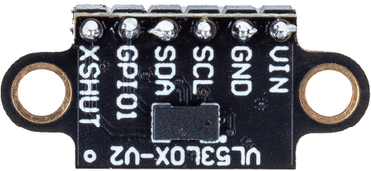

.. note:: 

    ¡Hola, bienvenido a la Comunidad de Entusiastas de Raspberry Pi, Arduino y ESP32 en Facebook! Profundiza en Raspberry Pi, Arduino y ESP32 junto con otros entusiastas.

    **¿Por qué unirse?**

    - **Soporte experto**: Resuelve problemas postventa y desafíos técnicos con la ayuda de nuestra comunidad y equipo.
    - **Aprender y compartir**: Intercambia consejos y tutoriales para mejorar tus habilidades.
    - **Vistazos exclusivos**: Obtén acceso anticipado a nuevos anuncios de productos y adelantos.
    - **Descuentos especiales**: Disfruta de descuentos exclusivos en nuestros productos más nuevos.
    - **Promociones festivas y sorteos**: Participa en sorteos y promociones especiales de temporada.

    👉 ¿Listo para explorar y crear con nosotros? Haz clic en [|link_sf_facebook|] y únete hoy mismo.

.. _cpn_VL53L0X:

Sensor de distancia Micro-LIDAR Time of Flight (VL53L0X)
===============================================================

.. raw:: html
    
     

El módulo VL53L0X es un sensor avanzado de medición de distancia mediante el principio Time of Flight (ToF) que ofrece mediciones de distancia altamente precisas, independientemente del color o la reflectancia del objetivo. Fabricado por STMicroelectronics, este sensor destaca por medir distancias absolutas de hasta 2 metros, lo que lo hace ideal para aplicaciones en áreas como robótica, drones y dispositivos portátiles.

Especificaciones
---------------------------
* Voltaje de suministro: 3.3V o 5V
* Tamaño de PCB: 11 x 25 mm
* Método de comunicación: I2C
* Distancia de medición ToF: ≤2M

Conexiones
---------------------------
* **VIN**: Este es el pin de alimentación.
* **GND**: Tierra común para alimentación y lógica.
* **SCL**: Pin de reloj I2C, conéctalo a la línea de reloj I2C de tu microcontrolador.
* **SDA**: Pin de datos I2C, conéctalo a la línea de datos I2C de tu microcontrolador.
* **GPIO1**: Salida de interrupción programable. Esta salida no está desplazada en nivel.
* **XSHUT**: Este pin es una entrada de apagado activo bajo; al poner este pin en bajo, el sensor entra en modo de espera. Esta entrada no está desplazada en nivel.

Ejemplo
---------------------------
* :ref:`uno_lesson21_vl53l0x` (Arduino UNO)
* :ref:`esp32_lesson21_vl53l0x` (ESP32)
* :ref:`pico_lesson21_vl53l0x` (Raspberry Pi Pico)
* :ref:`pi_lesson21_vl53l0x` (Raspberry Pi)