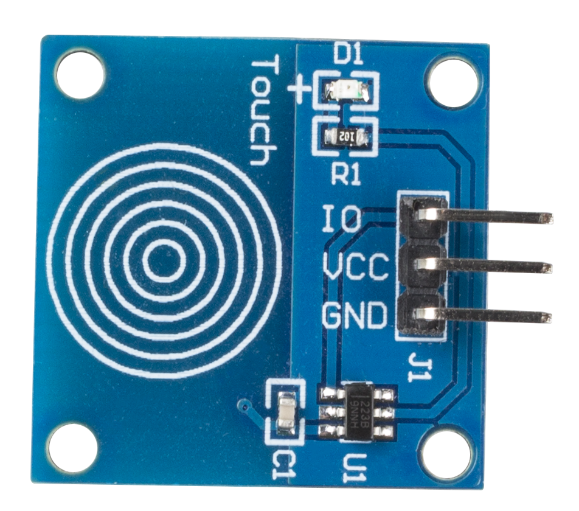
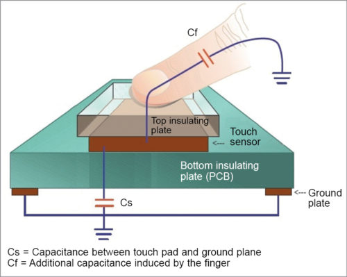
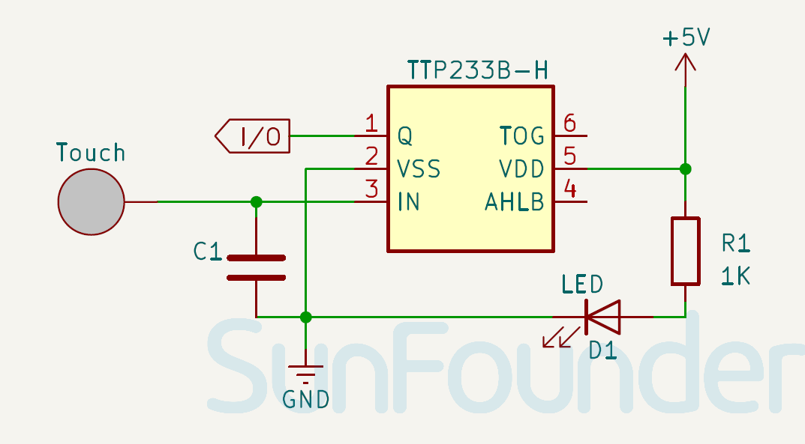

.. note:: 

    Ciao! Benvenuto nella community Facebook dedicata agli appassionati di SunFounder, Raspberry Pi, Arduino ed ESP32! Unisciti a noi per approfondire il mondo di Raspberry Pi, Arduino ed ESP32 insieme ad altri maker ed entusiasti.

    **Perché unirsi?**

    - **Supporto esperto**: Risolvi problemi post-vendita e sfide tecniche con l’aiuto della nostra community e del nostro team.
    - **Impara e condividi**: Scambia consigli e tutorial per migliorare le tue competenze.
    - **Anteprime esclusive**: Ottieni accesso anticipato a novità e anteprime sui nuovi prodotti.
    - **Sconti speciali**: Approfitta di sconti esclusivi sui nostri prodotti più recenti.
    - **Promozioni festive e giveaway**: Partecipa a omaggi e promozioni speciali durante le festività.

    👉 Pronto a esplorare e creare con noi? Clicca su [|link_sf_facebook|] e unisciti oggi stesso!

.. _cpn_touch:

Modulo Sensore Touch
==========================

Il sensore touch (noto anche come pulsante touch o interruttore touch) è ampiamente utilizzato per il controllo di dispositivi, come ad esempio lampade tattili. Ha la stessa funzionalità di un pulsante meccanico, ma viene sempre più utilizzato nei dispositivi moderni perché dona al prodotto un aspetto più elegante e pulito.

Pinout
---------------------------
* **VCC**: Ingresso di alimentazione positiva dal controllore principale.  
* **GND**: Collegamento a massa.  
* **IO**: Uscita digitale. Livello alto quando toccato, livello basso quando non toccato.

Principio di funzionamento
------------------------------
Questo modulo è un interruttore capacitivo basato sul chip sensore TTP223B. In condizioni normali, il modulo emette un livello basso con basso consumo energetico; quando un dito tocca la superficie sensibile, il modulo passa a livello alto e ritorna a livello basso dopo che il dito viene rimosso.

Ecco come funziona un interruttore capacitivo:

Un interruttore touch capacitivo è composto da diversi strati: una piastra isolante superiore, seguita da una piastra conduttiva, un altro strato isolante e infine una piastra di massa.

.. raw:: html

     

In pratica, un sensore capacitivo può essere realizzato su un PCB a doppia faccia, utilizzando un lato come area sensibile al tocco e l'altro lato come piastra di massa. Quando viene applicata una tensione tra queste due superfici, esse si caricano come in un condensatore. In stato di equilibrio, entrambe le piastre raggiungono la stessa tensione della sorgente.

Il circuito di rilevamento contiene un oscillatore la cui frequenza dipende dalla capacità del pad touch. Quando un dito si avvicina al pad, l’aumento di capacità altera la frequenza dell’oscillatore. Il circuito di rilevamento monitora questa frequenza a intervalli regolari e, quando la variazione supera una soglia predefinita, viene generato un evento di pressione del tasto.

Schema elettrico
---------------------------

.. raw:: html

    

Esempi
---------------------------
* :ref:`uno_lesson22_touch_sensor` (Arduino UNO)  
* :ref:`esp32_lesson22_touch_sensor` (ESP32)  
* :ref:`pico_lesson22_touch_sensor` (Raspberry Pi Pico)  
* :ref:`pi_lesson22_touch_sensor` (Raspberry Pi)  

* :ref:`uno_lesson42_touch_toggle_light` (Arduino UNO)  
* :ref:`esp32_touch_toggle_light` (ESP32)