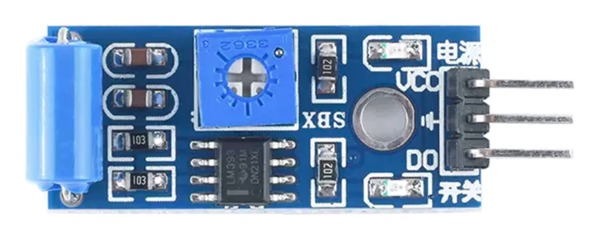
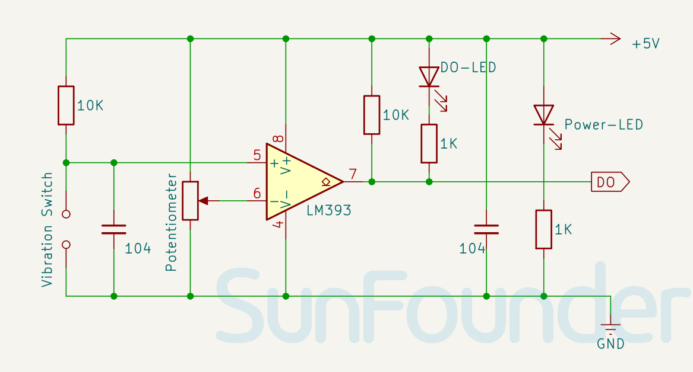

.. note:: 

    Ciao! Benvenuto nella community Facebook dedicata agli appassionati di SunFounder, Raspberry Pi, Arduino ed ESP32! Unisciti a noi per approfondire il mondo di Raspberry Pi, Arduino ed ESP32 insieme ad altri maker ed entusiasti.

    **Perché unirsi?**

    - **Supporto esperto**: Risolvi problemi post-vendita e sfide tecniche con l’aiuto della nostra community e del nostro team.
    - **Impara e condividi**: Scambia consigli e tutorial per migliorare le tue competenze.
    - **Anteprime esclusive**: Ottieni accesso anticipato a novità e anteprime sui nuovi prodotti.
    - **Sconti speciali**: Approfitta di sconti esclusivi sui nostri prodotti più recenti.
    - **Promozioni festive e giveaway**: Partecipa a omaggi e promozioni speciali durante le festività.

    👉 Pronto a esplorare e creare con noi? Clicca su [|link_sf_facebook|] e unisciti oggi stesso!

.. _cpn_vibration:

Modulo Sensore di Vibrazione (SW-420)
========================================

Il sensore di vibrazione SW-420 è un modulo in grado di rilevare vibrazioni o urti su una superficie. Può essere utilizzato in molte applicazioni, come la rilevazione di colpi alla porta, malfunzionamenti di macchine, collisioni di veicoli o in sistemi di allarme. Funziona con una tensione di alimentazione compresa tra 3.3V e 5V ed è dotato di tre componenti principali: due LED (uno per lo stato dell’alimentazione e uno per l’uscita del sensore) e un potenziometro che consente di regolare la soglia di sensibilità alla vibrazione.

Pinout
---------------------------
* **VCC**: Ingresso di alimentazione positiva dal controllore principale.  
* **GND**: Collegamento a massa.  
* **DO**: Uscita digitale. Durante il normale funzionamento, il sensore fornisce un segnale LOW. Quando viene rilevata una vibrazione, l'uscita passa a livello HIGH.

Principio di funzionamento
-----------------------------
Il modulo SW-420 è composto da un interruttore a vibrazione SW-420 e da un comparatore di tensione LM393. L’interruttore a vibrazione contiene una molla e un’asta all’interno di un tubo. Quando il dispositivo è soggetto a vibrazioni, la molla entra in contatto con l’asta, chiudendo il circuito. Il sensore rileva queste oscillazioni e le converte in segnali elettrici. Il chip comparatore LM393 confronta questi segnali con una tensione di riferimento impostata tramite il potenziometro. Se l’ampiezza del segnale supera questa soglia, l’uscita del comparatore va a livello alto (1), altrimenti rimane a livello basso (0).

Schema elettrico
----------------------------

.. raw:: html

    

Esempi
---------------------------
* :ref:`uno_lesson24_vibration_sensor` (Arduino UNO)  
* :ref:`esp32_lesson24_vibration_sensor` (ESP32)  
* :ref:`pico_lesson24_vibration_sensor` (Raspberry Pi Pico)  
* :ref:`pi_lesson24_vibration_sensor` (Raspberry Pi)  

* :ref:`uno_lesson44_digital_dice` (Arduino UNO)  
* :ref:`uno_iot_vib_alert_system` (Arduino UNO)  
* :ref:`esp32_digital_dice` (ESP32)