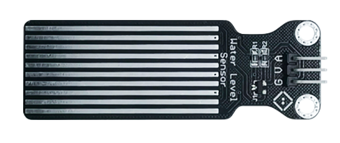
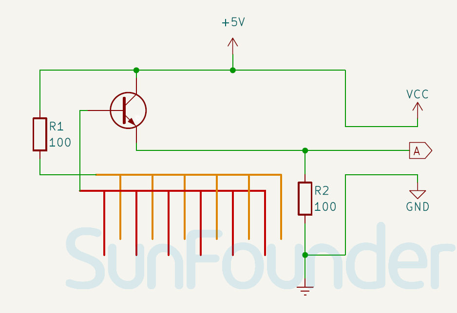

.. note::

    Bonjour et bienvenue dans la communauté des passionnés de SunFounder Raspberry Pi, Arduino et ESP32 sur Facebook ! Plongez plus profondément dans les univers du Raspberry Pi, de l'Arduino et de l'ESP32 avec d'autres passionnés.

    **Pourquoi rejoindre ?**

    - **Support d'experts** : Résolvez les problèmes après-vente et les défis techniques avec l'aide de notre communauté et de notre équipe.
    - **Apprendre & Partager** : Échangez des astuces et des tutoriels pour améliorer vos compétences.
    - **Aperçus exclusifs** : Bénéficiez d'un accès en avant-première aux annonces de nouveaux produits et aux avant-premières.
    - **Réductions spéciales** : Profitez de réductions exclusives sur nos nouveaux produits.
    - **Promotions festives et cadeaux** : Participez à des tirages au sort et des promotions festives.

    👉 Prêts à explorer et à créer avec nous ? Cliquez sur [|link_sf_facebook|] et rejoignez-nous aujourd'hui !

.. _cpn_water_level:

Module Capteur de Niveau d'Eau
=====================================

.. raw:: html

    

Le capteur de niveau d'eau est un dispositif abordable et convivial, compact et léger. Il utilise des traces de fils parallèles exposés pour mesurer la taille des gouttes d'eau ou le volume, permettant ainsi de déterminer le niveau d'eau. Ce capteur convertit sans effort les niveaux d'eau en signaux analogiques, qui peuvent être facilement utilisés par les fonctions de programmation pour déclencher des alarmes de niveau d'eau. Sa faible consommation d'énergie et sa grande sensibilité sont également des caractéristiques remarquables.

Spécifications
---------------------------
* Tension d'alimentation : 3,3V ou 5V
* Taille du PCB : 22 x 60mm
* Plage de température de fonctionnement : 10℃ - 30℃
* Plage d'humidité de fonctionnement : 10% - 90%

Brochage
---------------------------
* **V** : C'est l'entrée d'alimentation positive du contrôle principal.
* **G** : Connexion à la terre.
* **A** : Sortie analogique. Plus le niveau d'eau est élevé, plus la tension de sortie est grande.

Schéma
---------------------------

.. raw:: html

    

Exemple
---------------------------
* :ref:`uno_lesson25_water_level` (Arduino UNO)
* :ref:`esp32_lesson25_water_level` (ESP32)
* :ref:`pico_lesson25_water_level` (Raspberry Pi Pico)
* :ref:`pi_lesson25_water_level` (Raspberry Pi)
