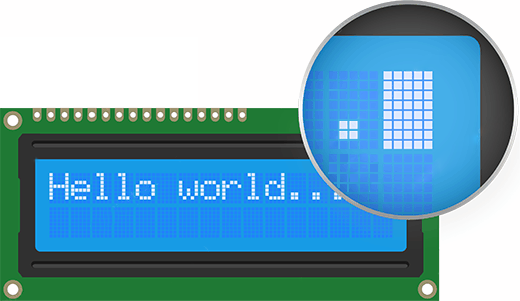

.. note:: 

    Ciao! Benvenuto nella community Facebook dedicata agli appassionati di SunFounder, Raspberry Pi, Arduino ed ESP32! Unisciti a noi per approfondire il mondo di Raspberry Pi, Arduino ed ESP32 insieme ad altri maker ed entusiasti.

    **Perché unirsi?**

    - **Supporto esperto**: Risolvi problemi post-vendita e sfide tecniche con l’aiuto della nostra community e del nostro team.
    - **Impara e condividi**: Scambia consigli e tutorial per migliorare le tue competenze.
    - **Anteprime esclusive**: Ottieni accesso anticipato a novità e anteprime sui nuovi prodotti.
    - **Sconti speciali**: Approfitta di sconti esclusivi sui nostri prodotti più recenti.
    - **Promozioni festive e giveaway**: Partecipa a omaggi e promozioni speciali durante le festività.

    👉 Pronto a esplorare e creare con noi? Clicca su [|link_sf_facebook|] e unisciti oggi stesso!

.. _cpn_i2c_lcd1602:

I2C LCD 1602
==========================

.. image:: img/26_i2c_lcd.png
    :width: 90%
    :align: center

.. raw:: html

    

Un I2C LCD1602 è un dispositivo in grado di visualizzare testo e caratteri su un display a cristalli liquidi (LCD) 16x2 (16 colonne e 2 righe) utilizzando il protocollo I2C. Può essere utilizzato per mostrare informazioni dai tuoi progetti Arduino, come letture da sensori, messaggi, menu, ecc. Il modulo I2C include un chip PCF8574 che converte i dati seriali I2C in dati paralleli per il display LCD.

* |link_PCF8574_Datasheet|

Principio di funzionamento
-------------------------------

Un I2C LCD1602 è composto da un normale display LCD1602 e da un modulo I2C montato sul retro. Il modulo I2C è un chip che espande le porte I/O dell’Arduino tramite il protocollo I2C. Questo protocollo seriale di comunicazione utilizza due fili: SDA (dati) e SCL (clock). Permette la comunicazione tra più dispositivi tramite due soli fili e indirizzi univoci.

Il modulo I2C converte i segnali provenienti dall’Arduino in comandi per l’LCD. L’LCD dispone di 16x2 celle in grado di visualizzare caratteri o simboli. Ogni cella è composta da una matrice di 5x8 punti che possono essere attivati o disattivati applicando una tensione. Combinazioni diverse di punti accesi permettono di mostrare simboli o lettere.

.. raw:: html
    
       

**Indirizzo I2C**

L’indirizzo predefinito è solitamente 0x27, ma in alcuni casi potrebbe essere 0x3F.

Prendendo come esempio l’indirizzo predefinito 0x27, è possibile modificarlo cortocircuitando i pad A0/A1/A2; in stato predefinito A0/A1/A2 sono impostati su 1. Se si effettua un cortocircuito, il valore corrispondente diventa 0.

.. image:: img/26_i2c_address.jpg
    :width: 600
    :align: center

.. raw:: html
    
     

**Retroilluminazione/Contrasto**

La retroilluminazione può essere attivata tramite un jumper. Rimuovendolo si disattiva la retroilluminazione. Il potenziometro blu sul retro serve per regolare il contrasto (il rapporto di luminosità tra bianco e nero).

.. image:: img/26_back_lcd1602.jpg
    :width: 600
    :align: center

.. raw:: html
    
      

* **Jumper di cortocircuito**: consente di abilitare la retroilluminazione; rimuovendolo, la retroilluminazione viene disattivata.
* **Potenziometro**: regola il contrasto (la nitidezza del testo visualizzato); ruotandolo in senso orario si aumenta il contrasto, in senso antiorario si diminuisce.

.. note::
    Dopo aver collegato l’LCD, accendi l’Arduino e regola il contrasto ruotando il potenziometro sul modulo I2C finché non appare la prima riga di rettangoli. Questo garantisce che il display funzioni correttamente.

Esempi
---------------------------
* :ref:`uno_lesson26_lcd` (Arduino UNO)  
* :ref:`esp32_lesson26_lcd` (ESP32)  
* :ref:`pico_lesson26_lcd` (Raspberry Pi Pico)  
* :ref:`pico_lesson26_lcd` (Raspberry Pi)  

* :ref:`uno_lesson43_potentiometer_scale_value` (Arduino UNO)  
* :ref:`uno_lesson45_plant_monitor` (Arduino UNO)  
* :ref:`uno_lesson46_bluetooth_lcd` (Arduino UNO)  
* :ref:`esp32_potentiometer_scale_value` (ESP32)  
* :ref:`esp32_plant_monitor` (ESP32)  
* :ref:`esp32_iot_owm` (ESP32)