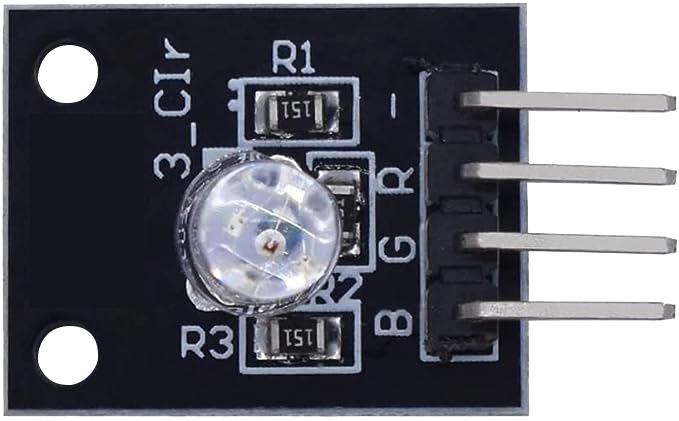
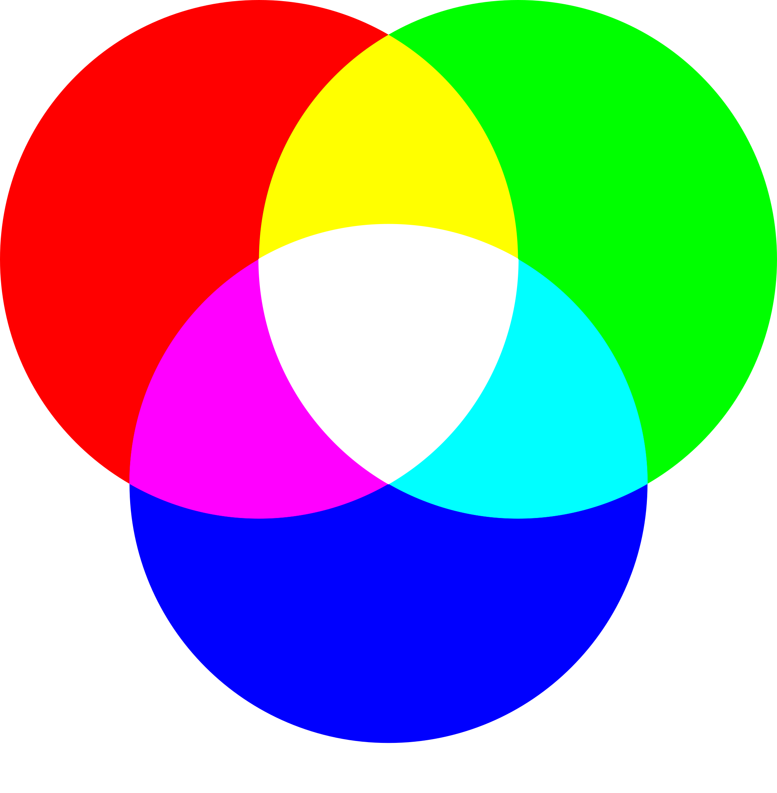
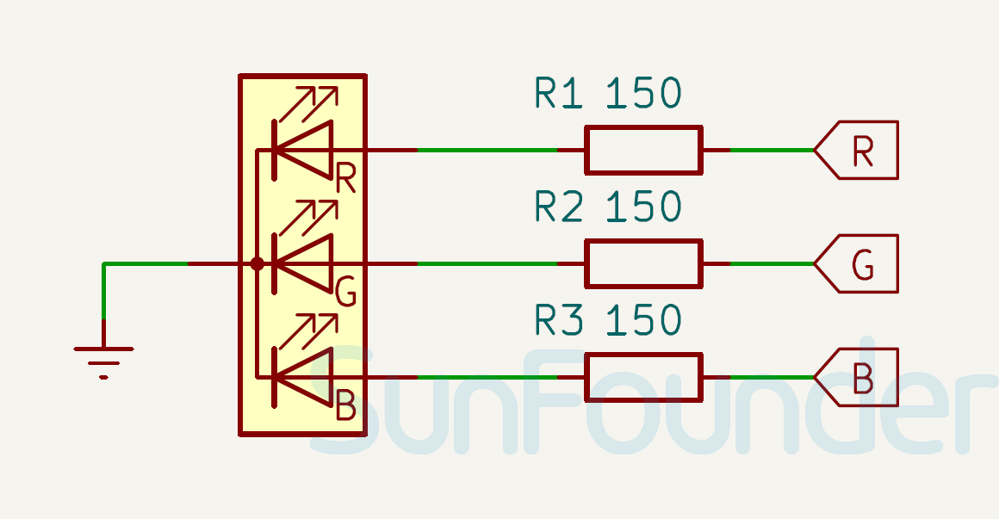

.. note::

    Bonjour et bienvenue dans la communauté des passionnés de SunFounder Raspberry Pi, Arduino et ESP32 sur Facebook ! Explorez en profondeur le Raspberry Pi, Arduino et ESP32 avec d'autres passionnés.

    **Pourquoi rejoindre ?**

    - **Support d'experts** : Résolvez les problèmes après-vente et les défis techniques avec l'aide de notre communauté et de notre équipe.
    - **Apprendre & Partager** : Échangez des astuces et des tutoriels pour améliorer vos compétences.
    - **Aperçus exclusifs** : Accédez en avant-première aux annonces de nouveaux produits et aux avant-premières.
    - **Réductions spéciales** : Profitez de réductions exclusives sur nos nouveaux produits.
    - **Promotions festives et cadeaux** : Participez à des tirages au sort et des promotions de fêtes.

    👉 Prêts à explorer et à créer avec nous ? Cliquez sur [|link_sf_facebook|] et rejoignez-nous aujourd'hui !

.. _cpn_rgb:

Module LED RGB
==========================

.. raw:: html
    
     

Le module LED RVB (rouge, vert, bleu) émet une gamme de couleurs en mélangeant la lumière rouge, verte et bleue. Chaque couleur est ajustée à l'aide du PWM. Il peut être utilisé pour créer des effets d'éclairage colorés ou pour apprendre à utiliser le PWM (modulation de largeur d'impulsion) avec Arduino.

Brochage
---------------------------

* **GND** : Masse commune pour l'alimentation.
* **B** : Contrôle la luminosité de la LED rouge. En ajustant le courant traversant cette broche, l'intensité de la lumière rouge peut être variée.
* **R** : Contrôle la luminosité de la LED verte. De manière similaire à la broche rouge, ajuster le courant traversant cette broche change l'intensité de la lumière verte.
* **G** : Contrôle la luminosité de la LED bleue. En ajustant le courant traversant cette broche, l'intensité de la lumière bleue peut être modifiée.

Principe
---------------------------
Le module RGB fonctionne en utilisant une LED couleur pleine capable d'utiliser les broches R, G et B avec une entrée de tension PWM réglable.
Les couleurs de la LED peuvent être combinées. Par exemple, mélanger la lumière bleue et verte donne une lumière cyan, la lumière rouge et verte donne une lumière jaune. Cela s'appelle "la méthode additive de mélange des couleurs".

* `Couleur additive - Wikipedia <https://fr.wikipedia.org/wiki/Couleur_additive>`_

Basé sur cette méthode, nous pouvons utiliser les trois couleurs primaires pour mélanger la lumière visible de n'importe quelle couleur selon différentes proportions. Par exemple, l'orange peut être produit avec plus de rouge et moins de vert.
La force des couleurs primaires (rouge, bleu, vert) est ajustée pour obtenir un effet complet de mélange des couleurs. La PWM est une technique où le cycle de travail d'un signal numérique est modifié, ajustant le pourcentage de temps que le signal reste actif pendant une période donnée. En changeant le cycle de travail, nous pouvons rendre la LED plus lumineuse ou plus sombre.

Schéma
---------------------------

.. raw:: html

    

Exemple
---------------------------
* :ref:`uno_lesson28_rgb_module` (Arduino UNO)
* :ref:`esp32_lesson28_rgb_module` (ESP32)
* :ref:`pico_lesson28_rgb_module` (Raspberry Pi Pico)
* :ref:`pi_lesson28_rgb_module` (Raspberry Pi)

* :ref:`esp32_lesson30_relay_module` (ESP32)
* :ref:`pico_lesson30_relay_module` (Raspberry Pi Pico)
* :ref:`pi_lesson30_relay_module` (Raspberry Pi)

* :ref:`uno_lesson38_gas_leak_alarm` (Arduino UNO)
* :ref:`uno_lesson40_motion_triggered_relay` (Arduino UNO)
* :ref:`esp32_gas_leak_alarm` (ESP32)
* :ref:`esp32_motion_triggered_relay` (ESP32)
* :ref:`esp32_bluetooth_led` (ESP32)
* :ref:`esp32_iot_mqtt` (ESP32)
* :ref:`esp32_adafruit_io` (ESP32)
* :ref:`esp32_iot_bluetooth_app` (ESP32)