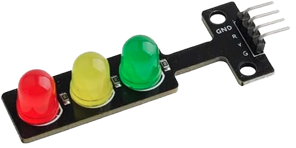
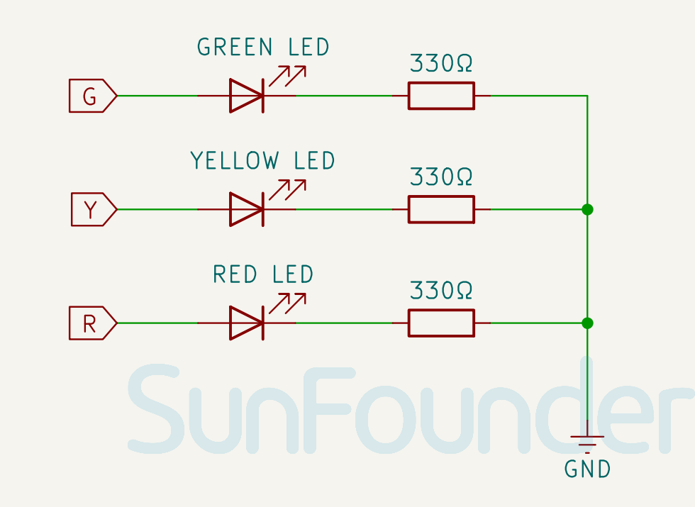

.. note::

    Bonjour et bienvenue dans la communauté des passionnés de SunFounder Raspberry Pi, Arduino et ESP32 sur Facebook ! Plongez plus profondément dans l'univers du Raspberry Pi, de l'Arduino et du ESP32 avec d'autres passionnés.

    **Pourquoi rejoindre ?**

    - **Support d'experts** : Résolvez les problèmes après-vente et les défis techniques avec l'aide de notre communauté et de notre équipe.
    - **Apprendre & Partager** : Échangez des conseils et des tutoriels pour améliorer vos compétences.
    - **Aperçus exclusifs** : Obtenez un accès anticipé aux annonces de nouveaux produits et aux aperçus exclusifs.
    - **Réductions spéciales** : Profitez de réductions exclusives sur nos nouveaux produits.
    - **Promotions festives et cadeaux** : Participez à des tirages au sort et à des promotions festives.

    👉 Prêts à explorer et à créer avec nous ? Cliquez sur [|link_sf_facebook|] et rejoignez-nous aujourd'hui !

.. _cpn_traffic:

Module Feu Tricolore
==========================

.. raw:: html
    
     

Le module de feu tricolore est un petit dispositif capable d'afficher les lumières rouge, jaune et verte, tout comme un vrai feu de circulation. Il peut être utilisé pour créer un modèle de système de feux de circulation ou pour apprendre à contrôler des LED avec Arduino. Il se distingue par sa petite taille, son câblage simple, sa ciblage et son installation personnalisable. Il peut être connecté à une broche PWM pour contrôler la luminosité de la LED.

Principe
---------------------------
Le module de feu tricolore peut être contrôlé de deux manières principales. La méthode la plus simple consiste à utiliser des entrées numériques de l'Arduino, où un signal HAUT ou BAS active directement la LED correspondante. Alternativement, la modulation de largeur d'impulsion (PWM) peut être utilisée, notamment lorsque l'on souhaite varier la luminosité de la LED. La PWM est une technique où le cycle de service d'un signal numérique est modifié pour moduler la luminosité de la LED. Le cycle de service représente le pourcentage de temps pendant lequel un signal reste actif sur une période donnée. Par exemple, un cycle de service de 50 % signifie que le signal est actif pendant la moitié de la durée et inactif pour le reste. Ajuster le cycle de service permet de moduler la luminosité de la LED.

Schéma
---------------------------

.. raw:: html

    

Exemple
---------------------------
* :ref:`uno_lesson29_traffic_light_module` (Arduino UNO)
* :ref:`esp32_lesson29_traffic_light_module` (ESP32)
* :ref:`pico_lesson30_relay_module` (Raspberry Pi Pico)
* :ref:`pi_lesson30_relay_module` (Raspberry Pi)

* :ref:`uno_lesson30_relay_module` (Arduino UNO)

* :ref:`uno_lesson42_touch_toggle_light` (Arduino UNO)
* :ref:`uno_lesson47_bluetooth_traffic_light` (Arduino UNO)
* :ref:`esp32_touch_toggle_light` (ESP32)