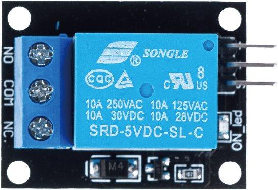
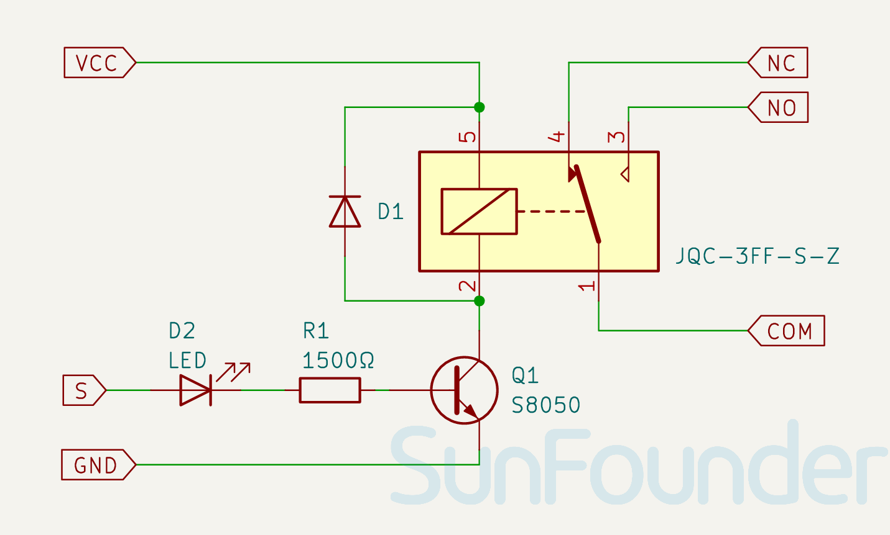

.. note:: 

    ¡Hola, bienvenido a la Comunidad de Entusiastas de Raspberry Pi, Arduino y ESP32 en Facebook! Profundiza más en Raspberry Pi, Arduino y ESP32 junto con otros entusiastas.

    **¿Por qué unirte?**

    - **Soporte experto**: Resuelve problemas postventa y desafíos técnicos con la ayuda de nuestra comunidad y equipo.
    - **Aprende y comparte**: Intercambia consejos y tutoriales para mejorar tus habilidades.
    - **Previsualizaciones exclusivas**: Accede anticipadamente a anuncios de nuevos productos y vistas previas.
    - **Descuentos especiales**: Disfruta de descuentos exclusivos en nuestros productos más recientes.
    - **Promociones festivas y sorteos**: Participa en sorteos y promociones especiales durante las festividades.

    👉 ¿Listo para explorar y crear con nosotros? Haz clic en [|link_sf_facebook|] y únete hoy.

.. _cpn_relay:

Módulo de Relé de 5V
==========================

.. raw:: html
    
     

Los módulos de relé de 5V son dispositivos que pueden encender y apagar dispositivos de alto voltaje o corriente utilizando una señal de 5V proveniente de un Arduino. Se pueden usar para controlar dispositivos como luces, ventiladores, motores, solenoides, etc. El relé de 5V tiene tres terminales de alto voltaje (NC, C y NO) que se conectan al dispositivo que deseas controlar. El otro lado tiene tres pines de bajo voltaje (Ground, Vcc y Signal) que se conectan al Arduino.

Principio
---------------------------
Un relé es un dispositivo utilizado para proporcionar conexión entre dos o más puntos o dispositivos en respuesta a la señal de entrada aplicada. En otras palabras, los relés proporcionan aislamiento entre el controlador y los dispositivos, que pueden operar tanto en corriente alterna (AC) como en corriente continua (DC). Sin embargo, reciben señales de un microcontrolador que trabaja con corriente continua (DC), por lo que se requiere un relé para hacer el puente entre ambos. El relé es extremadamente útil cuando necesitas controlar una gran cantidad de corriente o voltaje con una señal eléctrica pequeña.

Cada relé tiene 5 partes:

.. image:: img/30_relay_2.jpeg
    :width: 500
    :align: center

Electroimán - Consiste en un núcleo de hierro enrollado con un cable. Cuando se pasa corriente a través de él, se convierte en magnético. Por esta razón, se le llama electroimán.

Armadura - La tira magnética móvil se conoce como armadura. Cuando la corriente fluye a través de ella, la bobina se energiza, produciendo un campo magnético que se usa para abrir o cerrar los puntos normalmente abiertos (N/O) o normalmente cerrados (N/C). La armadura puede moverse con corriente continua (DC) así como con corriente alterna (AC).

Resorte - Cuando no fluye corriente a través de la bobina del electroimán, el resorte tira de la armadura para que el circuito no se complete.

Juego de contactos eléctricos - Hay dos puntos de contacto:

* Normalmente abierto: conectado cuando el relé está activado, y desconectado cuando está inactivo.
* Normalmente cerrado: no conectado cuando el relé está activado, y conectado cuando está inactivo.

Marco moldeado - Generalmente está hecho de plástico y proporciona soporte estructural y protección al relé.

El principio de funcionamiento del relé es simple. Cuando se suministra energía al relé, comienza a fluir corriente a través de la bobina de control; como resultado, el electroimán comienza a energizarse. Luego, la armadura es atraída hacia la bobina, lo que hace que el contacto móvil se cierre con los contactos normalmente abiertos, energizando el circuito con la carga. Romper el circuito sería un caso similar, ya que el contacto móvil será elevado hacia los contactos normalmente cerrados por la fuerza del resorte. De esta manera, el encendido y apagado del relé puede controlar el estado de un circuito de carga.

Diagrama esquemático
---------------------------

.. raw:: html

    

Ejemplo
---------------------------
* :ref:`uno_lesson30_relay_module` (Arduino UNO)
* :ref:`esp32_lesson30_relay_module` (ESP32)
* :ref:`pico_lesson30_relay_module` (Raspberry Pi Pico)
* :ref:`pi_lesson30_relay_module` (Raspberry Pi)

* :ref:`uno_lesson40_motion_triggered_relay` (Arduino UNO)
* :ref:`esp32_motion_triggered_relay` (ESP32)