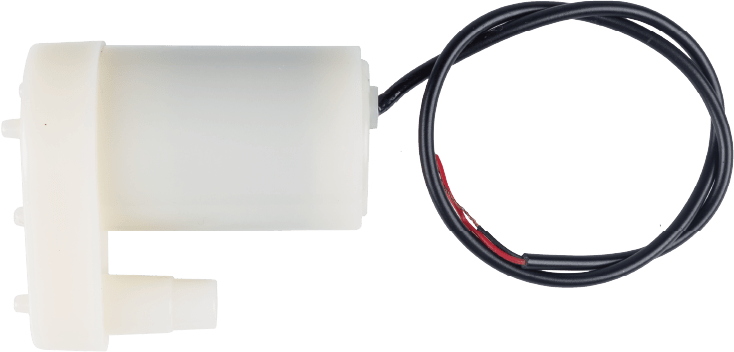

.. note:: 

    Ciao! Benvenuto nella community Facebook degli appassionati di SunFounder Raspberry Pi, Arduino ed ESP32! Approfondisci le tue conoscenze su Raspberry Pi, Arduino ed ESP32 insieme ad altri appassionati.

    **Perché unirsi?**

    - **Supporto esperto**: Risolvi problemi post-vendita e sfide tecniche con l’aiuto del nostro team e della community.
    - **Impara e condividi**: Scambia suggerimenti e tutorial per migliorare le tue competenze.
    - **Anteprime esclusive**: Accedi in anteprima ai nuovi annunci di prodotto e alle anticipazioni.
    - **Sconti speciali**: Approfitta di sconti esclusivi sui nostri prodotti più recenti.
    - **Promozioni festive e giveaway**: Partecipa a promozioni festive e omaggi.

    👉 Pronto a esplorare e creare con noi? Clicca su [|link_sf_facebook|] e unisciti oggi stesso!

.. _cpn_pump:

Pompa Centrifuga
==========================

.. raw:: html
    
     

Una pompa centrifuga è un dispositivo che consente di spostare liquidi da un punto a un altro utilizzando una girante rotante. Può essere utilizzata per pompare acqua, olio, prodotti chimici, ecc. La pompa è composta principalmente da due parti: un motore e un corpo pompa. Il motore fornisce l’energia, mentre il corpo pompa converte l’energia rotazionale in pressione e flusso.

Specifiche
---------------------------

* **Tensione operativa**: DC 3 ~ 4.5V  
* **Corrente operativa**: 120 ~ 180mA  
* **Potenza**: 0.36 ~ 0.91W  
* **Prevalenza massima**: 0.35 ~ 0.55M  
* **Portata massima**: 80 ~ 100 L/H  
* **Durata operativa continua**: 100 ore  
* **Grado di impermeabilità**: IP68  
* **Modalità di azionamento**: DC, azionamento magnetico  
* **Materiale**: Plastica tecnica  
* **Diametro esterno uscita**: 7.8 mm  
* **Diametro interno uscita**: 6.5 mm  
* È una pompa sommergibile e deve essere utilizzata come tale. Tende a surriscaldarsi se attivata senza essere immersa in acqua, con rischio di danneggiamento.

Esempi
---------------------------
* :ref:`uno_lesson31_pump` (Arduino UNO)
* :ref:`esp32_lesson31_pump` (ESP32)
* :ref:`pico_lesson31_pump` (Raspberry Pi Pico)
* :ref:`pi_lesson31_pump` (Raspberry Pi)

* :ref:`uno_lesson39_soap_dispenser` (Arduino UNO)
* :ref:`uno_lesson45_plant_monitor` (Arduino UNO)
* :ref:`esp32_soap_dispenser` (ESP32)
* :ref:`esp32_plant_monitor` (ESP32)
