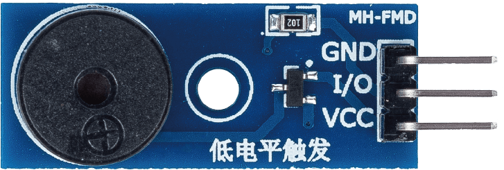
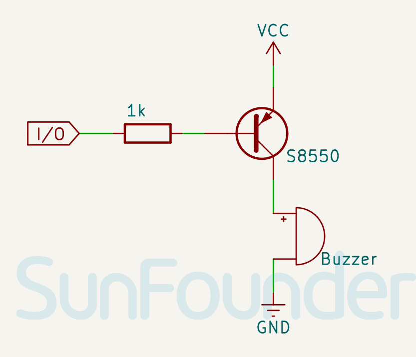

.. note:: 

    Ciao! Benvenuto nella community Facebook degli appassionati di SunFounder Raspberry Pi, Arduino ed ESP32! Approfondisci Raspberry Pi, Arduino ed ESP32 insieme ad altri appassionati.

    **Perché unirsi?**

    - **Supporto esperto**: Risolvi problemi post-vendita e difficoltà tecniche con l’aiuto del nostro team e della community.
    - **Impara e condividi**: Scambia consigli e tutorial per migliorare le tue competenze.
    - **Anteprime esclusive**: Ottieni accesso anticipato a nuovi annunci e anteprime di prodotto.
    - **Sconti speciali**: Approfitta di sconti esclusivi sui nostri ultimi prodotti.
    - **Promozioni festive e giveaway**: Partecipa a eventi promozionali e concorsi a premi.

    👉 Pronto a esplorare e creare con noi? Clicca su [|link_sf_facebook|] e unisciti subito!

.. _cpn_buzzer:

Modulo Buzzer Passivo
==========================

.. raw:: html
    
     

Il buzzer passivo è un dispositivo che emette suoni quando riceve un segnale elettrico. È definito "passivo" perché non possiede un oscillatore interno, ma richiede un segnale esterno, ad esempio da un microcontrollore come Arduino, per funzionare. Il modulo contiene il buzzer e circuiti ausiliari per facilitarne l’uso con Arduino.

Pinout
---------------------------
* **VCC**: Alimentazione positiva dal controller principale.
* **GND**: Collegamento a massa.
* **I/O**: Pin di controllo tramite cui inviare segnali per gestire tono e frequenza del buzzer.

Schema elettrico
---------------------------

.. raw:: html

    

Esempi
---------------------------
* :ref:`uno_lesson32_passive_buzzer` (Arduino UNO)
* :ref:`esp32_lesson32_passive_buzzer` (ESP32)
* :ref:`pico_lesson32_passive_buzzer` (Raspberry Pi Pico)
* :ref:`pi_lesson32_passive_buzzer` (Raspberry Pi)

* :ref:`uno_lesson38_gas_leak_alarm` (Arduino UNO)
* :ref:`esp32_gas_leak_alarm` (ESP32)