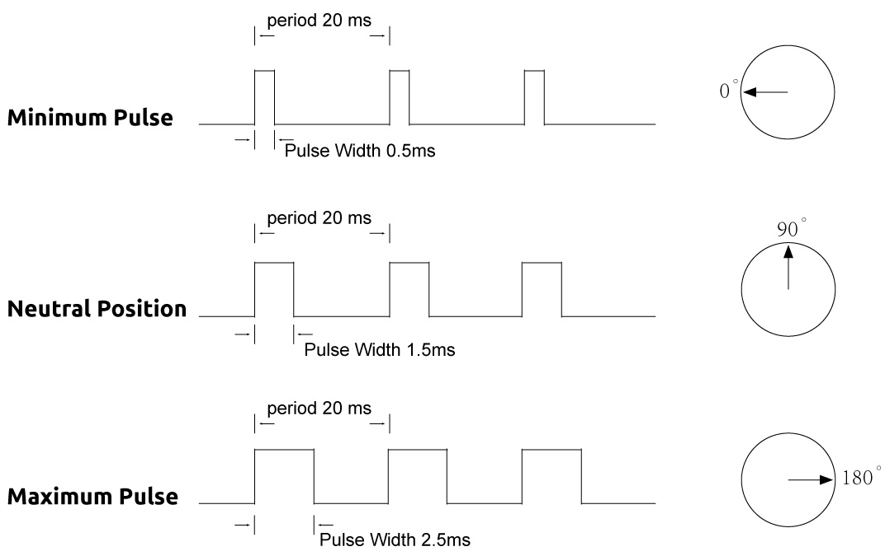

.. note::

    Bonjour, bienvenue dans la communauté des passionnés de SunFounder Raspberry Pi, Arduino et ESP32 sur Facebook ! Plongez plus profondément dans les univers Raspberry Pi, Arduino et ESP32 avec d'autres passionnés.

    **Pourquoi rejoindre ?**

    - **Support d'experts** : Résolvez les problèmes après-vente et les défis techniques avec l'aide de notre communauté et de notre équipe.
    - **Apprendre & Partager** : Échangez des astuces et des tutoriels pour améliorer vos compétences.
    - **Aperçus exclusifs** : Obtenez un accès anticipé aux annonces de nouveaux produits et aux coups d'œil exclusifs.
    - **Réductions spéciales** : Profitez de réductions exclusives sur nos produits les plus récents.
    - **Promotions festives et cadeaux** : Participez à des tirages au sort et des promotions festives.

    👉 Prêts à explorer et créer avec nous ? Cliquez sur [|link_sf_facebook|] et rejoignez-nous aujourd'hui !

.. _cpn_servo:

Moteur Servo (SG90)
==========================

.. image:: img/33_servo.png
    :width: 300
    :align: center

Les moteurs servo sont des dispositifs capables de pivoter à un angle ou une position spécifique. Ils sont utilisés pour déplacer des bras robotiques, des volants, des stabilisateurs de caméra, etc. Les moteurs servo ont trois fils : l'alimentation, la terre et le signal. Le fil d'alimentation, généralement rouge, doit être connecté à la broche 5V de la carte Arduino. Le fil de terre, généralement noir ou marron, doit être connecté à une broche de terre sur la carte. Le fil de signal, généralement jaune ou orange, doit être connecté à une broche PWM sur la carte.

Brochage
---------------------------
* Fil marron : GND
* Fil orange : Broche de signal, à connecter à la broche PWM de la carte principale.
* Fil rouge : VCC

Principe
---------------------------
Un servo est généralement composé des parties suivantes : boîtier, axe, système de pignon, potentiomètre, moteur DC, et carte embarquée.

Voici comment il fonctionne :

* Le microcontrôleur envoie des signaux PWM au servo, puis la carte embarquée dans le servo reçoit les signaux via la broche de signal et contrôle le moteur à l'intérieur pour tourner.
* En conséquence, le moteur entraîne le système de pignon puis motive l'axe après démultiplication.
* L'axe et le potentiomètre du servo sont connectés ensemble.
* Lorsque l'axe tourne, il entraîne le potentiomètre, de sorte que le potentiomètre envoie un signal de tension à la carte embarquée.
* Ensuite, la carte détermine la direction et la vitesse de rotation en fonction de la position actuelle, afin qu'elle puisse s'arrêter exactement à la bonne position définie et y rester.

.. image:: img/33_servo_internal.png
    :width: 450
    :align: center

.. raw:: html
    
     

.. _cpn_servo_pulse:

**Impulsion de travail**

L'angle est déterminé par la durée d'une impulsion appliquée au fil de commande. Cela s'appelle la modulation de largeur d'impulsion (PWM).

* Le servo s'attend à voir une impulsion toutes les 20 ms. La longueur de l'impulsion déterminera jusqu'où le servo tourne.
* Par exemple, une impulsion de 1,5 ms fera tourner le servo à la position de 90 degrés (position neutre).
* Lorsqu'une impulsion est envoyée à un servo qui est inférieure à 1,5 ms, le servo tourne à une position et maintient son arbre de sortie à un certain nombre de degrés dans le sens antihoraire par rapport au point neutre.
* Lorsque l'impulsion est plus large que 1,5 ms, l'inverse se produit.
* La largeur minimale et maximale de l'impulsion qui commandera le servo pour tourner à une position valide sont des fonctions de chaque servo.
* Généralement, l'impulsion sera d'environ 0,5 ms ~ 2,5 ms de large.

.. raw:: html
    
     

Exemple
---------------------------
* :ref:`uno_lesson33_servo` (Arduino UNO)
* :ref:`esp32_lesson33_servo` (ESP32)
* :ref:`pico_lesson33_servo` (Raspberry Pi Pico)
* :ref:`pi_lesson33_servo` (Raspberry Pi)

* :ref:`uno_lesson37_trashcan` (Arduino UNO)
* :ref:`esp32_trashcan` (ESP32)