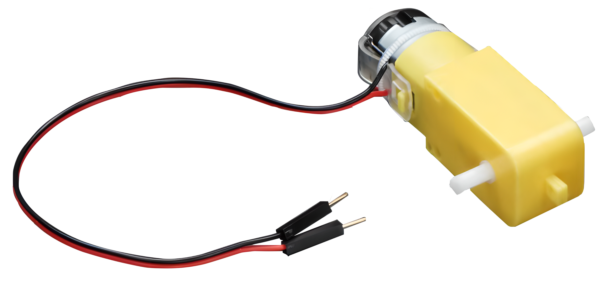
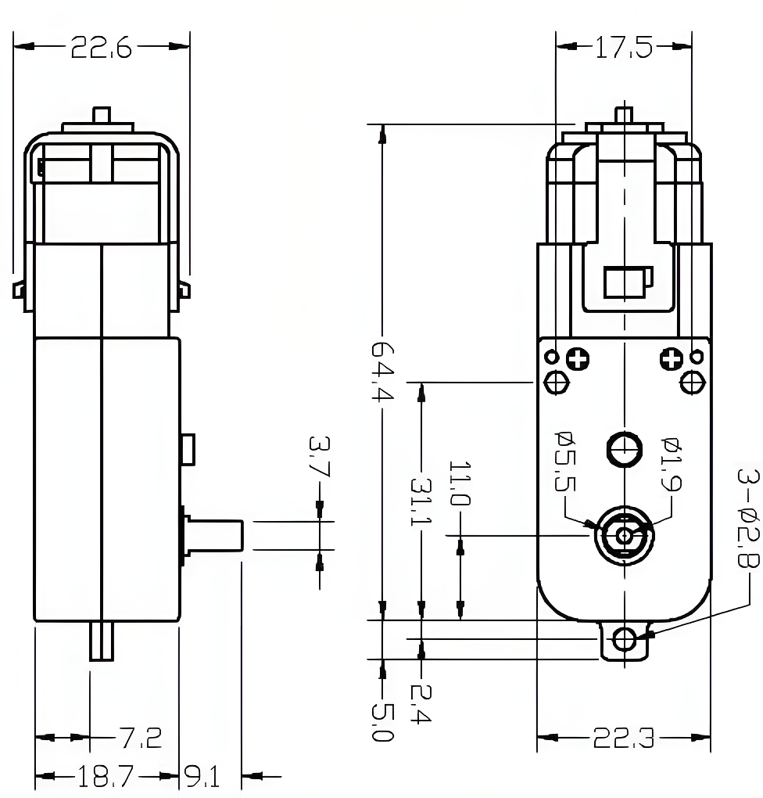

.. note::

    Bonjour et bienvenue dans la communauté des passionnés de SunFounder Raspberry Pi, Arduino et ESP32 sur Facebook ! Plongez plus profondément dans l'univers des Raspberry Pi, Arduino, et ESP32 avec d'autres passionnés.

    **Pourquoi rejoindre ?**

    - **Support d'experts** : Résolvez les problèmes après-vente et les défis techniques avec l'aide de notre communauté et de notre équipe.
    - **Apprendre & Partager** : Échangez des astuces et des tutoriels pour améliorer vos compétences.
    - **Aperçus exclusifs** : Accédez en avant-première aux annonces de nouveaux produits et aux coups d'œil exclusifs.
    - **Réductions spéciales** : Profitez de réductions exclusives sur nos produits les plus récents.
    - **Promotions festives et cadeaux** : Participez à des tirages au sort et des promotions festives.

    👉 Prêts à explorer et créer avec nous ? Cliquez sur [|link_sf_facebook|] et rejoignez-nous aujourd'hui !

.. _cpn_ttmotor:

Moteur TT
==========================

.. raw:: html
    
     

Un moteur TT est un type de moteur à courant continu équipé d'un réducteur. Le réducteur diminue la vitesse du moteur tout en augmentant son couple. Le moteur TT est couramment utilisé dans des applications telles que la propulsion de roues, d'hélices, de ventilateurs, etc. Un moteur TT possède deux fils : un fil positif et un fil négatif. Le fil positif est généralement rouge et le fil négatif est généralement noir.

Un moteur à engrenages CC TT avec un rapport de réduction de 1:48 est utilisé dans le produit, il est livré avec 2 fils de 200 mm avec des connecteurs mâles de 0,1" qui s'insèrent dans une plaque d'essai. Parfait pour être branché sur une plaque d'essai ou un bloc de jonction.

Vous pouvez alimenter ces moteurs avec une tension de 3 ~ 6VCC, mais bien sûr, ils tourneront un peu plus vite sous des tensions plus élevées.

**Détails techniques**

* Tension nominale : 3~6V
* Courant à vide continu : 150mA +/- 10%
* Vitesse de fonctionnement minimale (3V) : 90 +/- 10% RPM
* Vitesse de fonctionnement minimale (6V) : 200 +/- 10% RPM
* Couple de calage (3V) : 0,4 kg.cm
* Couple de calage (6V) : 0,8 kg.cm
* Rapport d'engrenage : 1:48
* Dimensions du corps : 70 x 22 x 18mm
* Longueur des fils : 200mm & AWG 28
* Poids : 30,6g

**Dessin dimensionnel**

.. raw:: html
    
     

Exemple
---------------------------
* :ref:`uno_lesson34_motor` (Arduino UNO)
* :ref:`esp32_lesson34_motor` (ESP32)
* :ref:`pico_lesson34_motor` (Raspberry Pi Pico)
* :ref:`pi_lesson34_motor` (Raspberry Pi)

* :ref:`uno_lesson07_speed` (Arduino UNO)
* :ref:`pi_lesson07_speed` (Raspberry Pi)
