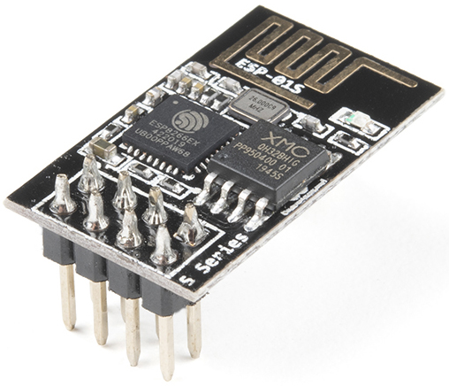
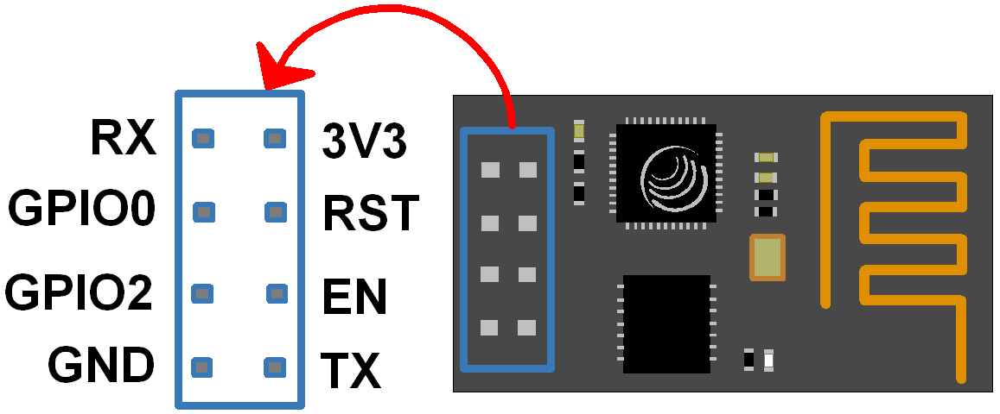
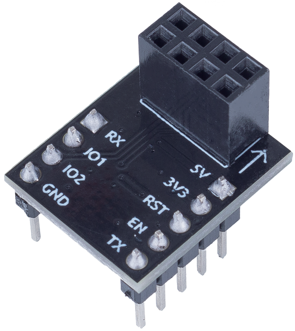
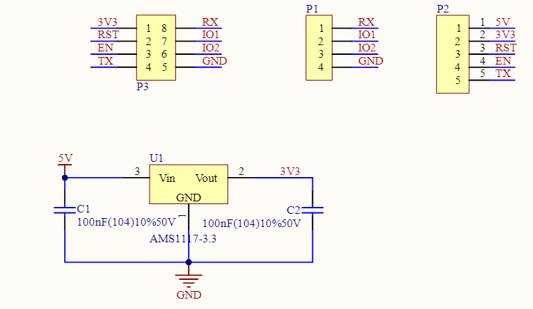

.. note:: 

    Ciao! Benvenuto nella community Facebook di appassionati di SunFounder Raspberry Pi, Arduino ed ESP32! Esplora più a fondo Raspberry Pi, Arduino ed ESP32 insieme ad altri entusiasti.

    **Perché unirsi?**

    - **Supporto esperto**: Risolvi problemi post-vendita e sfide tecniche grazie all’aiuto della nostra community e del nostro team.
    - **Impara e condividi**: Scambia consigli e tutorial per migliorare le tue competenze.
    - **Anteprime esclusive**: Ottieni l’accesso anticipato ai nuovi annunci di prodotto e alle anteprime riservate.
    - **Sconti speciali**: Approfitta di sconti esclusivi sui nostri prodotti più recenti.
    - **Promozioni festive e giveaway**: Partecipa a promozioni a tema e concorsi con premi.

    👉 Pronto a esplorare e creare con noi? Clicca su [|link_sf_facebook|] e unisciti oggi stesso!

.. _cpn_esp8266:

Modulo ESP8266
=================

L'ESP8266 è un microchip Wi-Fi a basso costo,
con software di rete TCP/IP integrato
e capacità di microcontrollore, prodotto da Espressif Systems a Shanghai, Cina.

Il chip è diventato noto ai maker occidentali nell’agosto 2014 con il modulo ESP-01,
realizzato da un produttore terzo, Ai-Thinker.
Questo piccolo modulo consente ai microcontrollori di connettersi a una rete Wi-Fi e di effettuare semplici connessioni TCP/IP utilizzando comandi in stile Hayes.
Inizialmente, però, la documentazione in inglese sul chip e i suoi comandi era quasi inesistente.
Il prezzo molto basso e la presenza di pochissimi componenti esterni nel modulo,
che facevano presagire un costo ancora più contenuto in produzione su larga scala,
attirarono numerosi hacker ad esplorare il modulo,
il chip e il software, traducendo nel frattempo la documentazione cinese.

Pin dell’ESP8266 e relative funzioni:

.. list-table:: ESP8266-01 Pins
   :widths: 25 25 100
   :header-rows: 1

   * - Pin	
     - Nome	
     - Descrizione
   * - 1	
     - TXD	
     - UART_TXD, invio dati; GPIO1; non consentita resistenza pull-down all’avvio.
   * - 2	
     - GND
     - Massa
   * - 3	
     - CU_PD	
     - Funziona a livello alto; spegnimento con livello basso.
   * - 4		
     - GPIO2
     - Deve essere a livello alto all’accensione; pull-down hardware non consentito; pull-up di default.
   * - 5	
     - RST	
     - Segnale di reset esterno; reset con livello basso; operativo con livello alto (default alto).
   * - 6	
     - GPIO0	
     - Indicatore stato WiFi; selezione modalità: Pull-up: = Flash Boot (modalità operativa); Pull-down = UART Download (modalità download).
   * - 7	
     - VCC	
     - Alimentazione (3.3V)
   * - 8	
     - RXD	
     - UART_RXD, ricezione; GPIO3

* `ESP8266 - Espressif <https://www.espressif.com/en/products/socs/esp8266>`_
* |link_esp8266_at|

Adattatore ESP8266
---------------------

L’adattatore ESP8266 è una scheda di espansione che consente di utilizzare il modulo ESP8266 su una breadboard.

È progettato per allinearsi perfettamente ai pin dell’ESP8266 e include anche un pin da 5V per ricevere l’alimentazione dalla scheda Arduino. Il chip AMS1117 integrato regola la tensione da 5V a 3.3V per alimentare in modo sicuro il modulo.

Lo schema elettrico è il seguente:

Esempi
---------------------------
* :ref:`uno_lesson35_esp8266` (Arduino UNO)
* :ref:`uno_iot_weather_monito` (Arduino UNO)
* :ref:`uno_iot_vib_alert_system` (Arduino UNO)
* :ref:`uno_iot_flame` (Arduino UNO)
* :ref:`uno_iot_intrusion_alert_system` (Arduino UNO)