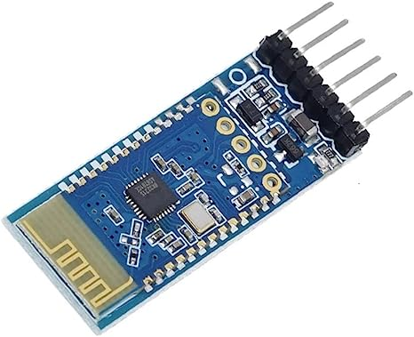
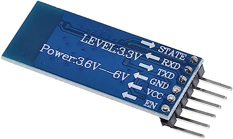

.. note:: 

    ¡Hola, bienvenido a la Comunidad de Entusiastas de Raspberry Pi, Arduino y ESP32 en Facebook! Profundiza más en Raspberry Pi, Arduino y ESP32 junto con otros entusiastas.

    **¿Por qué unirte?**

    - **Soporte experto**: Resuelve problemas postventa y desafíos técnicos con la ayuda de nuestra comunidad y equipo.
    - **Aprende y comparte**: Intercambia consejos y tutoriales para mejorar tus habilidades.
    - **Previsualizaciones exclusivas**: Accede anticipadamente a anuncios de nuevos productos y vistas previas.
    - **Descuentos especiales**: Disfruta de descuentos exclusivos en nuestros productos más recientes.
    - **Promociones festivas y sorteos**: Participa en sorteos y promociones especiales durante las festividades.

    👉 ¿Listo para explorar y crear con nosotros? Haz clic en [|link_sf_facebook|] y únete hoy!

.. _cpn_jdy31:

Módulo Bluetooth JDY-31
=====================================

.. warning::
  Este módulo **no es compatible con dispositivos Apple**, por lo que los tutoriales que impliquen este módulo requieren un teléfono o tablet Android.

El módulo Bluetooth JDY-31 es un reemplazo compatible con los pines del módulo Bluetooth HC-06. Es más sencillo y fácil de usar que el HC-06, y generalmente está disponible a un precio ligeramente inferior.

El módulo Bluetooth JDY-31 se basa en el diseño Bluetooth 3.0 SPP y puede soportar transmisión de datos en Windows, Linux y Android. La frecuencia de trabajo del módulo JDY-31 es de 2.4 GHz con modulación GFSK. La potencia máxima de transmisión es de 8 dB, y la distancia máxima de transmisión es de 30 metros. Los usuarios pueden modificar el nombre del dispositivo mediante comandos AT, así como la tasa de baudios y otros parámetros.

Pines del JDY-31 y sus funciones:

.. list-table:: JDY-31 Pins
   :widths: 25 25 100
   :header-rows: 1

   * - Pin	
     - Nombre	
     - Descripción
   * - 1	
     - STATE	
     - Pin de estado de conexión (no conectado a nivel bajo, salida a nivel alto después de la conexión)
   * - 2	
     - RXD	
     - Pin receptor, este pin debe conectarse al pin TX del dispositivo siguiente.
   * - 3	
     - TXD	
     - Pin transmisor, este pin debe conectarse al pin RX del dispositivo siguiente.
   * - 4		
     - GND	
     - Tierra
   * - 5	
     - VCC	
     - Fuente de alimentación (1.8-3.6V, recomendado 3.3V)
   * - 6	
     - EN	
     - Habilitar o deshabilitar el módulo. Cuando este pin está a nivel alto, el módulo se habilita y comienza a transmitir y recibir datos.

Aplicación del parche: la aplicación general solo necesita conectar los 4 pines VCC, GND, RXD, TXD. Si es necesario desconectar activamente en el estado de conexión, envíe AT+DISC en el estado de conexión.

Conjunto de comandos AT
---------------------------

+------------+--------------------------------------------------+-------------------+
|  Comando   |                  Función                         |  Predeterminado   |
+------------+--------------------------------------------------+-------------------+
| AT+VERSION | Número de versión                                | JDY-31-V1.2       |
+------------+--------------------------------------------------+-------------------+
| AT+RESET   | Reinicio suave                                   |                   |
+------------+--------------------------------------------------+-------------------+
| AT+DISC    | Desconectar (válido cuando está conectado)       |                   |
+------------+--------------------------------------------------+-------------------+
| AT+LADDR   | Consultar la dirección MAC del módulo            |                   |
+------------+--------------------------------------------------+-------------------+
| AT+PIN     | Establecer o consultar la contraseña de conexión | 1234              |
+------------+--------------------------------------------------+-------------------+
| AT+BAUD    | Establecer o consultar la tasa de baudios        | 9600              |
+------------+--------------------------------------------------+-------------------+
| AT+NAME    | Establecer o consultar el nombre de difusión     | JDY-31-SPP        |
+------------+--------------------------------------------------+-------------------+
| AT+DEFAULT | Restablecer a los valores de fábrica             |                   |
+------------+--------------------------------------------------+-------------------+
| AT+ENLOG   | Salida de estado del puerto serie                | 1                 |
+------------+--------------------------------------------------+-------------------+

Ejemplo
---------------------------
* :ref:`uno_lesson36_bluetooth` (Arduino UNO)
* :ref:`uno_lesson46_bluetooth_lcd` (Arduino UNO)
* :ref:`uno_lesson47_bluetooth_traffic_light` (Arduino UNO)