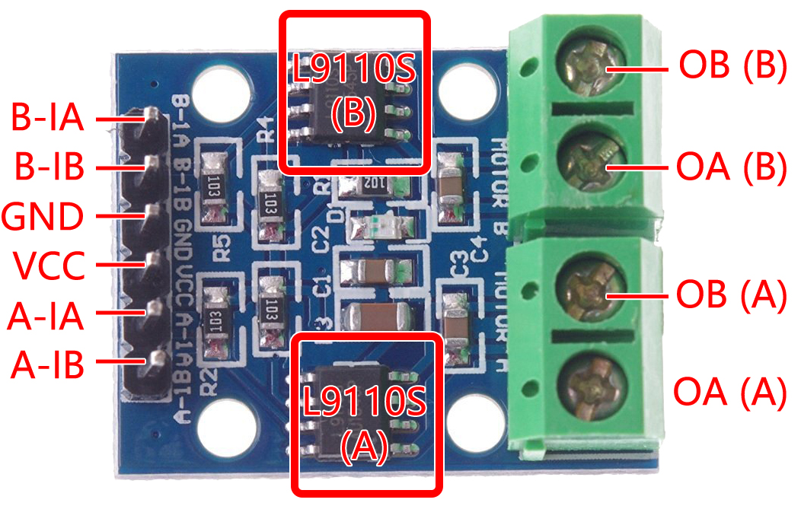

.. note:: 

    Ciao! Benvenuto nella community Facebook degli appassionati SunFounder di Raspberry Pi, Arduino ed ESP32! Approfondisci le tue conoscenze su Raspberry Pi, Arduino ed ESP32 insieme a una comunità di appassionati.

    **Perché unirsi?**

    - **Supporto esperto**: Risolvi problemi post-vendita e sfide tecniche grazie al supporto del nostro team e della community.
    - **Impara e condividi**: Scambia consigli e tutorial per migliorare le tue competenze.
    - **Anteprime esclusive**: Accedi in anteprima alle novità sui prodotti e agli sneak peek.
    - **Sconti speciali**: Approfitta di sconti esclusivi sui nostri prodotti più recenti.
    - **Promozioni festive e giveaway**: Partecipa a concorsi e promozioni durante le festività.

    👉 Pronto a esplorare e creare con noi? Clicca su [|link_sf_facebook|] e unisciti subito!

.. _cpn_l9110:

Modulo Driver per Motori L9110
==================================

Il modulo driver per motori L9110 è progettato per pilotare due motori contemporaneamente. Integra due chip driver L9110S indipendenti, ciascuno in grado di fornire una corrente continua fino a 800mA.

Con un intervallo di tensione da 2.5V a 12V, il modulo è compatibile con microcontrollori da 3.3V e 5V.

Questo modulo rappresenta una soluzione compatta ed efficiente per il controllo di motori in numerose applicazioni. 
Grazie all'architettura a doppio canale, consente il controllo indipendente di due motori—ideale per progetti in cui è richiesto un controllo simultaneo.

La sua capacità di erogare corrente continua elevata lo rende adatto ad alimentare motori da piccoli a medi, risultando utile in ambiti come la robotica, l’automazione e altri progetti motorizzati. Il suo ampio intervallo di tensione garantisce versatilità con diverse fonti di alimentazione.

Progettato per essere facile da usare, il modulo offre terminali di input e output intuitivi per una semplice connessione con microcontrollori o dispositivi di controllo. Include anche protezioni integrate contro sovracorrenti e sovratemperature per garantire sicurezza e affidabilità.

* **B-1A & B-1B(B-2A)**: Pin di input per controllare il senso di rotazione del Motore B.
* **A-1A & A-1B**: Pin di input per controllare il senso di rotazione del Motore A.
* **0A & OB(A)**: Pin di output per il Motore A.
* **0A & OB(B)**: Pin di output per il Motore B.
* **VCC**: Pin di alimentazione (2.5V-12V).
* **GND**: Pin di massa.

**Caratteristiche**

* 2 chip L9110S integrati per il controllo dei motori
* Controllo motori a doppio canale
* Controllo indipendente della direzione di rotazione dei motori
* Uscita a corrente elevata (800mA per canale)
* Ampio intervallo di tensione (2.5V-12V)
* Design compatto
* Terminali di input/output comodi
* Protezioni integrate
* Ampia versatilità applicativa
* Dimensioni PCB: 29.2mm x 23mm
* Temperatura operativa: -20°C ~ 80°C
* LED di stato di accensione integrato

.. _cpn_l9110_principle:

**Principio di Funzionamento**

Tabella della verità del Motore B:

Questa tabella mostra gli stati del Motore B in base ai valori dei pin B-1A e B-1B(B-2A). Indica la direzione di rotazione (oraria o antioraria), la frenata o l'arresto del motore.

.. list-table:: 
    :widths: 25 25 50
    :header-rows: 1

    * - B-1A
      - B-1B(B-2A)
      - Stato del Motore B
    * - 1
      - 0
      - Ruota in senso orario
    * - 0
      - 1
      - Ruota in senso antiorario
    * - 0
      - 0
      - Freno
    * - 1
      - 1
      - Stop

Tabella della verità del Motore A:

Questa tabella mostra gli stati del Motore A in base ai valori dei pin A-1A e A-1B. Indica la direzione di rotazione (oraria o antioraria), la frenata o l'arresto del motore.

.. list-table:: 
    :widths: 25 25 50
    :header-rows: 1

    * - A-1A
      - A-1B
      - Stato del Motore A
    * - 1
      - 0
      - Ruota in senso orario
    * - 0
      - 1
      - Ruota in senso antiorario
    * - 0
      - 0
      - Freno
    * - 1
      - 1
      - Stop

Esempi
---------------------------
* :ref:`uno_lesson31_pump` (Arduino UNO)
* :ref:`esp32_lesson31_pump` (ESP32)
* :ref:`pico_lesson31_pump` (Raspberry Pi Pico)
* :ref:`pi_lesson31_pump` (Raspberry Pi)

* :ref:`uno_lesson34_motor` (Arduino UNO)
* :ref:`esp32_lesson34_motor` (ESP32)
* :ref:`pico_lesson34_motor` (Raspberry Pi Pico)
* :ref:`pi_lesson34_motor` (Raspberry Pi)

* :ref:`uno_lesson07_speed` (Arduino UNO)
* :ref:`pi_lesson07_speed` (Raspberry Pi)

* :ref:`uno_lesson39_soap_dispenser` (Arduino UNO)
* :ref:`uno_lesson45_plant_monitor` (Arduino UNO)
* :ref:`esp32_soap_dispenser` (ESP32)
* :ref:`esp32_plant_monitor` (ESP32)
