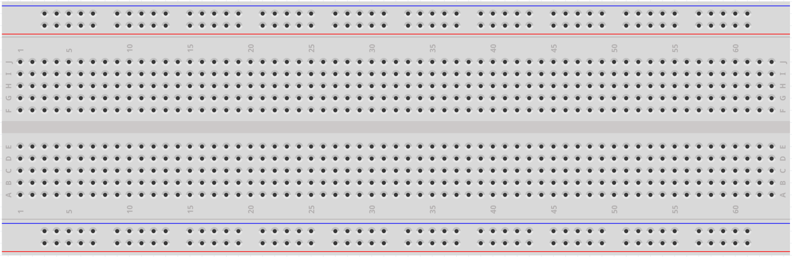
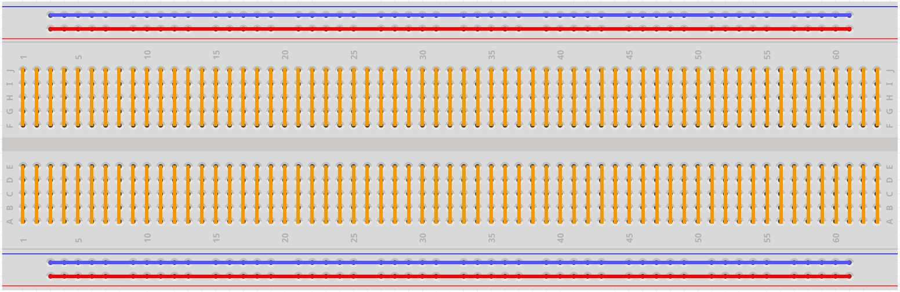

.. note:: 

    Ciao! Benvenuto nella community Facebook di appassionati di SunFounder Raspberry Pi, Arduino ed ESP32! Esplora più a fondo il mondo di Raspberry Pi, Arduino ed ESP32 insieme ad altri appassionati.

    **Perché unirsi?**

    - **Supporto esperto**: Risolvi problemi post-vendita e difficoltà tecniche grazie all’aiuto della nostra community e del nostro team.
    - **Impara e condividi**: Scambia consigli e tutorial per migliorare le tue competenze.
    - **Anteprime esclusive**: Accedi in anteprima agli annunci di nuovi prodotti e anticipazioni.
    - **Sconti speciali**: Approfitta di sconti esclusivi sui nostri prodotti più recenti.
    - **Promozioni festive e giveaway**: Partecipa a concorsi e promozioni durante le festività.

    👉 Pronto a esplorare e creare con noi? Clicca su [|link_sf_facebook|] e unisciti oggi stesso!

.. _cpn_breadboard:

Breadboard
==============

La breadboard è una base di costruzione utilizzata per la prototipazione di circuiti elettronici. Originariamente il termine si riferiva a un tagliere in legno utilizzato per affettare il pane. Negli anni '70 è comparsa la breadboard senza saldature (nota anche come plugboard o terminal array board) e oggi il termine "breadboard" viene comunemente usato per indicare proprio questo tipo di strumento.

Serve per costruire e testare rapidamente circuiti prima di finalizzare il progetto definitivo. 
È dotata di numerosi fori nei quali possono essere inseriti componenti come IC, resistori e jumper wire. 
La breadboard consente di inserire e rimuovere i componenti con facilità.

L'immagine seguente mostra la struttura interna di una breadboard. 
Anche se i fori sulla breadboard sembrano indipendenti, in realtà sono collegati internamente tramite strisce metalliche.

Per saperne di più sulla breadboard, consulta: |link_breadboard_tutorials|
