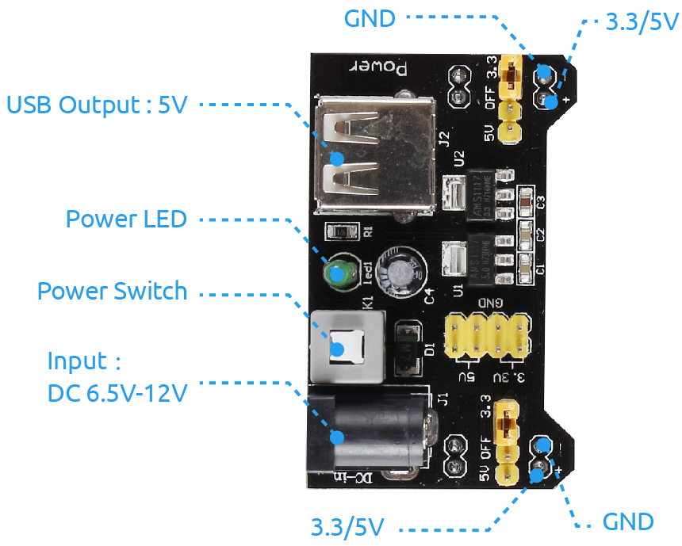

.. note:: 

    ¡Hola, bienvenido a la Comunidad de Entusiastas de Raspberry Pi, Arduino y ESP32 en Facebook! Profundiza más en Raspberry Pi, Arduino y ESP32 junto con otros entusiastas.

    **¿Por qué unirte?**

    - **Soporte experto**: Resuelve problemas postventa y desafíos técnicos con la ayuda de nuestra comunidad y equipo.
    - **Aprende y comparte**: Intercambia consejos y tutoriales para mejorar tus habilidades.
    - **Previsualizaciones exclusivas**: Accede anticipadamente a anuncios de nuevos productos y vistas previas.
    - **Descuentos especiales**: Disfruta de descuentos exclusivos en nuestros productos más recientes.
    - **Promociones festivas y sorteos**: Participa en sorteos y promociones especiales durante las festividades.

    👉 ¿Listo para explorar y crear con nosotros? Haz clic en [|link_sf_facebook|] y únete hoy!

.. _cpn_power_module:

Módulo de Fuente de Alimentación
====================================

El módulo de alimentación para placa de pruebas proporciona 3.3V y 5V con un diodo en serie y protección contra inversión de polaridad. Acepta entradas de 6.5V a 12V y proporciona salidas de 3.3V y +5V. Este módulo de fuente de alimentación es esencial para los experimentadores que necesitan probar circuitos electrónicos en placas de pruebas o placas perforadas/veroboards.

**Características**

#. Se conecta directamente a la placa estándar MB102.
#. Voltaje de entrada: 6.5-12 V (DC) o fuente de alimentación USB de 5V.
#. Voltaje de salida: 3.3V y 5V, conmutables.
#. Corriente máxima de salida: <700 mA.
#. Interruptor de encendido/apagado para el voltaje de entrada externo.
#. Control independiente de las vías de alimentación superior e inferior de la placa de pruebas. Puede cambiarse a 0V, 3.3V, 5V usando los jumpers en cualquier vía.
#. Dos grupos de pines de salida DC de 3.3V y 5V a bordo, convenientemente utilizables con cables externos.
#. Conector USB a bordo para salida de alimentación a dispositivos externos.
#. Tamaño: 5.3cm x 3.5cm.

Ejemplo
---------------------------
* :ref:`uno_lesson39_soap_dispenser` (Arduino UNO)
* :ref:`esp32_soap_dispenser` (ESP32)

* :ref:`uno_lesson45_plant_monitor` (Arduino UNO)
* :ref:`esp32_plant_monitor` (ESP32)

* :ref:`uno_lesson39_soap_dispenser` (Arduino UNO)
* :ref:`esp32_soap_dispenser` (ESP32)
