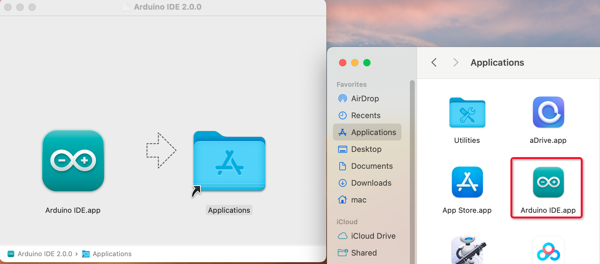

.. note:: 

    ¡Hola, bienvenido a la Comunidad de Entusiastas de Raspberry Pi, Arduino y ESP32 en Facebook! Profundiza más en Raspberry Pi, Arduino y ESP32 junto con otros entusiastas.

    **¿Por qué unirte?**

    - **Soporte experto**: Resuelve problemas postventa y desafíos técnicos con la ayuda de nuestra comunidad y equipo.
    - **Aprende y comparte**: Intercambia consejos y tutoriales para mejorar tus habilidades.
    - **Previsualizaciones exclusivas**: Accede anticipadamente a anuncios de nuevos productos y vistas previas.
    - **Descuentos especiales**: Disfruta de descuentos exclusivos en nuestros productos más recientes.
    - **Promociones festivas y sorteos**: Participa en sorteos y promociones especiales durante las festividades.

    👉 ¿Listo para explorar y crear con nosotros? Haz clic en [|link_sf_facebook|] y únete hoy!

.. _install_arduino:

Descargar e Instalar el IDE de Arduino 2.0
=============================================

El IDE de Arduino, conocido como el Entorno de Desarrollo Integrado de Arduino, proporciona todo el soporte de software necesario para completar un proyecto de Arduino. Es un software de programación diseñado específicamente para Arduino, proporcionado por el equipo de Arduino, que nos permite escribir programas y cargarlos en la placa de Arduino.

El IDE de Arduino 2.0 es un proyecto de código abierto. Es un gran paso con respecto a su robusto predecesor, el IDE de Arduino 1.x, y viene con una interfaz de usuario renovada, un gestor de placas y bibliotecas mejorado, depurador, función de autocompletado y mucho más.

En este tutorial, mostraremos cómo descargar e instalar el IDE de Arduino 2.0 en tu computadora con Windows, Mac o Linux.

Requisitos
-------------------

* Windows - Win 10 y versiones posteriores, 64 bits
* Linux - 64 bits
* Mac OS X - Versión 10.14: "Mojave" o posterior, 64 bits

Descargar el IDE de Arduino 2.0
-------------------------------

#. Visita |link_download_arduino|.

#. Descarga el IDE correspondiente a tu versión de SO.

   .. image:: img/sp_001.png

Instalación
------------------------------

Windows
^^^^^^^^^^^^^

#. Haz doble clic en el archivo ``arduino-ide_xxxx.exe`` para ejecutar el archivo descargado.

#. Lee el acuerdo de licencia y acepta los términos.

   .. image:: img/sp_002.png

#. Elige las opciones de instalación.

   .. image:: img/sp_003.png

#. Elige la ubicación de la instalación. Se recomienda instalar el software en una unidad diferente de la unidad del sistema.

   .. image:: img/sp_004.png

#. Luego, haz clic en Finalizar.

   .. image:: img/sp_005.png

macOS
^^^^^^^^^^^^^^^^

Haz doble clic en el archivo descargado ``arduino_ide_xxxx.dmg`` y sigue las instrucciones para copiar **Arduino IDE.app** a la carpeta **Aplicaciones**, verás que el IDE de Arduino se instala correctamente después de unos segundos.

Linux
^^^^^^^^^^^^

Para el tutorial sobre la instalación del IDE de Arduino 2.0 en un sistema Linux, consulta |link_install_arduino_linux|

Abrir el IDE
--------------

#. La primera vez que abras el IDE de Arduino 2.0, instalará automáticamente las placas AVR de Arduino, las bibliotecas incorporadas y otros archivos necesarios.

   .. image:: img/sp_901.png

#. Además, tu firewall o centro de seguridad puede mostrarte varias ventanas preguntándote si deseas instalar algunos controladores de dispositivos. Por favor, instala todos ellos.

   .. image:: img/sp_104.png

#. ¡Ahora tu IDE de Arduino está listo!

   .. note::
     En caso de que algunas instalaciones no se hayan realizado debido a problemas de red u otras razones, puedes volver a abrir el IDE de Arduino y terminará el resto de la instalación. La ventana de salida no se abrirá automáticamente después de que todas las instalaciones se completen, a menos que hagas clic en Verificar o Cargar.

