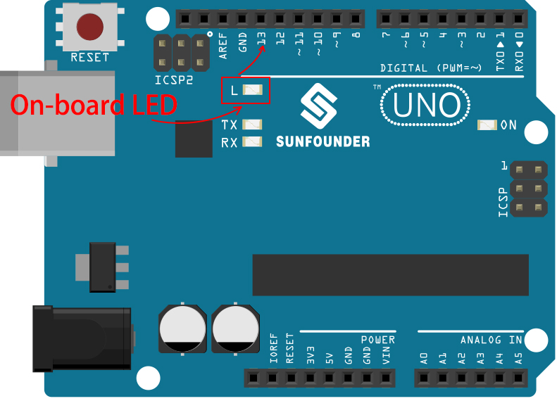

.. note::

    Bonjour, bienvenue dans la communauté des passionnés de SunFounder pour Raspberry Pi, Arduino et ESP32 sur Facebook ! Explorez plus profondément les univers de Raspberry Pi, Arduino et ESP32 avec d'autres amateurs.

    **Pourquoi rejoindre ?**

    - **Support d'experts** : Résolvez les problèmes après-vente et les défis techniques avec l'aide de notre communauté et de notre équipe.
    - **Apprendre & Partager** : Échangez des astuces et des tutoriels pour renforcer vos compétences.
    - **Aperçus exclusifs** : Obtenez un accès anticipé aux annonces de nouveaux produits et aux aperçus exclusifs.
    - **Réductions spéciales** : Profitez de réductions exclusives sur nos nouveaux produits.
    - **Promotions festives et cadeaux** : Participez à des concours et des promotions festives.

    👉 Prêt à explorer et à créer avec nous ? Cliquez sur [|link_sf_facebook|] et rejoignez-nous dès aujourd'hui !

Comment téléverser un sketch sur la carte ?
=============================================

Dans cette section, vous apprendrez comment téléverser le sketch créé précédemment sur la carte Arduino, ainsi que quelques considérations importantes.

**1. Choisissez la carte et le port**

Les cartes de développement Arduino sont généralement accompagnées d'un câble USB. Utilisez-le pour connecter la carte à votre ordinateur.

Sélectionnez la **Carte** et le **Port** appropriés dans l'IDE Arduino. Normalement, les cartes Arduino sont automatiquement reconnues par l'ordinateur et se voient attribuer un port, que vous pouvez sélectionner ici.

    .. image:: img/board_port.png
        :width: 90%

Si votre carte est déjà branchée mais non reconnue, vérifiez si le logo **INSTALLÉ** apparaît dans la section **Cartes Arduino AVR** du **Gestionnaire de cartes**, sinon, veuillez défiler un peu et cliquer sur **INSTALL**.

    .. image:: img/upload1.png
        :width: 90%

Spécifiquement, pour UNO R4, recherchez **"UNO R4"** dans le **Gestionnaire de cartes** et vérifiez si la bibliothèque correspondante est installée.

    .. image:: img/install_uno_r4_lib.png
        :width: 90%

Redémarrer l'IDE Arduino et reconnecter la carte Arduino résoudra la plupart des problèmes. Vous pouvez également cliquer sur **Outils** -> **Carte** ou **Port** pour les sélectionner.

**2. Vérifiez le Sketch**

Après avoir cliqué sur le bouton Vérifier, le sketch sera compilé pour voir s'il y a des erreurs.

    .. image:: img/sp221014_174532.png
        :width: 90%

Vous pouvez utiliser cette fonction pour trouver des erreurs si vous avez supprimé des caractères ou tapé quelques lettres par erreur. Depuis la barre de messages, vous pouvez voir où et quel type d'erreurs se sont produites.

    .. image:: img/sp221014_175307.png
        :width: 90%

S'il n'y a pas d'erreurs, vous verrez un message comme celui ci-dessous.

    .. image:: img/sp221014_175512.png
        :width: 90%

**3. Téléversez le sketch**

Après avoir complété les étapes ci-dessus, cliquez sur le bouton **Téléverser** pour téléverser ce sketch sur la carte.

    .. image:: img/sp221014_175614.png
        :width: 90%

Si le téléversement est réussi, vous pourrez voir l'invite suivante.

    .. image:: img/sp221014_175654.png
        :width: 90%

En même temps, la LED embarquée clignotera.

.. raw:: html
    
     

La carte Arduino exécutera automatiquement le sketch après que l'alimentation soit appliquée après le téléversement. Le programme en cours peut être remplacé en téléversant un nouveau sketch.

