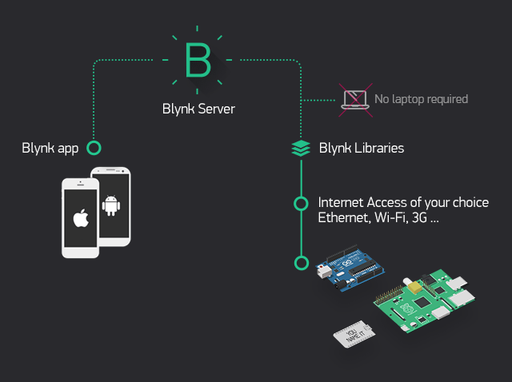

.. note::

    Ciao e benvenuto nella community Facebook dedicata agli appassionati di SunFounder Raspberry Pi, Arduino ed ESP32! Approfondisci le tue conoscenze su Raspberry Pi, Arduino ed ESP32 insieme ad altri appassionati.

    **Perché unirsi?**

    - **Supporto esperto**: Risolvi problemi post-vendita e sfide tecniche grazie all’aiuto della community e del nostro team.
    - **Impara e condividi**: Scambia consigli e tutorial per migliorare le tue competenze.
    - **Anteprime esclusive**: Ottieni accesso anticipato agli annunci dei nuovi prodotti e alle anteprime.
    - **Sconti speciali**: Approfitta di sconti esclusivi sui nostri prodotti più recenti.
    - **Promozioni festive e giveaway**: Partecipa a giveaway e promozioni speciali durante le festività.

    👉 Pronto a esplorare e creare con noi? Clicca su [|link_sf_facebook|] e unisciti oggi stesso!

.. _iot_blynk_start:

Inizia con Blynk
=============================

Blynk è una suite completa di strumenti software pensata per prototipare, distribuire e gestire da remoto dispositivi elettronici connessi, su qualsiasi scala: dai progetti IoT personali fino a milioni di prodotti commerciali connessi.
Con Blynk, chiunque può collegare il proprio hardware al cloud e creare applicazioni per iOS, Android e web senza scrivere codice, per analizzare dati in tempo reale e storici provenienti dai dispositivi, controllarli a distanza da qualsiasi parte del mondo, ricevere notifiche importanti e molto altro.

Per far comunicare la scheda R4 con Blynk è necessaria una configurazione iniziale.

Segui attentamente i passaggi riportati di seguito, rispettando l’ordine indicato e senza saltare alcun capitolo.

.. toctree::
    :maxdepth: 2

    01-iot_esp8266_config
    02-iot_blynk_config
    03-iot_add_lib
    04-iot_connect_r4_blynk