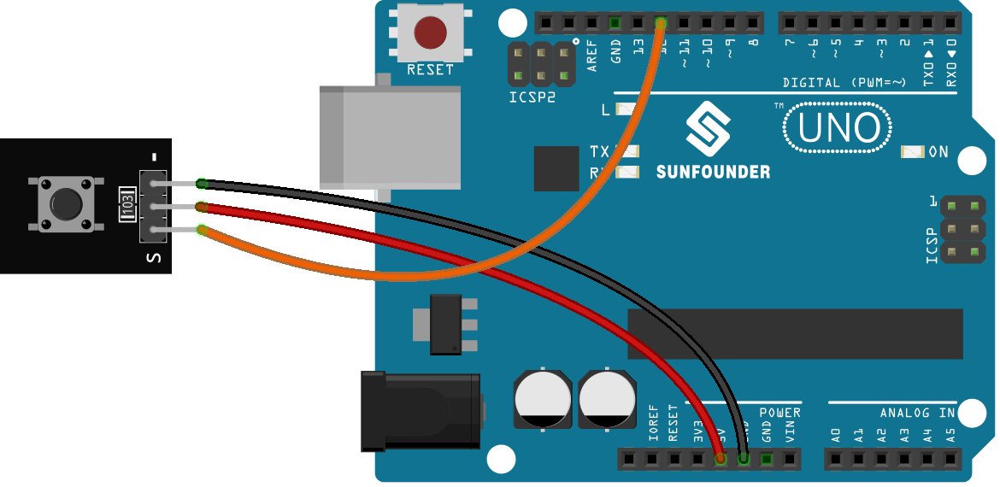

.. note::

    Bonjour, bienvenue dans la communauté des passionnés de SunFounder Raspberry Pi, Arduino et ESP32 sur Facebook ! Plongez plus profondément dans l'univers de Raspberry Pi, Arduino et ESP32 avec d'autres passionnés.

    **Pourquoi rejoindre ?**

    - **Support d'expert** : Résolvez les problèmes post-vente et les défis techniques avec l'aide de notre communauté et de notre équipe.
    - **Apprendre et partager** : Échangez des astuces et des tutoriels pour améliorer vos compétences.
    - **Aperçus exclusifs** : Obtenez un accès anticipé aux annonces de nouveaux produits et aux aperçus exclusifs.
    - **Réductions spéciales** : Profitez de réductions exclusives sur nos nouveaux produits.
    - **Promotions festives et cadeaux** : Participez à des cadeaux et promotions de fêtes.

    👉 Prêts à explorer et à créer avec nous ? Cliquez sur [|link_sf_facebook|] et rejoignez-nous aujourd'hui !

.. _uno_lesson01_button:

Leçon 01 : Module Bouton
==================================

Dans cette leçon, vous apprendrez comment un bouton interagit avec une LED à l'aide d'un Arduino. Nous verrons comment l'appui sur le bouton allume la LED et comment la relâcher l'éteint. Ce projet est idéal pour les débutants car il fournit une compréhension pratique des opérations d'entrée et de sortie sur la plateforme Arduino.

Composants nécessaires
---------------------------

Pour ce projet, nous avons besoin des composants suivants.

Il est définitivement pratique d'acheter un kit complet, voici le lien :

.. list-table::
    :widths: 20 20 20
    :header-rows: 1

    *   - Nom	
        - ÉLÉMENTS DE CE KIT
        - LIEN
    *   - Kit capteur universel pour bricoleurs
        - 94
        - |link_umsk|

Vous pouvez également les acheter séparément via les liens ci-dessous.

.. list-table::
    :widths: 30 20
    :header-rows: 1

    *   - Introduction au composant
        - Lien d'achat

    *   - Arduino UNO R3 ou R4
        - |link_Uno_R3_buy|
    *   - :ref:`cpn_button`
        - \-
        

Câblage
---------------------------

Code
---------------------------

.. raw:: html

    <iframe src=https://create.arduino.cc/editor/sunfounder01/2249707e-73aa-400b-8141-15424c291f44/preview?embed style="height:510px;width:100%;margin:10px 0" frameborder=0></iframe>

Analyse du code
---------------------------

#. Initialisation des broches

   Les broches pour le bouton et la LED sont définies et initialisées. La ``buttonPin`` est configurée en entrée pour lire l'état du bouton, et la ``ledPin`` est configurée en sortie pour contrôler la LED.

   .. note::
      La plupart des cartes Arduino ont une broche connectée à une LED embarquée en série avec une résistance. La constante ``LED_BUILTIN`` est le numéro de la broche à laquelle la LED embarquée est connectée. La plupart des cartes ont cette LED connectée à la broche numérique 13.
   
   .. code-block:: arduino

      const int buttonPin = 12;        // Numéro de la broche pour le bouton
      const int ledPin = LED_BUILTIN;  // Numéro de la broche pour la LED
      int buttonState = 0;  // Variable pour maintenir l'état actuel du bouton

#. Fonction Setup

   Cette fonction s'exécute une fois et configure les modes des broches. ``pinMode(buttonPin, INPUT)`` configure la broche du bouton comme une entrée. ``pinMode(ledPin, OUTPUT)`` configure la broche de la LED comme une sortie.
   
   .. code-block:: arduino

      void setup() {
        pinMode(buttonPin, INPUT);  // Initialise buttonPin comme une broche d'entrée
        pinMode(ledPin, OUTPUT);    // Initialise ledPin comme une broche de sortie

#. Fonction Loop principale

   C'est le cœur du programme où l'état du bouton est continuellement lu et l'état de la LED est contrôlé. ``digitalRead(buttonPin)`` lit l'état du bouton. Si le bouton est pressé (état LOW), la LED est allumée par ``digitalWrite(ledPin, HIGH)``. Si non pressé, la LED est éteinte (``digitalWrite(ledPin, LOW)``).

   Le :ref:`button module<cpn_button>` utilisé dans ce projet possède une résistance de tirage interne (voir son :ref:`schéma<cpn_button_sch>`), ce qui fait que le bouton est à un niveau bas lorsqu'il est pressé et reste à un niveau haut lorsqu'il est relâché.
   
   .. code-block:: arduino

      void loop() {
        // Lire l'état actuel du bouton
        buttonState = digitalRead(buttonPin);

        // Vérifier si le bouton est pressé (LOW)
        if (buttonState == LOW) {
          digitalWrite(ledPin, HIGH);  // Allumer la LED
        } else {
          digitalWrite(ledPin, LOW);  // Éteindre la LED
        }
      }
