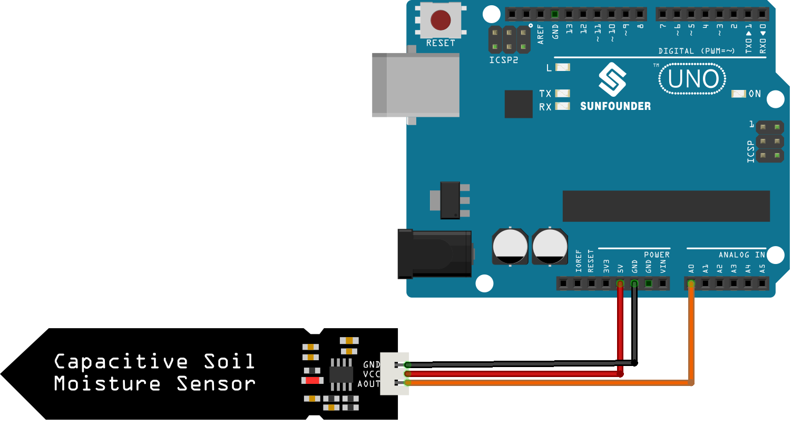

.. note::

    Ciao e benvenuto nella community Facebook dedicata agli appassionati di SunFounder Raspberry Pi, Arduino ed ESP32! Approfondisci le tue conoscenze su Raspberry Pi, Arduino ed ESP32 insieme ad altri maker entusiasti.

    **Perché unirsi?**

    - **Supporto esperto**: Risolvi problemi post-vendita e difficoltà tecniche grazie al supporto della nostra community e del nostro team.
    - **Impara e condividi**: Scambia suggerimenti e tutorial per migliorare le tue competenze.
    - **Anteprime esclusive**: Ricevi in anteprima annunci di nuovi prodotti e contenuti esclusivi.
    - **Sconti speciali**: Approfitta di sconti esclusivi sui nostri prodotti più recenti.
    - **Promozioni festive e giveaway**: Partecipa a promozioni speciali e concorsi a premi durante le festività.

    👉 Pronto a esplorare e creare con noi? Clicca su [|link_sf_facebook|] e unisciti oggi stesso!

.. _uno_lesson02_soil_moisture:

Lezione 02: Sensore Capacitivo di Umidità del Suolo
======================================================

In questa lezione imparerai a collegare un sensore capacitivo di umidità del suolo ad Arduino e a interpretarne le letture. Il progetto prevede la lettura dell’uscita analogica del sensore tramite Arduino e la comprensione del fatto che valori più bassi indicano un livello di umidità del suolo più elevato. Attraverso il codice fornito, acquisirai esperienza pratica nella gestione degli input analogici e della comunicazione seriale con Arduino.

Componenti Necessari
---------------------------

Per questo progetto sono richiesti i seguenti componenti.

È sicuramente comodo acquistare un kit completo, ecco il link:

.. list-table::
    :widths: 20 20 20
    :header-rows: 1

    *   - Nome
        - COMPONENTI INCLUSI NEL KIT
        - LINK
    *   - Universal Maker Sensor Kit
        - 94
        - |link_umsk|

Puoi anche acquistare i componenti singolarmente tramite i link riportati di seguito.

.. list-table::
    :widths: 30 20
    :header-rows: 1

    *   - Descrizione Componente
        - Link per l'acquisto

    *   - Arduino UNO R3 o R4
        - |link_Uno_R3_buy|
    *   - :ref:`cpn_soil`
        - |link_soil_moisture_buy|

Collegamenti
---------------------------

Codice
---------------------------

.. raw:: html

    <iframe src=https://create.arduino.cc/editor/sunfounder01/fa2c3492-576b-4039-bbfe-891ed87e72c9/preview?embed style="height:510px;width:100%;margin:10px 0" frameborder=0></iframe>

Analisi del Codice
---------------------------

#. Definizione del pin del sensore:

   Questa riga di codice dichiara una costante intera ``sensorPin`` e le assegna il valore ``A0``, ovvero il pin analogico al quale è collegato il sensore.

   .. code-block:: arduino

      const int sensorPin = A0;

#. Funzione setup:

   La funzione ``setup()`` viene eseguita una sola volta all’avvio del programma. Inizializza la comunicazione seriale alla velocità di 9600 baud. Questa configurazione è necessaria per inviare i dati al monitor seriale.

   .. code-block:: arduino

      void setup() {
        Serial.begin(9600);
      }

#. Funzione loop:

   La funzione ``loop()`` viene eseguita continuamente dopo ``setup()``. Legge il valore del sensore dal pin A0 tramite ``analogRead()`` e lo stampa sul monitor seriale. L’istruzione ``delay(500)`` mette in pausa il ciclo per 500 millisecondi prima della lettura successiva, controllando così la frequenza di acquisizione dati.

   .. code-block:: arduino

      void loop() {
        Serial.println(analogRead(A0));
        delay(500);
      }

