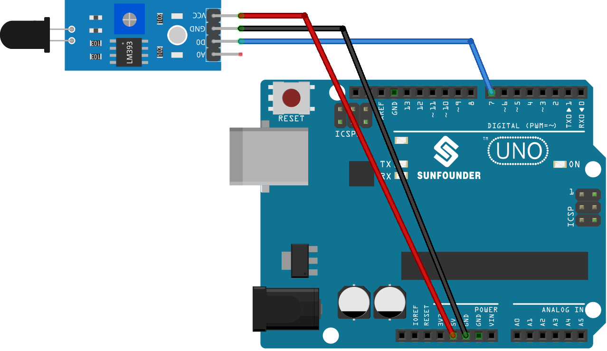

.. note::

    Bonjour, bienvenue dans la communauté des passionnés de SunFounder Raspberry Pi, Arduino et ESP32 sur Facebook ! Plongez plus profondément dans l'univers de Raspberry Pi, Arduino et ESP32 avec d'autres passionnés.

    **Pourquoi rejoindre ?**

    - **Support d'expert** : Résolvez les problèmes post-vente et les défis techniques avec l'aide de notre communauté et de notre équipe.
    - **Apprendre et partager** : Échangez des astuces et des tutoriels pour améliorer vos compétences.
    - **Aperçus exclusifs** : Obtenez un accès anticipé aux annonces de nouveaux produits et aux aperçus exclusifs.
    - **Réductions spéciales** : Profitez de réductions exclusives sur nos nouveaux produits.
    - **Promotions festives et cadeaux** : Participez à des cadeaux et promotions de fêtes.

    👉 Prêts à explorer et à créer avec nous ? Cliquez sur [|link_sf_facebook|] et rejoignez-nous aujourd'hui !

.. _uno_lesson03_flame:

Leçon 03 : Module Capteur de Flamme
======================================

Dans cette leçon, vous apprendrez à intégrer un capteur de flamme avec une carte Arduino pour détecter la présence de feu. Nous verrons comment le capteur de flamme, lorsqu'il détecte une flamme, active la LED intégrée de l'Arduino pour s'allumer et envoie un message d'avertissement au moniteur série. À l'inverse, en l'absence de flamme, la LED reste éteinte et un message différent est transmis au moniteur. Ce projet est un excellent point de départ pour les débutants, offrant une compréhension complète de la gestion des entrées et sorties numériques sur la plateforme Arduino. Il fournit une approche pratique pour apprendre l'intégration des capteurs et les mécanismes de réponse en temps réel dans un système basé sur Arduino.

Composants nécessaires
---------------------------

Pour ce projet, nous avons besoin des composants suivants.

Il est définitivement pratique d'acheter un kit complet, voici le lien :

.. list-table::
    :widths: 20 20 20
    :header-rows: 1

    *   - Nom	
        - ÉLÉMENTS DE CE KIT
        - LIEN
    *   - Kit capteur universel pour bricoleurs
        - 94
        - |link_umsk|

Vous pouvez également les acheter séparément via les liens ci-dessous.

.. list-table::
    :widths: 30 20
    :header-rows: 1

    *   - Introduction au composant
        - Lien d'achat

    *   - Arduino UNO R3 ou R4
        - |link_Uno_R3_buy|
    *   - :ref:`cpn_flame`
        - |link_flame_sensor_module_buy|

Câblage
---------------------------

Code
---------------------------

.. raw:: html

    <iframe src=https://create.arduino.cc/editor/sunfounder01/244b68c4-0c4d-46fb-b220-985d42f4efdc/preview?embed style="height:510px;width:100%;margin:10px 0" frameborder=0></iframe>

Analyse du code
---------------------------

1. La première ligne de code est une déclaration d'entier constant pour la broche du capteur de flamme. Nous utilisons la broche numérique 7 pour lire la sortie du capteur de flamme.

   .. code-block:: arduino
   
      const int sensorPin = 7;

2. La fonction ``setup()`` initialise la broche du capteur de flamme en tant qu'entrée et la broche de la LED intégrée en tant que sortie. Elle commence également la communication série à un débit de 9600 bauds pour envoyer des messages au moniteur série.

   .. code-block:: arduino
   
      void setup() {
        pinMode(sensorPin, INPUT);     // Définir la broche du capteur de flamme comme entrée
        pinMode(LED_BUILTIN, OUTPUT);  // Définir la broche de la LED intégrée comme sortie
        Serial.begin(9600);            // Initialiser le moniteur série à un débit de 9600
      }

3. La fonction ``loop()`` est l'endroit où nous vérifions en continu l'état du capteur de flamme. Si le capteur détecte une flamme, la LED intégrée est allumée et un message est imprimé sur le moniteur série. Si aucune flamme n'est détectée, la LED est éteinte et un message différent est imprimé. Le processus se répète toutes les 100 millisecondes.

   .. note:: 
      Vous pouvez changer le seuil de détection des flammes en ajustant le potentiomètre sur le module capteur de flamme.

   .. code-block:: arduino
   
      void loop() {
        // Vérifier si le capteur détecte un feu
        if (digitalRead(sensorPin) == 0) {
          digitalWrite(LED_BUILTIN, HIGH);  // Allumer la LED intégrée
          Serial.println("** Fire detected!!! **");
        } else {
          digitalWrite(LED_BUILTIN, LOW);  // Éteindre la LED intégrée
          Serial.println("No Fire detected");
        }
        delay(100);
      }
