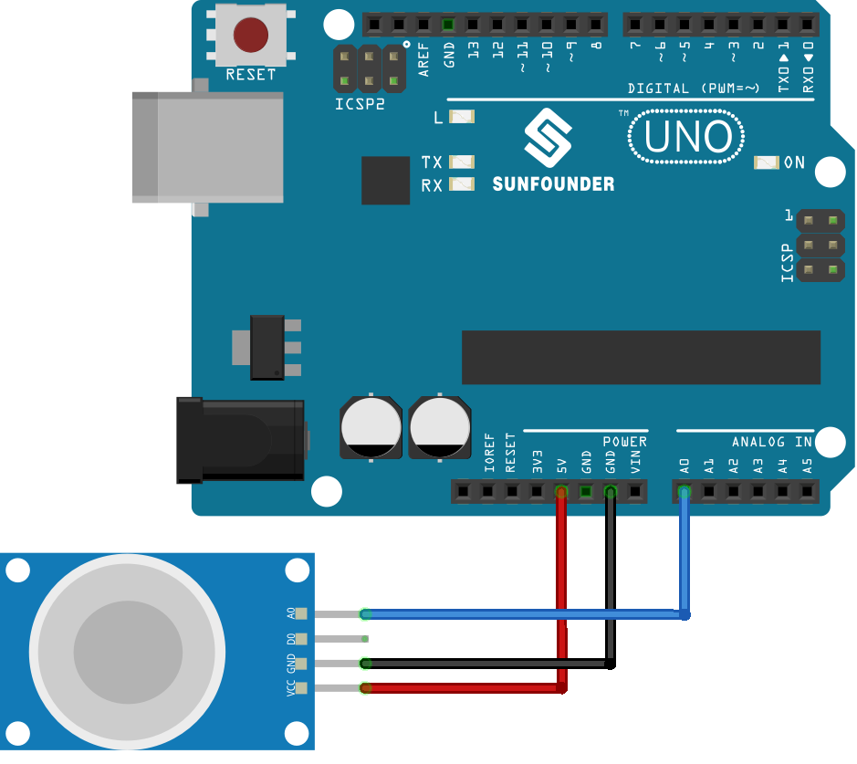

.. note:: 

    ¡Hola, bienvenido a la comunidad de entusiastas de SunFounder Raspberry Pi, Arduino y ESP32 en Facebook! Profundiza en Raspberry Pi, Arduino y ESP32 junto a otros entusiastas.

    **¿Por qué unirse?**

    - **Soporte experto**: Resuelve problemas postventa y desafíos técnicos con la ayuda de nuestra comunidad y equipo.
    - **Aprender y compartir**: Intercambia consejos y tutoriales para mejorar tus habilidades.
    - **Preestrenos exclusivos**: Accede de forma anticipada a anuncios de nuevos productos y avances.
    - **Descuentos especiales**: Disfruta de descuentos exclusivos en nuestros productos más nuevos.
    - **Promociones festivas y sorteos**: Participa en sorteos y promociones especiales.

    👉 ¿Listo para explorar y crear con nosotros? Haz clic en [|link_sf_facebook|] y únete hoy mismo!

.. _uno_lesson04_mq2:

Lección 04: Módulo Sensor de Gas (MQ-2)
============================================

En esta lección, aprenderás cómo utilizar el Sensor de Gas MQ-2 con un Arduino Uno para medir las concentraciones de gas. Exploraremos cómo el sensor lee valores de salida analógica que van de 0 a 1023, los cuales representan la concentración de gases en el aire. Este proyecto es esencial para entender la detección ambiental y el procesamiento de señales analógicas en Arduino, además de ser una excelente introducción al trabajo con sensores e interpretación de sus salidas. Discutiremos la importancia de precalentar el sensor para obtener lecturas precisas y profundizaremos en los conceptos básicos de la comunicación serial para la visualización de datos. Esta lección es ideal para principiantes interesados en proyectos de Arduino y monitoreo ambiental.

Componentes necesarios
--------------------------

En este proyecto, necesitamos los siguientes componentes.

Es definitivamente conveniente comprar un kit completo, aquí está el enlace:

.. list-table::
    :widths: 20 20 20
    :header-rows: 1

    *   - Nombre
        - ARTÍCULOS EN ESTE KIT
        - ENLACE
    *   - Kit de Sensores Universal Maker
        - 94
        - |link_umsk|

También puedes comprarlos por separado desde los enlaces a continuación.

.. list-table::
    :widths: 30 10
    :header-rows: 1

    *   - Introducción del componente
        - Enlace de compra

    *   - Arduino UNO R3 o R4
        - |link_Uno_R3_buy|
    *   - :ref:`cpn_gas`
        - |link_mq2_gas_sensor_module_buy|

Cableado
---------------------------

Código
---------------------------

.. raw:: html

    <iframe src=https://create.arduino.cc/editor/sunfounder01/6af3295c-28dd-4319-8f26-587930ffd2ef/preview?embed style="height:510px;width:100%;margin:10px 0" frameborder=0></iframe>

Análisis del Código
---------------------------

1. La primera línea de código declara una constante entera para el pin del sensor de gas. Usamos el pin analógico A0 para leer la salida del sensor de gas.

   .. code-block:: arduino
   
      const int sensorPin = A0;

2. La función ``setup()`` es donde inicializamos nuestra comunicación serial a una velocidad de 9600 baudios. Esto es necesario para imprimir las lecturas del sensor de gas en el monitor serial.

   .. code-block:: arduino
   
      void setup() {
        Serial.begin(9600);  // Inicia la comunicación serial a una velocidad de 9600 baudios
      }

3. La función ``loop()`` es donde leemos continuamente el valor analógico del sensor de gas y lo imprimimos en el monitor serial. Usamos la función ``analogRead()`` para leer el valor analógico del sensor. Luego esperamos 50 milisegundos antes de la siguiente lectura. Este retraso permite que el monitor serial procese los datos.

   .. note:: 
   
     El MQ2 es un sensor de calentamiento que generalmente requiere precalentamiento antes de su uso. Durante el período de precalentamiento, el sensor suele leer un valor alto que disminuye gradualmente hasta estabilizarse.

   .. code-block:: arduino
   
      void loop() {
        Serial.print("Analog output: ");
        Serial.println(analogRead(sensorPin));  // Lee el valor analógico del sensor de gas e imprime en el monitor serial
        delay(50);                             // Espera 50 milisegundos
      }

