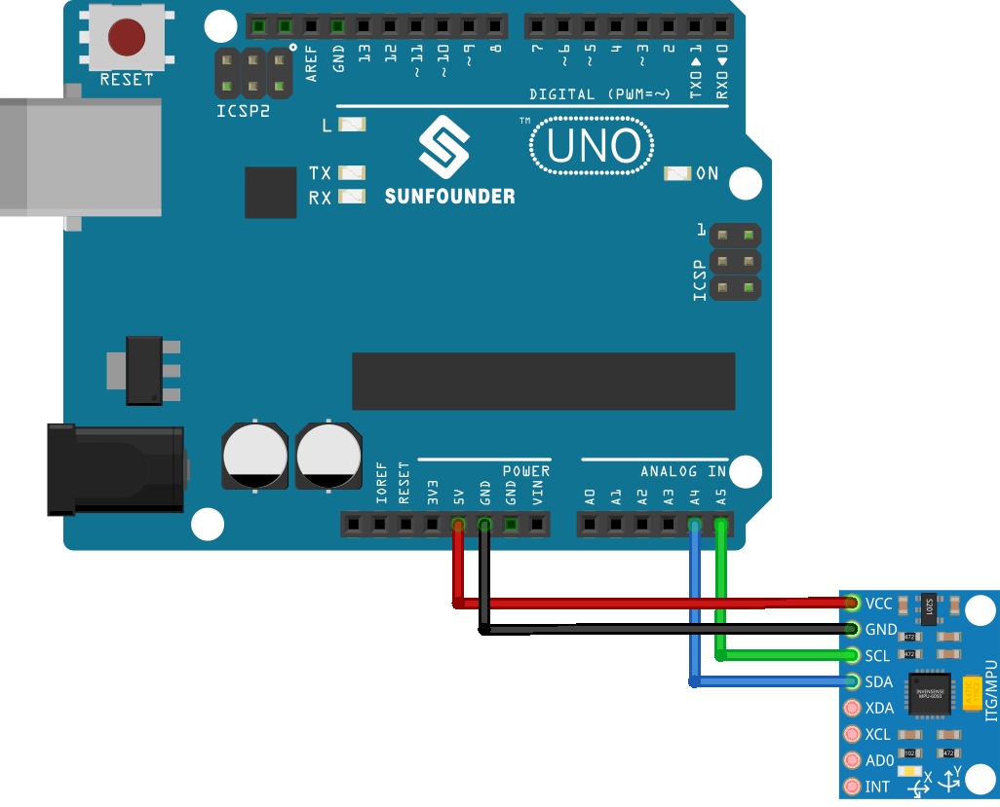

.. note::

    Bonjour, bienvenue dans la communauté des passionnés de SunFounder Raspberry Pi, Arduino et ESP32 sur Facebook ! Plongez plus profondément dans l'univers de Raspberry Pi, Arduino et ESP32 avec d'autres passionnés.

    **Pourquoi rejoindre ?**

    - **Support d'expert** : Résolvez les problèmes après-vente et les défis techniques avec l'aide de notre communauté et de notre équipe.
    - **Apprendre et partager** : Échangez des astuces et des tutoriels pour améliorer vos compétences.
    - **Aperçus exclusifs** : Obtenez un accès anticipé aux annonces de nouveaux produits et aux aperçus exclusifs.
    - **Réductions spéciales** : Profitez de réductions exclusives sur nos nouveaux produits.
    - **Promotions festives et cadeaux** : Participez à des cadeaux et promotions de fêtes.

    👉 Prêts à explorer et à créer avec nous ? Cliquez sur [|link_sf_facebook|] et rejoignez-nous aujourd'hui !

.. _uno_lesson05_mpu6050:

Leçon 05 : Module Gyroscope et Accéléromètre (MPU6050)
==========================================================

Dans cette leçon, vous apprendrez à utiliser le capteur MPU6050 avec un Arduino pour mesurer l'accélération, la rotation et la température. Nous explorerons l'initialisation du capteur, le réglage de ses plages de mesure et la lecture des données pour affichage sur le moniteur série. Ce projet offre une approche pratique du travail avec les capteurs de mouvement et leur intégration avec Arduino, parfait pour ceux qui souhaitent plonger dans le monde de l'électronique et de la gestion des données de capteurs.

Composants nécessaires
--------------------------

Pour ce projet, nous avons besoin des composants suivants.

Il est définitivement pratique d'acheter un kit complet, voici le lien :

.. list-table::
    :widths: 20 20 20
    :header-rows: 1

    *   - Nom	
        - ÉLÉMENTS DE CE KIT
        - LIEN
    *   - Kit capteur universel pour bricoleurs
        - 94
        - |link_umsk|

Vous pouvez également les acheter séparément via les liens ci-dessous.

.. list-table::
    :widths: 30 10
    :header-rows: 1

    *   - Introduction au composant
        - Lien d'achat

    *   - Arduino UNO R3 ou R4
        - |link_Uno_R3_buy|
    *   - :ref:`cpn_mpu6050`
        - |link_mpu6050_buy|

Câblage
---------------------------

Code
---------------------------

.. note:: 
    Pour installer la bibliothèque, utilisez le gestionnaire de bibliothèques Arduino et recherchez **"Adafruit MPU6050"** puis installez-la.

.. raw:: html

    <iframe src=https://create.arduino.cc/editor/sunfounder01/b0efe80d-c89d-402e-a213-a778c404565b/preview?embed style="height:510px;width:100%;margin:10px 0" frameborder=0></iframe>

Analyse du code
---------------------------

1. Le code commence par inclure les bibliothèques nécessaires et créer un objet pour le capteur MPU6050. Ce code utilise la bibliothèque Adafruit_MPU6050, la bibliothèque Adafruit_Sensor et la bibliothèque Wire. La bibliothèque ``Adafruit_MPU6050`` est utilisée pour interagir avec le capteur MPU6050 et récupérer les données d'accélération, de rotation et de température. La bibliothèque ``Adafruit_Sensor`` fournit une interface commune pour différents types de capteurs. La bibliothèque ``Wire`` est utilisée pour la communication I2C, nécessaire pour communiquer avec le capteur MPU6050.

   .. note:: 
       Pour installer la bibliothèque, utilisez le gestionnaire de bibliothèques Arduino et recherchez **"Adafruit MPU6050"** puis installez-la.
   
   .. code-block:: arduino
   
      #include <Adafruit_MPU6050.h>
      #include <Adafruit_Sensor.h>
      #include <Wire.h>
      Adafruit_MPU6050 mpu;
   
2. La fonction ``setup()`` initialise la communication série et vérifie si le capteur est détecté. Si le capteur n'est pas trouvé, l'Arduino entre dans une boucle infinie avec un message "Échec de la détection du capteur MPU6050". Si trouvé, les plages de l'accéléromètre, du gyro et la bande passante du filtre sont réglées, et un délai est ajouté pour la stabilité.

   .. code-block:: arduino
   
      void setup(void) {
        // Initialiser la communication série
        Serial.begin(9600);
   
        // Vérifier si le capteur MPU6050 est détecté
        if (!mpu.begin()) {
          Serial.println("Failed to find MPU6050 chip");
          while (1) {
            delay(10);
          }
        }
        Serial.println("MPU6050 Found!");
   
        // régler la plage de l'accéléromètre à +-8G
        mpu.setAccelerometerRange(MPU6050_RANGE_8_G);
   
        // régler la plage du gyro à +- 500 degrés/s
        mpu.setGyroRange(MPU6050_RANGE_500_DEG);
   
        // régler la bande passante du filtre à 21 Hz
        mpu.setFilterBandwidth(MPU6050_BAND_21_HZ);
   
        // Ajouter un délai pour la stabilité
        delay(100);
      }

3. Dans la fonction ``loop()``, le programme crée des événements pour stocker les lectures des capteurs, puis récupère les lectures. Les valeurs d'accélération, de rotation et de température sont ensuite imprimées sur le moniteur série.

   .. code-block:: arduino
   
      void loop() {
        // Créer de nouveaux événements de capteur avec les lectures
        sensors_event_t a, g, temp;
        mpu.getEvent(&a, &g, &temp);
   
        // Imprimer les lectures d'accélération, de rotation et de température
        // ...
   
        // Ajouter un délai pour éviter de surcharger le moniteur série
        delay(1000);
      }
