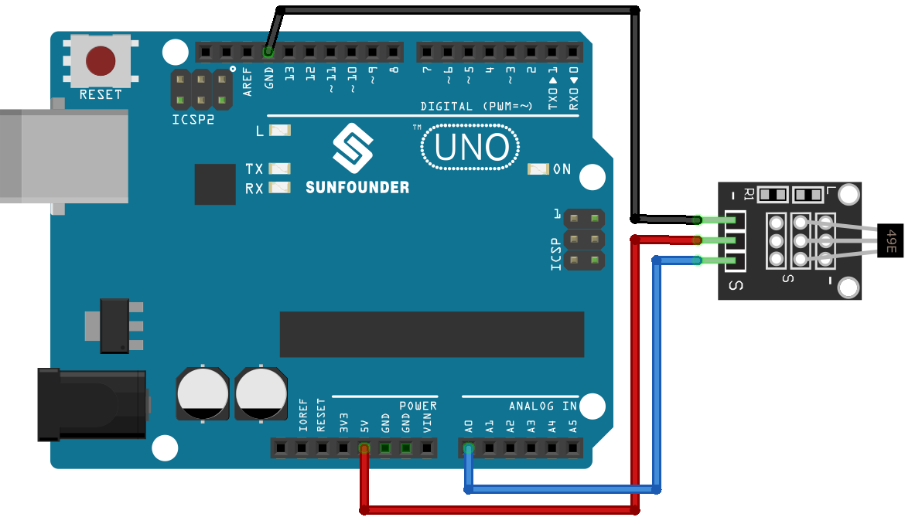

.. note:: 

    Ciao e benvenuto nella Community Facebook degli appassionati di SunFounder Raspberry Pi, Arduino ed ESP32! Approfondisci le tue conoscenze su Raspberry Pi, Arduino ed ESP32 insieme ad altri appassionati.

    **Perché unirsi?**

    - **Supporto Esperto**: Risolvi problemi post-vendita e sfide tecniche con l’aiuto del nostro team e della community.
    - **Impara e Condividi**: Scambia suggerimenti e tutorial per migliorare le tue competenze.
    - **Anteprime Esclusive**: Ottieni l’accesso anticipato alle novità sui prodotti e ad anteprime esclusive.
    - **Sconti Speciali**: Approfitta di sconti esclusivi sui nostri prodotti più recenti.
    - **Promozioni e Giveaway Festivi**: Partecipa a promozioni festive e concorsi con premi.

    👉 Pronto a esplorare e creare con noi? Clicca su [|link_sf_facebook|] ed entra oggi stesso!

.. _uno_lesson06_hall_sensor:

Lezione 06: Modulo Sensore di Hall
======================================

In questa lezione scoprirai come un sensore di Hall rileva i campi magnetici utilizzando Arduino. Vedremo come leggere il segnale analogico del sensore tramite Arduino Uno e come interpretare i valori per determinare la polarità del campo magnetico. Capirai il funzionamento del sensore di Hall e come la scheda Arduino elabora e visualizza questi dati in tempo reale.

Componenti Necessari
--------------------------

Per questo progetto sono necessari i seguenti componenti.

È sicuramente comodo acquistare un kit completo, ecco il link:

.. list-table::
    :widths: 20 20 20
    :header-rows: 1

    *   - Nome	
        - CONTENUTO DEL KIT
        - LINK
    *   - Universal Maker Sensor Kit
        - 94
        - |link_umsk|

Puoi anche acquistare i componenti singolarmente dai link sottostanti.

.. list-table::
    :widths: 30 20
    :header-rows: 1

    *   - Descrizione del Componente
        - Link per l'acquisto

    *   - Arduino UNO R3 o R4
        - |link_Uno_R3_buy|
    *   - :ref:`cpn_hall`
        - \-

Collegamenti
---------------------------

Codice
---------------------------

.. raw:: html

    <iframe src=https://create.arduino.cc/editor/sunfounder01/fc459930-a030-4a1d-b998-e57a6a4f2e78/preview?embed style="height:510px;width:100%;margin:10px 0" frameborder=0></iframe>

Analisi del Codice
---------------------------

1. Configurazione del Sensore di Hall

   .. code-block:: arduino

      const int hallSensorPin = A0;  // Pin A0 collegato all'uscita del sensore di Hall
      void setup() {
        Serial.begin(9600);             // Inizializza la comunicazione seriale a 9600 bps
        pinMode(hallSensorPin, INPUT);  // Imposta il pin del sensore di Hall come ingresso
      }

   L’uscita del sensore di Hall è collegata al pin A0 dell’Arduino. La funzione ``setup()`` inizializza la comunicazione seriale a 9600 bit al secondo per mostrare i dati sul monitor seriale. La funzione ``pinMode()`` configura il pin A0 come ingresso.

2. Lettura del Sensore di Hall e Rilevamento della Polarità

   Il modulo sensore di Hall è dotato di un sensore lineare ad effetto Hall 49E, in grado di rilevare la polarità (nord e sud) e l’intensità relativa di un campo magnetico. Se si avvicina il polo sud di un magnete al lato marcato 49E (quello con il testo inciso), il valore letto aumenterà linearmente in proporzione all’intensità del campo. Viceversa, se si avvicina il polo nord, il valore decrescerà in proporzione alla stessa. Per ulteriori dettagli, consulta :ref:`cpn_hall`.

   .. code-block:: arduino

      void loop() {
        int sensorValue = analogRead(hallSensorPin);  // Legge il valore analogico dal sensore di Hall
        Serial.print(sensorValue);                    // Stampa il valore grezzo nel monitor seriale
        delay(200);                                   // Attende 200 millisecondi

        // Determina la polarità magnetica in base al valore del sensore
        if (sensorValue >= 700) {
          Serial.print(" - South pole detected");  // Polo sud rilevato se il valore ≥ 700
        } else if (sensorValue <= 300) {
          Serial.print(" - North pole detected");  // Polo nord rilevato se il valore ≤ 300
        }

        Serial.println();  // Va a capo per il prossimo output
      }

