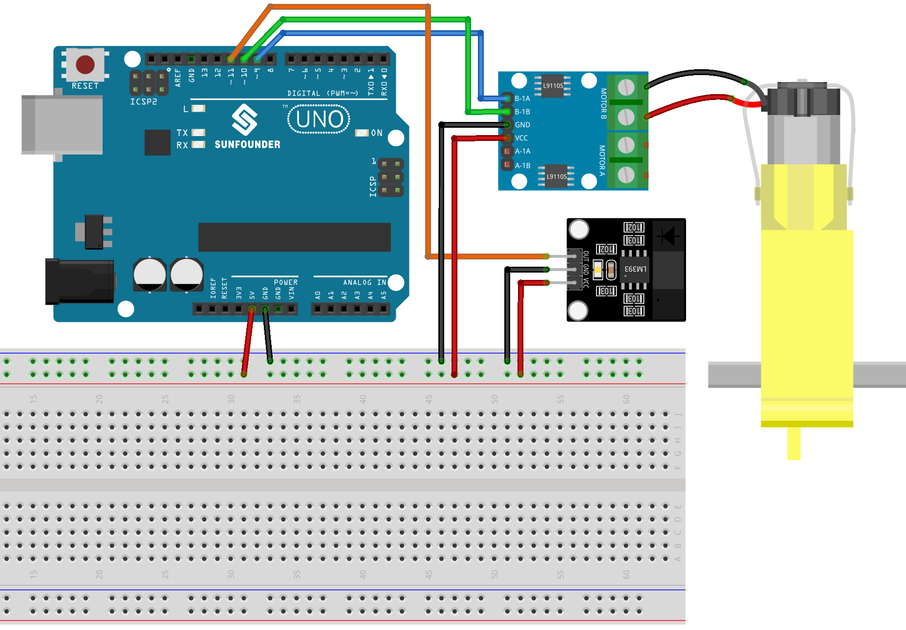

.. note:: 

    Ciao e benvenuto nella Community Facebook degli appassionati di SunFounder Raspberry Pi, Arduino ed ESP32! Approfondisci le tue conoscenze su Raspberry Pi, Arduino ed ESP32 insieme ad altri maker come te.

    **Perché unirsi?**

    - **Supporto Esperto**: Risolvi problemi post-vendita e sfide tecniche con il supporto del nostro team e della community.
    - **Impara e Condividi**: Scambia consigli e tutorial per migliorare le tue competenze.
    - **Anteprime Esclusive**: Accedi in anticipo agli annunci dei nuovi prodotti e a contenuti esclusivi.
    - **Sconti Speciali**: Approfitta di sconti riservati sui nostri prodotti più recenti.
    - **Promozioni Festive e Giveaway**: Partecipa a promozioni e giveaway durante le festività.

    👉 Pronto a esplorare e creare con noi? Clicca su [|link_sf_facebook|] ed entra subito!

.. _uno_lesson07_speed:

Lezione 07: Modulo Sensore di Velocità a Infrarossi
========================================================

In questa lezione imparerai a misurare la velocità di un motore utilizzando un modulo sensore di velocità con un Arduino Uno. Vedremo come configurare il motore e il sensore, programmare l’Arduino per calcolare le rotazioni al secondo e visualizzare i dati. Questo progetto è ideale per utenti di livello intermedio, poiché offre un'esperienza pratica nell’elaborazione dei dati in tempo reale e nel controllo di motori tramite la piattaforma Arduino.

Componenti Necessari
--------------------------

Per questo progetto servono i seguenti componenti.

È sicuramente comodo acquistare un kit completo, ecco il link:

.. list-table::
    :widths: 20 20 20
    :header-rows: 1

    *   - Nome	
        - CONTENUTO DEL KIT
        - LINK
    *   - Universal Maker Sensor Kit
        - 94
        - |link_umsk|

In alternativa, puoi acquistare i componenti singolarmente dai link sottostanti.

.. list-table::
    :widths: 30 20
    :header-rows: 1

    *   - Descrizione del Componente
        - Link per l'acquisto

    *   - Arduino UNO R3 o R4
        - |link_Uno_R3_buy|
    *   - :ref:`cpn_breadboard`
        - |link_breadboard_buy|
    *   - :ref:`cpn_speed`
        - |link_speed_sensor_module_buy|
    *   - :ref:`cpn_ttmotor`
        - \-
    *   - :ref:`cpn_l9110`
        - \-

Collegamenti
---------------------------

Codice
---------------------------

.. raw:: html

    <iframe src=https://create.arduino.cc/editor/sunfounder01/0d705c03-2813-4e71-8ec6-1208684358c9/preview?embed style="height:510px;width:100%;margin:10px 0" frameborder=0></iframe>

Analisi del Codice
---------------------------

#. Configurazione dei pin e inizializzazione delle variabili. In questa parte definiamo i pin per il motore e il sensore di velocità, oltre alle variabili che serviranno per misurare e calcolare la velocità del motore.

   .. code-block:: arduino

      // Define the sensor and motor pins
      const int sensorPin = 11;
      const int motorB_1A = 9;
      const int motorB_2A = 10;
      
      // Define variables for measuring speed
      unsigned long start_time = 0;
      unsigned long end_time = 0;
      int steps = 0;
      float steps_old = 0;
      float temp = 0;
      float rps = 0;

#. Inizializzazione nella funzione ``setup()``. Questa sezione imposta la comunicazione seriale, configura i pin e definisce la velocità iniziale del motore.

   .. code-block:: arduino

      void setup() {
        Serial.begin(9600);
        pinMode(sensorPin, INPUT);
        pinMode(motorB_1A, OUTPUT);
        pinMode(motorB_2A, OUTPUT);
        analogWrite(motorB_1A, 160);
        analogWrite(motorB_2A, 0);
      }

#. Misurazione della velocità del motore nella funzione ``loop()``. In questa parte del codice vengono conteggiati i passi del motore per un intervallo di 1 secondo. I passi vengono poi utilizzati per calcolare le rotazioni al secondo (rps), che vengono stampate sul monitor seriale.

   ``millis()`` restituisce il numero di millisecondi trascorsi da quando la scheda Arduino ha iniziato ad eseguire il programma corrente. 

   .. code-block:: arduino

      void loop() {
        start_time = millis();
        end_time = start_time + 1000;
        while (millis() < end_time) {
          if (digitalRead(sensorPin)) {
            steps = steps + 1;
            while (digitalRead(sensorPin))
              ;
          }
        }
        temp = steps - steps_old;
        steps_old = steps;
        rps = (temp / 20);
        Serial.print("rps:");
        Serial.println(rps);
      }