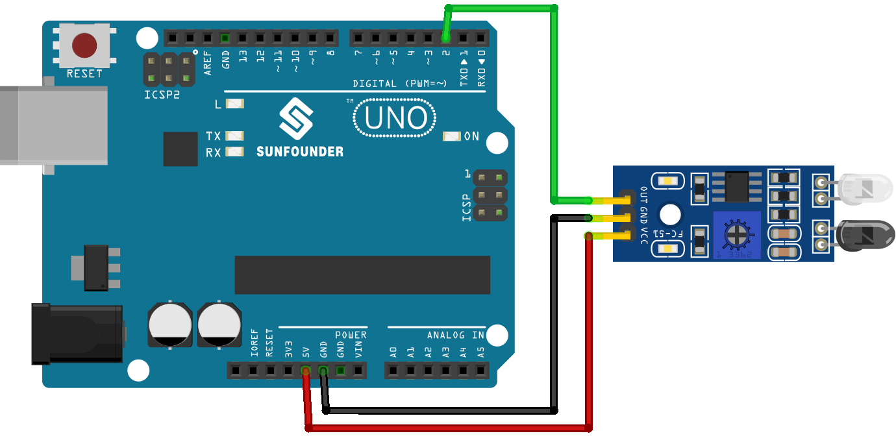

.. note::

    Bonjour, bienvenue dans la communauté des passionnés de SunFounder Raspberry Pi, Arduino et ESP32 sur Facebook ! Plongez plus profondément dans l'univers de Raspberry Pi, Arduino et ESP32 avec d'autres passionnés.

    **Pourquoi rejoindre ?**

    - **Support d'expert** : Résolvez les problèmes post-vente et les défis techniques avec l'aide de notre communauté et de notre équipe.
    - **Apprendre et partager** : Échangez des astuces et des tutoriels pour améliorer vos compétences.
    - **Aperçus exclusifs** : Obtenez un accès anticipé aux annonces de nouveaux produits et aux aperçus exclusifs.
    - **Réductions spéciales** : Profitez de réductions exclusives sur nos nouveaux produits.
    - **Promotions festives et cadeaux** : Participez à des cadeaux et promotions de fêtes.

    👉 Prêts à explorer et à créer avec nous ? Cliquez sur [|link_sf_facebook|] et rejoignez-nous aujourd'hui !

.. _uno_lesson08_ir_obstacle_avoidance:

Leçon 08 : Module Capteur de Détection d'Obstacles IR
=========================================================

Dans cette leçon, vous apprendrez à utiliser un capteur de détection d'obstacles infrarouge avec un Arduino Uno. Nous explorerons comment lire les signaux numériques du capteur pour détecter des obstacles. Vous verrez comment le voyant rouge du capteur s'illumine en présence d'obstacles et comment il envoie un signal de bas niveau à l'Arduino. Cette leçon est parfaite pour les débutants, offrant une expérience pratique de la lecture des entrées numériques et de la pratique de la communication série sur la plateforme Arduino.

Composants nécessaires
--------------------------

Pour ce projet, nous avons besoin des composants suivants.

Il est définitivement pratique d'acheter un kit complet, voici le lien :

.. list-table::
    :widths: 20 20 20
    :header-rows: 1

    *   - Nom	
        - ÉLÉMENTS DE CE KIT
        - LIEN
    *   - Kit capteur universel pour bricoleurs
        - 94
        - |link_umsk|

Vous pouvez également les acheter séparément via les liens ci-dessous.

.. list-table::
    :widths: 30 20
    :header-rows: 1

    *   - Introduction au composant
        - Lien d'achat

    *   - Arduino UNO R3 ou R4
        - |link_Uno_R3_buy|
    *   - :ref:`cpn_ir_obstacle`
        - |link_obstacle_avoidance_module_buy|

Câblage
---------------------------

Code
---------------------------

.. raw:: html

    <iframe src=https://create.arduino.cc/editor/sunfounder01/be83e63b-959c-4d9c-a27b-0be46291c1f8/preview?embed style="height:510px;width:100%;margin:10px 0" frameborder=0></iframe>

Analyse du code
---------------------------

1. Définir le numéro de broche pour la connexion du capteur :

   .. code-block:: arduino

     const int sensorPin = 2;

   Connectez la broche de sortie du capteur à la broche 2 de l'Arduino.

2. Configuration de la communication série et définition de la broche du capteur comme entrée :

   .. code-block:: arduino

     void setup() {
       pinMode(sensorPin, INPUT);  
       Serial.begin(9600);
     }

   Initialisez la communication série à un débit de 9600 bauds pour afficher sur le moniteur série.
   Réglez la broche du capteur comme entrée pour lire le signal d'entrée.

3. Lire la valeur du capteur et l'imprimer sur le moniteur série :

   .. code-block:: arduino

     void loop() {
       Serial.println(digitalRead(sensorPin));
       delay(50); 
     }
   
   Lisez continuellement la valeur numérique de la broche du capteur en utilisant ``digitalRead()`` et imprimez la valeur sur le moniteur série en utilisant ``Serial.println()``.
   Ajoutez un délai de 50 ms entre les impressions pour une meilleure visualisation.

   .. note:: 
   
      Si le capteur ne fonctionne pas correctement, ajustez l'émetteur IR et le récepteur pour les rendre parallèles. De plus, vous pouvez ajuster la portée de détection à l'aide du potentiomètre intégré.
