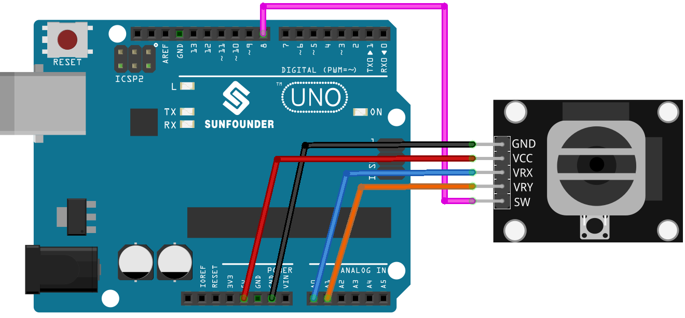

.. note:: 

    ¡Hola, bienvenido a la comunidad de entusiastas de SunFounder Raspberry Pi, Arduino y ESP32 en Facebook! Profundiza en Raspberry Pi, Arduino y ESP32 junto a otros entusiastas.

    **¿Por qué unirse?**

    - **Soporte experto**: Resuelve problemas postventa y desafíos técnicos con la ayuda de nuestra comunidad y equipo.
    - **Aprender y compartir**: Intercambia consejos y tutoriales para mejorar tus habilidades.
    - **Preestrenos exclusivos**: Accede de forma anticipada a anuncios de nuevos productos y avances.
    - **Descuentos especiales**: Disfruta de descuentos exclusivos en nuestros productos más nuevos.
    - **Promociones festivas y sorteos**: Participa en sorteos y promociones especiales.

    👉 ¿Listo para explorar y crear con nosotros? Haz clic en [|link_sf_facebook|] y únete hoy mismo!

.. _uno_lesson09_joystick:

Lección 09: Módulo Joystick
==================================

En esta lección, aprenderás cómo leer los valores de un módulo joystick utilizando un Arduino Uno. Exploraremos cómo conectar los ejes X e Y del joystick al Arduino y cómo mostrar sus valores en el monitor serial. Además, abordaremos el uso de un botón conmutador en el joystick. Este proyecto es ideal para principiantes, ya que ofrece una experiencia práctica con entradas analógicas y digitales en la plataforma Arduino.

Componentes necesarios
--------------------------

En este proyecto, necesitamos los siguientes componentes.

Es definitivamente conveniente comprar un kit completo, aquí está el enlace:

.. list-table::
    :widths: 20 20 20
    :header-rows: 1

    *   - Nombre
        - ARTÍCULOS EN ESTE KIT
        - ENLACE
    *   - Kit de Sensores Universal Maker
        - 94
        - |link_umsk|

También puedes comprarlos por separado desde los enlaces a continuación.

.. list-table::
    :widths: 30 20
    :header-rows: 1

    *   - Introducción del componente
        - Enlace de compra

    *   - Arduino UNO R3 o R4
        - |link_Uno_R3_buy|
    *   - :ref:`cpn_joystick`
        - |link_joystick_buy|

Cableado
---------------------------

Código
---------------------------

.. raw:: html

    <iframe src=https://create.arduino.cc/editor/sunfounder01/82313b82-4ac8-407c-9b65-3e7d548e6520/preview?embed style="height:510px;width:100%;margin:10px 0" frameborder=0></iframe>

Análisis del Código
---------------------------

#. Definición de los pines:
   
   .. code-block:: arduino
   
      const int xPin = A0;  // el VRX se conecta a
      const int yPin = A1;  // el VRY se conecta a
      const int swPin = 8;  // el SW se conecta a

   Se definen las constantes para los pines del joystick. ``xPin`` y ``yPin`` son los pines analógicos para los ejes X e Y del joystick. ``swPin`` es un pin digital para el interruptor del joystick.

#. Función setup:

   .. code-block:: arduino
   
      void setup() {
        pinMode(swPin, INPUT_PULLUP);
        Serial.begin(9600);
      }

   Inicializa ``swPin`` como entrada con una resistencia pull-up, lo que es esencial para el funcionamiento del interruptor. Inicia la comunicación serial a 9600 baudios.

#. Bucle principal:

   .. code-block:: arduino
   
      void loop() {
        Serial.print("X: ");
        Serial.print(analogRead(xPin));  // imprimir el valor de VRX
        Serial.print("|Y: ");
        Serial.print(analogRead(yPin));  // imprimir el valor de VRY
        Serial.print("|Z: ");
        Serial.println(digitalRead(swPin));  // imprimir el valor de SW
        delay(50);
      }

   Lee continuamente e imprime los valores de los ejes y el interruptor del joystick en el Monitor Serial, con un retraso de 50 ms entre lecturas.