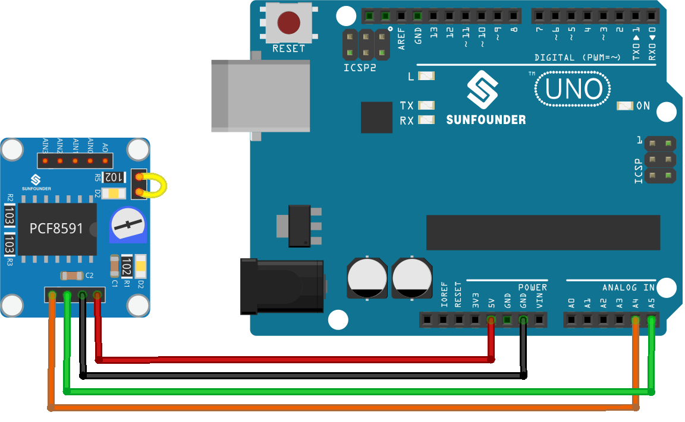

.. note::

    Bonjour, bienvenue dans la communauté des passionnés de SunFounder Raspberry Pi, Arduino et ESP32 sur Facebook ! Plongez plus profondément dans l'univers de Raspberry Pi, Arduino et ESP32 avec d'autres passionnés.

    **Pourquoi rejoindre ?**

    - **Support d'expert** : Résolvez les problèmes après-vente et les défis techniques avec l'aide de notre communauté et de notre équipe.
    - **Apprendre et partager** : Échangez des astuces et des tutoriels pour améliorer vos compétences.
    - **Aperçus exclusifs** : Obtenez un accès anticipé aux annonces de nouveaux produits et aux aperçus exclusifs.
    - **Réductions spéciales** : Profitez de réductions exclusives sur nos nouveaux produits.
    - **Promotions festives et cadeaux** : Participez à des cadeaux et promotions de fêtes.

    👉 Prêts à explorer et à créer avec nous ? Cliquez sur [|link_sf_facebook|] et rejoignez-nous aujourd'hui !

.. _uno_lesson10_pcf8591:

Leçon 10 : Module Convertisseur ADC DAC PCF8591
==================================================

Dans cette leçon, vous apprendrez à connecter l'Arduino Uno R4 (ou R3) avec un module convertisseur ADC DAC PCF8591. Nous aborderons la lecture des valeurs analogiques à partir de l'entrée AIN0, l'envoi de ces valeurs au DAC (AOUT) et l'affichage à la fois des lectures brutes et des lectures converties en tension sur le moniteur série. Le potentiomètre du module est connecté à AIN0 à l'aide de cavaliers, et la LED D2 du module est connectée à AOUT, vous permettant de voir que la luminosité de la LED D2 change lorsque vous tournez le potentiomètre.

Composants nécessaires
--------------------------

Pour ce projet, nous avons besoin des composants suivants.

Il est définitivement pratique d'acheter un kit complet, voici le lien :

.. list-table::
    :widths: 20 20 20
    :header-rows: 1

    *   - Nom	
        - ÉLÉMENTS DE CE KIT
        - LIEN
    *   - Kit capteur universel pour bricoleurs
        - 94
        - |link_umsk|

Vous pouvez également les acheter séparément via les liens ci-dessous.

.. list-table::
    :widths: 30 20
    :header-rows: 1

    *   - Introduction au composant
        - Lien d'achat

    *   - Arduino UNO R3 ou R4
        - |link_Uno_R3_buy|
    *   - :ref:`cpn_pcf8591`
        - |link_pcf8591_module_buy|

Câblage
---------------------------

Code
---------------------------

.. note:: 
   Pour installer la bibliothèque, utilisez le gestionnaire de bibliothèques Arduino et recherchez **"Adafruit PCF8591"** et installez-la.

.. raw:: html

    <iframe src=https://create.arduino.cc/editor/sunfounder01/217d04d3-2c19-44df-b66b-5c1582955260/preview?embed style="height:510px;width:100%;margin:10px 0" frameborder=0></iframe>

Analyse du code
---------------------------

#. **Inclusion de la bibliothèque et définition des constantes**

   .. note:: 
      Pour installer la bibliothèque, utilisez le gestionnaire de bibliothèques Arduino et recherchez **"Adafruit PCF8591"** et installez-la. 

   .. code-block:: arduino

      // Inclure la bibliothèque Adafruit PCF8591
      #include <Adafruit_PCF8591.h>
      // Définir la tension de référence pour la conversion ADC
      #define ADC_REFERENCE_VOLTAGE 5.0

   Cette section inclut la bibliothèque Adafruit PCF8591, qui fournit des fonctions pour interagir avec le module PCF8591. La tension de référence ADC est fixée à 5,0 volts, qui est la tension maximale que l'ADC peut mesurer.

#. **Configuration du module PCF8591**

   .. code-block:: arduino

      // Créer une instance du module PCF8591
      Adafruit_PCF8591 pcf = Adafruit_PCF8591();
      void setup() {
        Serial.begin(9600);
        Serial.println("# Adafruit PCF8591 demo");
        if (!pcf.begin()) {
          Serial.println("# PCF8591 not found!");
          while (1) delay(10);
        }
        Serial.println("# PCF8591 found");
        pcf.enableDAC(true);
      }

   Dans la fonction de configuration, la communication série est démarrée, et une instance du module PCF8591 est créée. La fonction ``pcf.begin()`` vérifie si le module est correctement connecté. Si ce n'est pas le cas, elle imprime un message d'erreur et arrête le programme. Si le module est trouvé, elle active le DAC.

#. **Lecture de l'ADC et écriture dans le DAC**

   .. code-block:: arduino

      void loop() {
        AIN0 = pcf.analogRead(0);
        pcf.analogWrite(AIN0);
        Serial.print("AIN0: ");
        Serial.print(AIN0);
        Serial.print(", ");
        Serial.print(int_to_volts(AIN0, 8, ADC_REFERENCE_VOLTAGE));
        Serial.println("V");
        delay(500);
      }

   La fonction de boucle lit en continu la valeur analogique de AIN0 (entrée analogique 0) du module PCF8591, puis écrit cette valeur de retour dans le DAC. Elle imprime également la valeur brute et la valeur convertie en tension de AIN0 sur le moniteur série.

   Les cavaliers relient le potentiomètre du module à AIN0, et la LED D2 est connectée à AOUT ; veuillez vous référer au schéma du module PCF8591 :ref:`schematic <cpn_pcf8591_sch>` pour plus de détails. La luminosité de la LED change lorsque le potentiomètre est tourné.

#. **Fonction de conversion numérique en tension**

   .. code-block:: arduino

      float int_to_volts(uint16_t dac_value, uint8_t bits, float logic_level) {
        return (((float)dac_value / ((1 << bits) - 1)) * logic_level);
      }

   Cette fonction convertit la valeur numérique en sa tension correspondante. Elle prend la valeur numérique (``dac_value``), le nombre de bits de résolution (``bits``), et la tension de niveau logique (``logic_level``) en arguments. La formule utilisée est une approche standard pour convertir une valeur numérique en sa tension équivalente.
