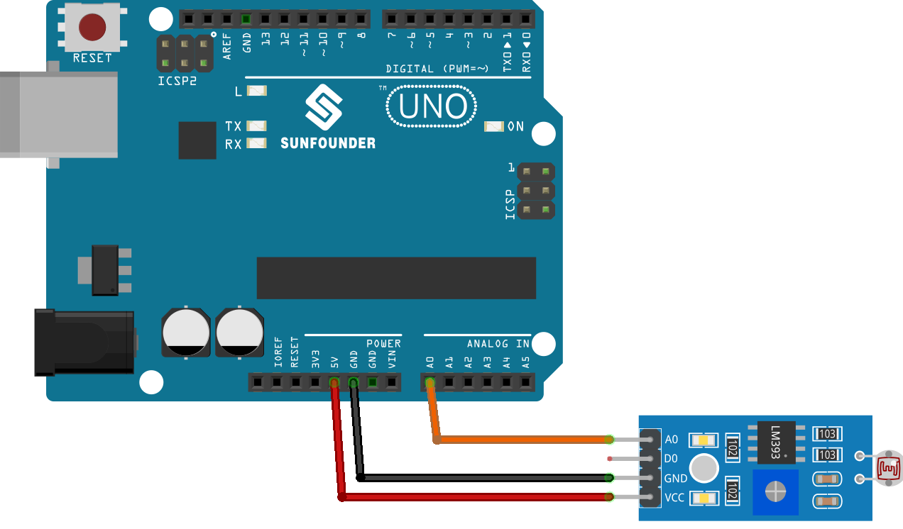

.. note:: 

    ¡Hola, bienvenido a la comunidad de entusiastas de SunFounder Raspberry Pi, Arduino y ESP32 en Facebook! Profundiza en Raspberry Pi, Arduino y ESP32 junto a otros entusiastas.

    **¿Por qué unirse?**

    - **Soporte experto**: Resuelve problemas postventa y desafíos técnicos con la ayuda de nuestra comunidad y equipo.
    - **Aprender y compartir**: Intercambia consejos y tutoriales para mejorar tus habilidades.
    - **Preestrenos exclusivos**: Accede de forma anticipada a anuncios de nuevos productos y avances.
    - **Descuentos especiales**: Disfruta de descuentos exclusivos en nuestros productos más nuevos.
    - **Promociones festivas y sorteos**: Participa en sorteos y promociones especiales.

    👉 ¿Listo para explorar y crear con nosotros? Haz clic en [|link_sf_facebook|] y únete hoy mismo!

.. _uno_lesson11_photoresistor:

Lección 11: Módulo de Fotoresistor
=====================================

En esta lección, aprenderás cómo medir la intensidad de la luz utilizando un sensor fotoresistor con un Arduino Uno. Cubriremos cómo leer y mostrar los valores analógicos del sensor, los cuales reflejan la cantidad de luz que detecta. Este proyecto es ideal para principiantes, ya que proporciona una experiencia práctica al trabajar con sensores y entender la entrada analógica en la plataforma Arduino. Además, mejorarás tu habilidad en la comunicación serial al mostrar las lecturas del sensor en el monitor serial.

Componentes necesarios
--------------------------

En este proyecto, necesitamos los siguientes componentes.

Es definitivamente conveniente comprar un kit completo, aquí está el enlace:

.. list-table::
    :widths: 20 20 20
    :header-rows: 1

    *   - Nombre
        - ARTÍCULOS EN ESTE KIT
        - ENLACE
    *   - Kit de Sensores Universal Maker
        - 94
        - |link_umsk|

También puedes comprarlos por separado desde los enlaces a continuación.

.. list-table::
    :widths: 30 20
    :header-rows: 1

    *   - Introducción del componente
        - Enlace de compra

    *   - Arduino UNO R3 o R4
        - |link_Uno_R3_buy|
    *   - :ref:`cpn_photoresistor`
        - |link_photoresistor_sensor_module_buy|

Cableado
---------------------------

Código
---------------------------

.. raw:: html

    <iframe src=https://create.arduino.cc/editor/sunfounder01/ac4664d2-2f44-4d5f-9cf4-a82eadc74d3e/preview?embed style="height:510px;width:100%;margin:10px 0" frameborder=0></iframe>

Análisis del Código
---------------------------

#. **Configuración del Pin del Sensor y Comunicación Serial**

   Comenzamos definiendo el pin del sensor e inicializando la comunicación serial en la función de configuración. El fotoresistor está conectado al pin analógico A0.

   .. code-block:: arduino

      const int sensorPin = A0;  // Pin conectado al fotoresistor

      void setup() {
        Serial.begin(9600);  // Iniciar la comunicación serial a 9600 baudios
      }

#. **Leer y Mostrar los Datos del Sensor**

   En la función loop, leemos continuamente el valor analógico del sensor y lo imprimimos en el Monitor Serial. También agregamos un breve retraso para estabilizar las lecturas.

   .. code-block:: arduino

      void loop() {
        Serial.println(analogRead(sensorPin));  // Leer e imprimir el valor analógico
        delay(50);                              // Breve retraso para estabilizar las lecturas
      }

